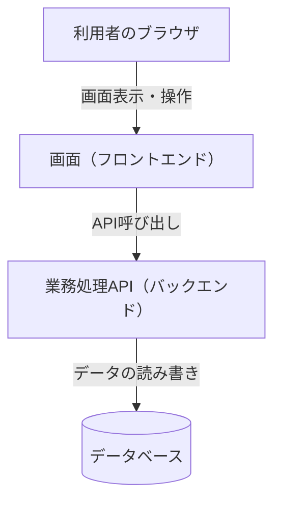

# 01_要件定義書

## 1. 文書概要

| 項目 | 内容 |
|---|---|
| 文書名 | イベント申込システム 要件定義書 |
| 対象システム | イベント申込システム |
| 作成目的 | 本システムが提供すべき機能・業務ルール・入出力・非機能要件を定義し、今後の設計・開発・改修における判断基準とする。 |
| 対象範囲 | 一般利用者向け機能（イベント閲覧・申込・お気に入り・コメント）、管理者向け機能（イベント管理・当日受付・実績確認・利用者管理）、およびこれらを支える共通機能（ログイン・利用者登録） |

本書は、システムが利用者に提供する価値・機能・業務ルールを定義する要件定義書であり、今後のテーブル定義書・API設計書・画面設計書・画面遷移図の上位文書として位置づける。各下位文書は本書の内容と矛盾しないものとする。

本書の内容と実際の稼働状況との間に差異が生じている、または本書の内容を正式仕様として確定させる前に関係者間で合意すべき事項がある場合は、`docs/06_設計確定時の確認事項.md`に記録する。

## 2. システム概要

### 2.1 システムの目的

本システムは、イベントの募集・申込受付・当日運営・実績集計に関する一連の業務を一元的に管理するWebアプリケーションである。一般利用者に対してはイベント情報の閲覧と参加申込の手段を提供し、管理者に対してはイベントの企画・管理と申込状況の把握・運営を行う手段を提供する。

### 2.2 背景・解決する課題

イベントの募集・申込管理を人手や個別の手段（メール、紙、表計算ソフト等）で行う場合、以下のような課題が生じやすい。

- 申込状況（受付数・残り枠）をリアルタイムに把握しづらい
- 定員超過時のキャンセル待ち管理や、キャンセル発生時の繰り上げ処理が煩雑になる
- 当日の参加者受付（本人確認・出欠記録）に手間がかかる
- 複数イベントの申込実績を横断的に集計する作業に時間を要する

本システムは、申込受付から定員管理、キャンセル待ちの繰り上げ、当日受付、実績集計までを一つの仕組みで扱うことで、これらの課題を解消することを目的とする。

### 2.3 システムの概要

本システムは、利用者が操作するブラウザ画面（フロントエンド）と、データの管理・業務処理を担うサーバー（バックエンド）、その情報を永続化するデータベースの3層構成をとる。利用者はブラウザを通じて画面を操作し、画面はサーバーが提供するAPIを通じてデータの取得・登録・更新を行う。

技術基盤・実行環境に関する標準は「8. 非機能要件」に定める。

## 3. 想定利用者

本システムの利用者は、次の2種類に区分する。

| 利用者区分 | 役割 |
|---|---|
| 一般利用者 | イベント情報を閲覧し、参加申込・キャンセル・お気に入り登録・コメント投稿を行う利用者。 |
| 管理者 | 一般利用者の機能に加え、イベントの登録・変更・削除・復元、当日受付、申込実績の確認・出力、利用者情報の確認を行う利用者。 |

利用者は、いずれか一方の区分に属する。管理者は参加申込を行う対象ではなく、イベントへの申込操作はできない。

管理者アカウントは、初期データとして投入された1件に加え、既存の管理者が新たな管理者アカウントを登録することで追加できる（詳細は「7. 業務ルール」参照）。

## 4. 利用シーン

一般利用者・管理者それぞれの主な利用シーンを次に示す。

### 4.1 一般利用者

1. メールアドレスを入力してログインする。初めて利用する場合は、名前とメールアドレスを入力して利用者登録を行い、そのままログイン状態となる。
2. イベント一覧（一覧表示・カレンダー表示の切替が可能）、またはキーワード・開催日による検索からイベントを探す。
3. イベント詳細を確認し、参加区分やアンケート項目が設定されている場合はこれらを入力したうえで参加を申し込む。
4. 定員に達しているイベントに申し込んだ場合は、キャンセル待ちとして登録され、マイページで順位を確認できる。
5. 気になるイベントをお気に入り登録し、マイページからまとめて確認できる。
6. イベント詳細画面でコメントを投稿・閲覧し、自分が投稿したコメントを削除できる。
7. マイページから自分の申込状況を確認し、必要に応じて申込をキャンセルする。

### 4.2 管理者

1. ログインし、管理者向けダッシュボードで全体状況（イベント数・利用者数・受付済申込数）を把握する。
2. イベントを新規登録し、参加区分（複数枠に分けた定員管理）やアンケート項目を設定する。
3. 登録済みイベントの内容を編集し、必要に応じて削除する。削除したイベントは一覧から確認し、復元できる。
4. イベント当日、申込者一覧を確認しながら受付（チェックイン）を行う。
5. イベントごとの申込実績（受付数・充足率）を確認し、申込明細をCSV形式で出力する。
6. 登録されている利用者の一覧を確認する。

## 5. システム機能

| 機能ID | 機能名 | 概要 | 利用者 |
|---|---|---|---|
| F-01 | ログイン | メールアドレスによる利用者識別と、以降の操作のための認証状態の確立 | 一般利用者・管理者 |
| F-02 | 利用者登録 | 名前・メールアドレスによる新規利用者登録（登録後は自動的にログイン状態となる） | 一般利用者（新規） |
| F-03 | イベント一覧・検索 | イベントの一覧表示（一覧形式／カレンダー形式）、キーワード・開催日による絞り込み | 一般利用者・管理者 |
| F-04 | イベント詳細確認 | 個別イベントの詳細情報・残り枠・申込可否・コメントの確認 | 一般利用者・管理者 |
| F-05 | イベント申込 | 参加区分の選択・アンケート回答を含む参加申込の受付、定員超過時のキャンセル待ち登録 | 一般利用者 |
| F-06 | 申込確認・キャンセル | 自分の申込状況の確認、キャンセル待ち順位の確認、申込のキャンセル | 一般利用者・管理者 |
| F-07 | お気に入り管理 | イベントのお気に入り登録・解除・一覧確認 | 一般利用者・管理者 |
| F-08 | イベントコメント | イベントに対するコメントの投稿・閲覧・削除 | 一般利用者・管理者 |
| F-09 | イベント登録・編集 | イベント情報および参加区分の新規登録・編集 | 管理者 |
| F-10 | イベント削除・復元 | イベントの削除（履歴を保持した無効化）、削除済みイベントの確認・復元 | 管理者 |
| F-11 | 当日受付 | イベント当日の申込者一覧確認とチェックイン処理 | 管理者 |
| F-12 | 申込実績確認・出力 | イベントごとの申込実績（受付数・充足率）の確認、申込明細のCSV出力 | 管理者 |
| F-13 | 利用者一覧確認 | 登録済み利用者の一覧確認 | 管理者 |
| F-14 | 管理者ダッシュボード | イベント数・利用者数・受付済申込数の概況表示 | 管理者 |
| F-15 | 管理者アカウント登録 | 既存の管理者による、新たな管理者アカウントの登録 | 管理者 |

各機能に対応するAPIは`docs/03_API設計書.md`、対応する画面は`docs/04_画面設計書.md`を参照。

## 6. 機能要件

### F-01 ログイン

- **目的**：登録済みの利用者が、以降の操作を行える状態（認証状態）になる。
- **操作**：利用者はメールアドレスを入力し、ログインを実行する。
- **入力**：メールアドレス（必須）。
- **処理**：入力されたメールアドレスに一致する利用者を特定する。
- **出力**：利用者情報（利用者ID・名前・メールアドレス・利用者区分）。
- **正常時**：認証状態が確立され、管理者は管理者向けダッシュボードへ、一般利用者はイベント一覧へ遷移する。
- **異常時**：入力されたメールアドレスに一致する利用者が存在しない場合、ログインを拒否し、その旨を通知する。
- **制約**：パスワードによる照合は行わない（詳細は「8. 非機能要件」参照）。

### F-02 利用者登録

- **目的**：初めて利用する者が、名前とメールアドレスのみで利用者登録を行い、そのまま利用を開始できる。
- **操作**：利用者は名前・メールアドレスを入力し、登録を実行する。
- **入力**：名前（必須）、メールアドレス（必須）。
- **処理**：メールアドレスの重複がないことを確認したうえで、一般利用者として登録する。
- **出力**：登録された利用者情報。
- **正常時**：登録と同時にログイン状態となり、イベント一覧へ遷移する。
- **異常時**：メールアドレスが既に登録済みの場合、登録を拒否し、その旨を通知する。入力項目が未入力・形式不正の場合、該当項目についてエラーを通知する。
- **制約**：本機能で作成される利用者は常に一般利用者であり、管理者として登録することはできない。

### F-03 イベント一覧・検索

- **目的**：開催予定・開催中のイベントを俯瞰し、関心のあるイベントを見つけられる。
- **操作**：利用者は一覧形式とカレンダー形式を切り替えて閲覧する。また、キーワード（イベント名・場所）や開催日の範囲を指定して絞り込む。
- **入力**：検索条件としてキーワード、開催日（開始・終了）を指定できる（いずれも任意）。
- **処理**：登録されている有効なイベント（削除されたイベントを除く）を対象に、指定された条件で絞り込む。
- **出力**：イベント名、開催日時、場所、定員、申込状況（受付済数／定員）、受付中・受付終了の別を一覧表示する。
- **正常時**：条件に合致するイベントを一覧表示する。
- **異常時**：該当するイベントが無い場合はその旨を表示する。一覧の取得に失敗した場合はエラーを通知する。
- **制約**：削除されたイベントは、検索・一覧のいずれにも表示しない。

### F-04 イベント詳細確認

- **目的**：申込等の判断に必要な情報を、イベントごとに確認できる。
- **操作**：利用者は一覧または検索結果からイベントを選択する。
- **入力**：なし。
- **処理**：対象イベントの詳細情報、参加区分ごとの残り枠、投稿済みコメントを取得する。
- **出力**：イベント名、開催日時、場所、定員、残り枠、申込締切、受付状況、説明、主催者名、参加区分一覧、コメント一覧。
- **正常時**：詳細情報を表示する。
- **異常時**：対象のイベントが存在しない、または削除済みの場合は、その旨を表示する。
- **制約**：なし。

### F-05 イベント申込

- **目的**：利用者がイベントへの参加意思を登録する。
- **操作**：利用者は参加区分（設定されている場合）を選択し、アンケート（設定されている場合）に回答したうえで申込を行う。
- **入力**：対象イベント、参加区分（区分が設定されているイベントでは必須）、アンケート回答（任意）。
- **処理**：申込の受付可否（受付期間内であるか）、参加区分の要否・妥当性、二重申込の有無、定員の空き状況を確認したうえで申込を登録する。
- **出力**：申込結果（受付済／キャンセル待ちの別、申込日時）。
- **正常時**：定員に空きがあれば「受付済」として登録し、申込完了として結果を表示する。
- **異常時**：受付期間外の場合、参加区分が未選択（区分が必要なイベントの場合）の場合、既に有効な申込が存在する場合は、それぞれ理由とともに申込を拒否する。
- **制約**：管理者はイベントへの申込を行えない。定員に達している場合はエラーとはせず、「キャンセル待ち」として登録する（詳細は「7. 業務ルール」参照）。

### F-06 申込確認・キャンセル

- **目的**：利用者が自分の申込状況を把握し、必要に応じて取り消せる。
- **操作**：利用者はマイページで自分の申込一覧を確認し、キャンセルしたい申込を選んで取り消す。
- **入力**：キャンセル対象の申込。
- **処理**：申込が本人のものであること、キャンセル可能な状態（開催前かつ有効な申込であること）を確認したうえで、申込をキャンセル済みとする。受付済の申込がキャンセルされた場合は、同一イベント（参加区分がある場合は同一区分）で最も古いキャンセル待ちの申込を自動的に繰り上げる。
- **出力**：申込一覧（イベント名、状況、開催日時、申込日時、キャンセル待ちの場合は順位）。
- **正常時**：キャンセルが完了し、一覧に反映される。
- **異常時**：本人以外の申込を指定した場合、既に開催後の申込、既にキャンセル済みの申込を指定した場合は、キャンセルを拒否する。
- **制約**：なし。

### F-07 お気に入り管理

- **目的**：利用者が関心のあるイベントを記録し、後から一覧で参照できる。
- **操作**：利用者はイベント一覧・検索結果・詳細画面からお気に入りの登録・解除を行い、マイページで一覧を確認する。
- **入力**：対象イベント。
- **処理**：お気に入りの登録・解除を行う。
- **出力**：お気に入り一覧（イベント名、開催日時、場所、受付状況、登録日時）。
- **正常時**：登録・解除が即時に反映される。
- **異常時**：処理に失敗した場合はエラーを通知する。
- **制約**：既に登録済みのイベントに対して再度登録操作を行っても、重複して登録されることはない。未登録のイベントに対して解除操作を行ってもエラーとはしない。

### F-08 イベントコメント

- **目的**：イベントについて利用者間で情報共有・質問ができる。
- **操作**：利用者はイベント詳細画面でコメントを投稿し、投稿済みコメントを閲覧する。自分の投稿、または管理者はすべての投稿を削除できる。
- **入力**：コメント本文（必須）。
- **処理**：投稿されたコメントを登録し、投稿日時順に一覧表示する。
- **出力**：コメント一覧（投稿者名、本文、投稿日時）。
- **正常時**：投稿・削除が即時に一覧へ反映される。
- **異常時**：本文が未入力の場合、投稿できない旨を通知する。投稿者本人・管理者以外による削除は拒否する。
- **制約**：コメントの編集機能は提供しない（投稿・削除のみ）。受付期間の内外を問わず投稿できる。

### F-09 イベント登録・編集

- **目的**：管理者がイベント情報を新規に登録し、内容を更新できる。
- **操作**：管理者はイベント情報（名称、開催日時、場所、定員、申込締切、説明等）および参加区分を入力し、登録・保存する。
- **入力**：イベント名、開催日時、場所、定員、申込締切（以上必須）、説明、主催者名、画像URL、アンケート文言、参加区分（区分名・定員の組を複数、任意）。
- **処理**：入力内容を検証したうえで、新規登録または既存イベントの更新を行う。参加区分を登録した場合、イベント全体の定員は参加区分の定員合計に synchronize（同期）する。
- **出力**：登録・更新後のイベント情報。
- **正常時**：保存が完了し、イベント管理一覧に反映される。
- **異常時**：必須項目の未入力、開催日時と申込締切の前後関係の誤り等は、項目ごとにエラーを通知する。参加区分に有効な申込が残っている状態での区分変更は拒否する。
- **制約**：管理者以外はこの機能を利用できない。

### F-10 イベント削除・復元

- **目的**：不要になったイベントを一覧から除外しつつ、誤って削除した場合に復元できる。
- **操作**：管理者はイベント管理一覧から削除を行い、削除済み一覧から復元を行う。
- **入力**：削除・復元の対象イベント。
- **処理**：削除は、申込等の履歴を保持したままイベントを無効化する。復元は、無効化を解除して一覧に復帰させる。
- **出力**：削除済みイベント一覧（イベント名、開催日時、場所、定員、削除日時）。
- **正常時**：削除・復元が即時に一覧へ反映される。
- **異常時**：受付済の申込が1件でも存在するイベントの削除は拒否する。
- **制約**：管理者以外はこの機能を利用できない。

### F-11 当日受付

- **目的**：イベント当日、申込者の来場確認（チェックイン）を行える。
- **操作**：管理者は対象イベントの申込者一覧を表示し、来場した申込者に対してチェックインを行う。
- **入力**：チェックイン対象の申込。
- **処理**：対象申込のチェックイン日時を記録する。
- **出力**：申込者一覧（申込者名、参加区分、状況、チェックイン日時）。
- **正常時**：チェックインが記録され、一覧に反映される。
- **異常時**：状況が「受付済」以外の申込（キャンセル待ち・キャンセル済）に対するチェックインは拒否する。
- **制約**：管理者以外はこの機能を利用できない。既にチェックイン済みの申込に対してチェックインを行おうとした場合は、実行前に確認を求め、管理者が実行の可否を選択する。

### F-12 申込実績確認・出力

- **目的**：管理者がイベントごとの申込状況を横断的に把握し、必要に応じて明細データを取得できる。
- **操作**：管理者は一覧（受付数・充足率）を確認し、並び順を切り替え、CSV形式でのダウンロードを行う。
- **入力**：並び順（開催日時順／受付数の多い順）。
- **処理**：イベントごとの受付数・定員充足率を集計する。CSV出力では、申込明細（イベント名・申込者名・申込日時・状況）を出力する。
- **出力**：集計結果一覧、またはCSVファイル。
- **正常時**：集計結果・CSVを取得できる。
- **異常時**：取得に失敗した場合はエラーを通知する。
- **制約**：管理者以外はこの機能を利用できない。集計一覧・CSV明細のいずれも、削除済みイベントを対象に含めない。CSV明細は、状況（受付済・キャンセル待ち・キャンセル済）を問わずすべての申込を対象とする。

### F-13 利用者一覧確認

- **目的**：管理者が登録済み利用者の状況を確認できる。
- **操作**：管理者は利用者一覧画面を表示する。
- **入力**：なし。
- **処理**：登録済み利用者の一覧を取得する。
- **出力**：利用者一覧（利用者ID、名前、メールアドレス、利用者区分）。
- **正常時**：一覧を表示する。
- **異常時**：取得に失敗した場合はエラーを通知する。
- **制約**：管理者以外はこの機能を利用できない。パスワード等の機微情報は含めない。

### F-14 管理者ダッシュボード

- **目的**：管理者がシステム全体の概況を一目で把握できる。
- **操作**：管理者はログイン後、ダッシュボードを表示する。
- **入力**：なし。
- **処理**：イベント数・利用者数・受付済申込数を集計する。
- **出力**：総イベント数、総利用者数、受付済申込数。
- **正常時**：集計結果を表示する。
- **異常時**：集計に必要な情報の取得に失敗した場合はエラーを通知する。
- **制約**：管理者以外はこの機能を利用できない。

### F-15 管理者アカウント登録

- **目的**：既存の管理者が、新たな管理者アカウントを登録できる。
- **操作**：管理者は登録する利用者の名前・メールアドレスを入力し、登録を実行する。
- **入力**：名前（必須）、メールアドレス（必須）。
- **処理**：メールアドレスの重複がないことを確認したうえで、管理者として登録する。
- **出力**：登録された利用者情報。
- **正常時**：登録が完了し、利用者一覧に反映される。
- **異常時**：メールアドレスが既に登録済みの場合、登録を拒否し、その旨を通知する。
- **制約**：管理者以外はこの機能を利用できない。

## 7. 業務ルール

- **申込受付可否**：イベントは、現在時刻が申込締切以前であり、かつ開催日時より前である場合にのみ、申込を受け付ける。いずれか一方でも満たさない場合は受付を締め切る。
- **参加区分の要否**：イベントに参加区分が1つ以上設定されている場合、申込時に参加区分の選択を必須とする。参加区分が設定されていないイベントでは、参加区分の指定を行わない。
- **定員判定とキャンセル待ち**：申込時点で対象（参加区分がある場合はその区分、無い場合はイベント全体）の受付済件数が定員未満であれば「受付済」、定員に達していれば「キャンセル待ち」として登録する。定員超過を理由に申込自体を拒否することはない。
- **二重申込の防止**：同一利用者が同一イベントに対して、「受付済」または「キャンセル待ち」の申込を既に持っている場合、新たな申込はできない。過去にキャンセルした履歴がある場合は、再度申込むことができる。
- **キャンセルの可否**：申込のキャンセルは、申込者本人のみが行える。対象の申込が「受付済」または「キャンセル待ち」であり、かつイベント開催前である場合にのみキャンセルできる。
- **キャンセル時の自動繰り上げ**：「受付済」の申込がキャンセルされた場合、同一イベント（参加区分がある場合は同一区分）内で最も申込日時が古い「キャンセル待ち」の申込を1件、自動的に「受付済」へ繰り上げる。
- **キャンセル待ち順位**：キャンセル待ちの申込には、同一対象（イベント、区分がある場合は区分）内で自分より申込日時が古いキャンセル待ちの件数+1を順位として提示する。
- **イベント削除の制約**：「受付済」の申込が1件でも存在するイベントは削除できない。「キャンセル待ち」「キャンセル済」のみの場合は削除できる。削除は申込等の履歴を保持したまま行う（記録を残す削除）。
- **イベント復元**：削除済みのイベントのみを復元の対象とする。
- **参加区分の変更**：イベント編集時に参加区分の内容を変更する場合、対象の区分に有効な申込（「受付済」または「キャンセル待ち」）が残っていると、その変更を拒否する。参加区分を新たに追加する場合も、既存の区分に紐付かない有効な申込が残っていると追加を拒否する。参加区分の登録内容は、変更のたびに全体を置き換える。区分未指定のまま保存した場合は既存の区分を維持し、区分を空として保存した場合は区分を全て解除する。イベント全体の定員は、区分が設定されている間は区分の定員合計に同期する。
- **参加区分名の一意性**：同一イベント内で、同じ名称の参加区分を重複して登録することはできない。
- **お気に入りの重複防止**：同一利用者・同一イベントの組み合わせでお気に入りが重複して登録されることはない。
- **コメントの削除権限**：コメントの削除は、投稿者本人、または管理者のみが行える。
- **チェックインの記録**：状況が「受付済」である申込に限り、チェックインを行える。チェックイン済みの申込に対して再度チェックインを行おうとした場合は、管理者に確認を求め、承認した場合に限りチェックイン日時を最新の実行時刻に更新する。
- **申込実績の集計対象**：申込状況の集計（受付数・充足率）および申込明細のCSV出力は、いずれも削除済みのイベントを対象に含めない。CSV出力は、状況（受付済・キャンセル待ち・キャンセル済）を問わず全ての申込を対象とする。
- **管理者アカウント**：管理者アカウントは、運用開始時に用意された1件に加え、既存の管理者が新たに登録することで追加できる。管理者アカウントの登録は、管理者のみが行える。

## 8. 入力要件

| 対象 | 項目 | 必須 | 型 | 最大長／制約 |
|---|---|---|---|---|
| ログイン | メールアドレス | ○ | 文字列（メール形式） | - |
| 利用者登録 | 名前 | ○ | 文字列 | 最大100文字 |
| 利用者登録 | メールアドレス | ○ | 文字列（メール形式） | 最大255文字。登録済みのメールアドレスとの重複不可 |
| イベント登録・編集 | イベント名 | ○ | 文字列 | 最大100文字 |
| イベント登録・編集 | 開催日時 | ○ | 日時 | 未来日時であること |
| イベント登録・編集 | 場所 | ○ | 文字列 | 最大100文字 |
| イベント登録・編集 | 定員 | ○（参加区分未設定時） | 数値 | 1以上。参加区分を設定した場合は区分の定員合計で自動算出 |
| イベント登録・編集 | 申込締切 | ○ | 日時 | 開催日時より前であること |
| イベント登録・編集 | 説明 | 任意 | 文字列 | 最大1000文字 |
| イベント登録・編集 | 主催者名 | 任意 | 文字列 | 最大100文字 |
| イベント登録・編集 | 画像URL | 任意 | 文字列 | 最大500文字 |
| イベント登録・編集 | アンケート文言 | 任意 | 文字列 | 最大200文字 |
| イベント登録・編集 | 参加区分名 | ○（区分登録時） | 文字列 | 最大50文字 |
| イベント登録・編集 | 参加区分の定員 | ○（区分登録時） | 数値 | 1以上 |
| イベント申込 | 参加区分 | ○（区分設定イベントのみ） | 選択 | 対象イベントに設定された区分のいずれか |
| イベント申込 | アンケート回答 | 任意 | 文字列 | 最大500文字 |
| コメント投稿 | 本文 | ○ | 文字列 | 最大500文字 |
| 管理者アカウント登録 | 名前 | ○ | 文字列 | 最大100文字 |
| 管理者アカウント登録 | メールアドレス | ○ | 文字列（メール形式） | 最大255文字。登録済みのメールアドレスとの重複不可 |

上表に明記のない細かな制約は`docs/02_テーブル定義書.md`・`docs/03_API設計書.md`を参照する。

## 9. エラー要件

利用者に通知するエラーは、発生要因に応じて次のように区分する。詳細な発生条件は各機能の異常時項目、詳細な応答仕様は`docs/03_API設計書.md`を参照。

| エラー区分 | 発生条件の例 | 利用者への通知方針 |
|---|---|---|
| 認証エラー | ログイン未完了の状態での操作、存在しない利用者としてのアクセス | ログイン画面へ案内し、再ログインを促す。 |
| 権限エラー | 一般利用者による管理者専用機能の利用、他人の申込・コメントへの操作 | 権限がない旨を通知し、操作を行わせない。 |
| 入力エラー | 必須項目の未入力、桁数超過、形式不正 | 該当する入力項目ごとに、修正すべき内容を明示する。 |
| 業務ルール違反エラー | 申込締切超過、二重申込、キャンセル不可の状態での取消、削除不可の状態での削除等 | 業務ルール上できない理由を通知する。 |
| データ未検出エラー | 存在しない、または削除済みのイベント・申込等の指定 | 対象が見つからない旨を通知する。 |
| 通信エラー | サーバーとの通信が行えない場合 | サーバーへ接続できない旨を通知する。 |

## 10. 非機能要件

本システムの非機能要件のうち、現時点で定めるものを次に示す。項目によっては、定量的な目標値・詳細方針を今後も定めない方針として確定している（`docs/06_設計確定時の確認事項.md`D-11参照）。それ以外で目標値が定まっていない項目は「未定義」とし、確定が必要な事項として扱う。

### 10.1 セキュリティ・認証

- 本システムの利用範囲は、学内（自組織内）の利用者に限定する運用を前提とする。この前提のもと、パスワードを用いた認証は行わず、ログイン時に確認された利用者を識別する情報を、以降のAPI呼び出しごとに付与することで利用者を識別する認証方式を採用する。
- 学外からのアクセスを許容する等、利用範囲を拡大する場合は、認証方式を改めて検討する。
- 通信の暗号化方式、セッション有効期限、パスワードポリシー等の詳細は未定義。

### 10.2 技術基盤

今後の開発における標準として、以下の技術基盤を用いる。

| 区分 | 標準 |
|---|---|
| バックエンド言語 | Java |
| バックエンドフレームワーク | Spring Boot |
| データベース | MySQL |
| フロントエンド | Angular（TypeScript） |
| データ交換方式 | HTTPによるREST API、JSON形式 |
| 文字コード | UTF-8 |

### 10.3 性能・可用性

- 応答時間、同時アクセス数、稼働率等の定量目標は、今後も定めない方針として確定している（`docs/06_設計確定時の確認事項.md`D-11参照）。
- 複数利用者による同時申込時の整合性は、悲観ロック（`SELECT ... FOR UPDATE`）による排他制御で担保する。対象イベントに参加区分が設定されている場合は区分単位、設定されていない場合はイベント単位で、定員判定から申込登録・キャンセル時の繰り上げまでの間、対象行をロックして直列化する（`docs/06_設計確定時の確認事項.md`D-10参照）。

### 10.4 データ整合性

- イベントの削除は、申込等の履歴を保持したまま無効化する方式（論理削除）とし、物理的な削除は行わない。
- 定員・申込状況の判定は、申込データから都度算出する方式とし、集計値を別途保持しない。

### 10.5 運用・ログ

- 障害調査・監査のためのログ出力方針は、今後も定めない方針として確定している（`docs/06_設計確定時の確認事項.md`D-11参照）。
- スキーマ変更の管理方法（マイグレーション手順を含む）も同様に、今後も定めない方針として確定している（同上）。

### 10.6 環境

- 想定される稼働環境（サーバー構成、コンテナ化、CI/CDの要否等）は、今後も定めない方針として確定している（`docs/06_設計確定時の確認事項.md`D-11参照）。
