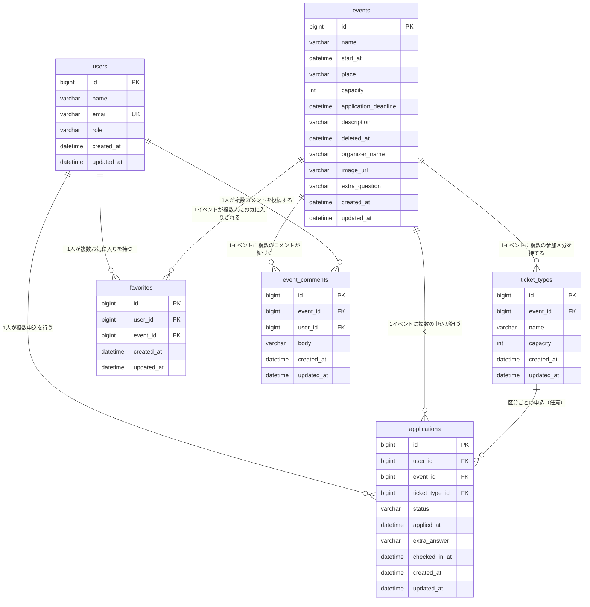

# 02_テーブル定義書

## 1. 概要

本書は、イベント申込システムが扱うデータの構造を定義するテーブル定義書である。`docs/01_要件定義書.md`に定めた機能・業務ルールを実現するために必要なデータをテーブルとして定義し、今後のデータベース設計・実装の基準とする。

- データベース管理システムはMySQL（8.0系）を使用する。
- 文字コードはUTF-8（utf8mb4）を使用する。
- 全テーブルにレコード作成日時（`created_at`）・更新日時（`updated_at`）を保持し、作成・更新の履歴を追跡できるようにする。

## 2. テーブル一覧

| テーブル名 | 用途 |
|---|---|
| `users` | 利用者（一般利用者・管理者）を管理する。 |
| `events` | イベント情報を管理する。 |
| `ticket_types` | イベントの参加区分（定員を分けた申込枠）を管理する。 |
| `applications` | イベントへの申込を管理する。 |
| `favorites` | 利用者によるイベントのお気に入り登録を管理する。 |
| `event_comments` | イベントに対するコメントを管理する。 |

## 3. ER図

## 4. テーブル定義

### 4.1 users（利用者）

利用者（一般利用者・管理者）を管理する。

| カラム名 | 型 | NULL | キー | デフォルト | 備考 |
|---|---|---|---|---|---|
| id | BIGINT | NOT NULL | PK, AUTO_INCREMENT | - | 利用者を一意に識別するID |
| name | VARCHAR(100) | NOT NULL | - | - | 利用者名 |
| email | VARCHAR(255) | NOT NULL | UNIQUE | - | ログインに使用するメールアドレス |
| role | VARCHAR(20) | NOT NULL | - | - | 利用者区分。`general`（一般利用者）または`admin`（管理者）のいずれかを設定する |
| created_at | DATETIME | NOT NULL | - | CURRENT_TIMESTAMP | 登録日時 |
| updated_at | DATETIME | NOT NULL | - | CURRENT_TIMESTAMP | 更新日時 |

制約：`email`に一意制約を設け、同一メールアドレスの重複登録を防止する。

### 4.2 events（イベント）

イベントの開催情報を管理する。

| カラム名 | 型 | NULL | キー | デフォルト | 備考 |
|---|---|---|---|---|---|
| id | BIGINT | NOT NULL | PK, AUTO_INCREMENT | - | イベントを一意に識別するID |
| name | VARCHAR(100) | NOT NULL | - | - | イベント名 |
| start_at | DATETIME | NOT NULL | INDEX | - | 開催日時 |
| place | VARCHAR(100) | NOT NULL | - | - | 開催場所 |
| capacity | INT | NOT NULL | - | - | 定員（1以上）。参加区分を設定している間は、区分の定員合計を反映する |
| application_deadline | DATETIME | NOT NULL | - | - | 申込締切日時。開催日時より前であることを要する |
| description | VARCHAR(1000) | NULL | - | - | イベントの説明文 |
| deleted_at | DATETIME | NULL | - | - | 削除日時。NULLの場合は有効なイベント、日時が設定されている場合は削除済み（論理削除） |
| organizer_name | VARCHAR(100) | NULL | - | - | 主催者名 |
| image_url | VARCHAR(500) | NULL | - | - | イベント画像のURL |
| extra_question | VARCHAR(200) | NULL | - | - | 申込時アンケートの質問文。NULLの場合はアンケートを行わない |
| created_at | DATETIME | NOT NULL | - | CURRENT_TIMESTAMP | 登録日時 |
| updated_at | DATETIME | NOT NULL | - | CURRENT_TIMESTAMP | 更新日時 |

制約：`capacity`は1以上であることを要する（CHECK制約）。

### 4.3 ticket_types（参加区分）

イベントを複数の枠に分けて定員管理する場合の、区分ごとの情報を管理する。イベントに区分を設定しない場合、本テーブルにレコードは存在しない。

| カラム名 | 型 | NULL | キー | デフォルト | 備考 |
|---|---|---|---|---|---|
| id | BIGINT | NOT NULL | PK, AUTO_INCREMENT | - | 参加区分を一意に識別するID |
| event_id | BIGINT | NOT NULL | FK → events.id（削除時CASCADE） | - | 対象イベント |
| name | VARCHAR(50) | NOT NULL | - | - | 区分名（例：一般枠、会員枠） |
| capacity | INT | NOT NULL | - | - | 当該区分の定員（1以上） |
| created_at | DATETIME | NOT NULL | - | CURRENT_TIMESTAMP | 登録日時 |
| updated_at | DATETIME | NOT NULL | - | CURRENT_TIMESTAMP | 更新日時 |

制約：`capacity`は1以上であることを要する（CHECK制約）。`(event_id, name)`の組み合わせに一意制約を設け、同一イベント内での区分名の重複を禁止する。

### 4.4 applications（申込）

イベントへの参加申込を管理する。

| カラム名 | 型 | NULL | キー | デフォルト | 備考 |
|---|---|---|---|---|---|
| id | BIGINT | NOT NULL | PK, AUTO_INCREMENT | - | 申込を一意に識別するID |
| user_id | BIGINT | NOT NULL | FK → users.id（削除時RESTRICT） | - | 申込者 |
| event_id | BIGINT | NOT NULL | FK → events.id（削除時CASCADE） | - | 対象イベント |
| ticket_type_id | BIGINT | NULL | FK → ticket_types.id（削除時RESTRICT） | - | 対象の参加区分。区分が設定されていないイベントへの申込ではNULL |
| status | VARCHAR(20) | NOT NULL | - | `受付済` | 申込状況。`受付済`／`キャンセル待ち`／`キャンセル済`のいずれかを設定する |
| applied_at | DATETIME | NOT NULL | - | CURRENT_TIMESTAMP | 申込日時 |
| extra_answer | VARCHAR(500) | NULL | - | - | 申込時アンケートへの回答 |
| checked_in_at | DATETIME | NULL | - | - | チェックイン（当日受付）日時。NULLの場合は未受付 |
| created_at | DATETIME | NOT NULL | - | CURRENT_TIMESTAMP | 登録日時 |
| updated_at | DATETIME | NOT NULL | - | CURRENT_TIMESTAMP | 更新日時 |

制約：`(user_id, event_id)`の組み合わせに一意制約は設けない。キャンセル後の再申込を業務上許容するため、有効な申込の有無は`status`の値（`受付済`または`キャンセル待ち`）によって判定する。

### 4.5 favorites（お気に入り）

利用者によるイベントのお気に入り登録を管理する。

| カラム名 | 型 | NULL | キー | デフォルト | 備考 |
|---|---|---|---|---|---|
| id | BIGINT | NOT NULL | PK, AUTO_INCREMENT | - | お気に入り登録を一意に識別するID |
| user_id | BIGINT | NOT NULL | FK → users.id（削除時RESTRICT） | - | 登録した利用者 |
| event_id | BIGINT | NOT NULL | FK → events.id（削除時CASCADE） | - | 対象イベント |
| created_at | DATETIME | NOT NULL | - | CURRENT_TIMESTAMP | 登録日時 |
| updated_at | DATETIME | NOT NULL | - | CURRENT_TIMESTAMP | 更新日時 |

制約：`(user_id, event_id)`の組み合わせに一意制約を設け、同一利用者・同一イベントの重複登録を防止する。

備考：削除済みのイベントに対するお気に入り登録も履歴として保持し、一覧から自動的には除外しない。

### 4.6 event_comments（イベントコメント）

イベントに対するコメントを管理する。

| カラム名 | 型 | NULL | キー | デフォルト | 備考 |
|---|---|---|---|---|---|
| id | BIGINT | NOT NULL | PK, AUTO_INCREMENT | - | コメントを一意に識別するID |
| event_id | BIGINT | NOT NULL | FK → events.id（削除時CASCADE） | - | 対象イベント |
| user_id | BIGINT | NOT NULL | FK → users.id（削除時RESTRICT） | - | 投稿者 |
| body | VARCHAR(500) | NOT NULL | - | - | コメント本文 |
| created_at | DATETIME | NOT NULL | INDEX（event_idとの複合） | CURRENT_TIMESTAMP | 投稿日時 |
| updated_at | DATETIME | NOT NULL | - | CURRENT_TIMESTAMP | 更新日時 |

制約：なし（インデックスのみ）。コメントの編集機能は提供しないため、`updated_at`は登録時の日時から変化しない。

## 5. テーブル間リレーション

| 親テーブル | 子テーブル | 親削除時の扱い | 備考 |
|---|---|---|---|
| users | favorites | RESTRICT | 利用者の削除機能は提供しない。 |
| users | applications | RESTRICT | 同上。 |
| users | event_comments | RESTRICT | 同上。 |
| events | ticket_types | CASCADE | イベントを物理的に削除した場合、紐づく参加区分も削除される。イベントの削除は論理削除（`deleted_at`の設定）を基本とするため、通常の運用では発生しない。 |
| events | applications | CASCADE | 同上。 |
| events | favorites | CASCADE | 同上。 |
| events | event_comments | CASCADE | 同上。 |
| ticket_types | applications | RESTRICT | 有効な申込が残っている参加区分は削除できないという業務ルールに対応する。 |

## 6. データ整合性に関する方針

- イベントの削除は論理削除（`events.deleted_at`への日時設定）とし、物理削除は行わない。これにより、削除後も申込・お気に入り・コメント等の関連データを履歴として保持する。
- 定員・申込状況（受付済件数、残り枠、充足率）は、`applications`テーブルの状況を都度集計することで算出し、別途の集計カラムは持たない。
- `role`（利用者区分）・`status`（申込状況）は、あらかじめ定めた値の範囲内でのみ使用する（「7. コード値一覧」参照）。

## 7. コード値一覧

| テーブル.カラム | 使用する値 | 意味 |
|---|---|---|
| users.role | `general` | 一般利用者 |
| users.role | `admin` | 管理者 |
| applications.status | `受付済` | 定員内で受け付けられた申込 |
| applications.status | `キャンセル待ち` | 定員超過により繰り上げ待ちとなっている申込 |
| applications.status | `キャンセル済` | 利用者が取り消した申込 |
