# 04_画面設計書

## 1. 概要

本書は、イベント申込システムの各画面について、表示内容・入力項目・操作・遷移を定義する画面設計書である。`docs/01_要件定義書.md`の各機能、`docs/03_API設計書.md`の各APIとの対応を明確にし、今後の画面設計・実装の基準とする。

## 2. 共通仕様

- **ログイン制御**：ログイン画面を除く全ての画面は、ログイン状態でなければ利用できない。未ログインでアクセスした場合はログイン画面へ案内する。
- **管理者専用画面の制御**：管理者向け画面は、管理者としてログインしている場合にのみ利用できる。一般利用者がアクセスした場合はイベント一覧画面へ案内する。
- **共通ヘッダー**：ログイン中は画面上部に共通のナビゲーションを表示する。管理者には「ダッシュボード／イベント管理／申込状況・実績／利用者管理／コメント管理」、一般利用者には「イベント一覧／イベント検索／マイページ」の導線を表示し、共通で「ログアウト」を提供する。
- **エラー表示**：API呼び出しに失敗した場合、サーバーから返された内容に応じたメッセージを優先して表示し、無い場合は画面ごとに定めた既定のメッセージを表示する。
- **通信不可時の表示**：サーバーと通信できない場合は、「サーバーに接続できません。バックエンドが起動しているか確認してください。」と表示する。

## 3. 画面一覧

| 画面ID | 画面名 | URL | 利用者 |
|---|---|---|---|
| SC-01 | ログイン | `/login` | 未ログイン |
| SC-02 | イベント一覧 | `/events` | 一般利用者・管理者 |
| SC-03 | イベント検索 | `/events/search` | 一般利用者・管理者 |
| SC-04 | イベント詳細・申込 | `/events/:id` | 一般利用者・管理者 |
| SC-05 | 申込完了 | `/events/:id/done` | 一般利用者・管理者 |
| SC-06 | マイページ | `/my/applications` | 一般利用者・管理者 |
| SC-07 | 管理者ダッシュボード | `/admin/dashboard` | 管理者 |
| SC-08 | イベント管理 | `/admin/events` | 管理者 |
| SC-09 | イベント登録・編集 | `/admin/events/new`、`/admin/events/:id/edit` | 管理者 |
| SC-10 | 削除済みイベント | `/admin/events/deleted` | 管理者 |
| SC-11 | 当日受付 | `/admin/events/:id/checkin` | 管理者 |
| SC-12 | 申込状況・実績 | `/admin/reports` | 管理者 |
| SC-13 | 利用者管理 | `/admin/users` | 管理者 |
| SC-14 | 404（該当ページなし） | 上記以外の全URL | 制限なし |
| SC-15 | 利用者詳細 | `/admin/users/:id` | 管理者 |
| SC-16 | コメントモデレーション | `/admin/comments` | 管理者 |

画面遷移の全体像は`docs/05_画面遷移図.md`を参照。

## 4. 画面詳細

### SC-01 ログイン

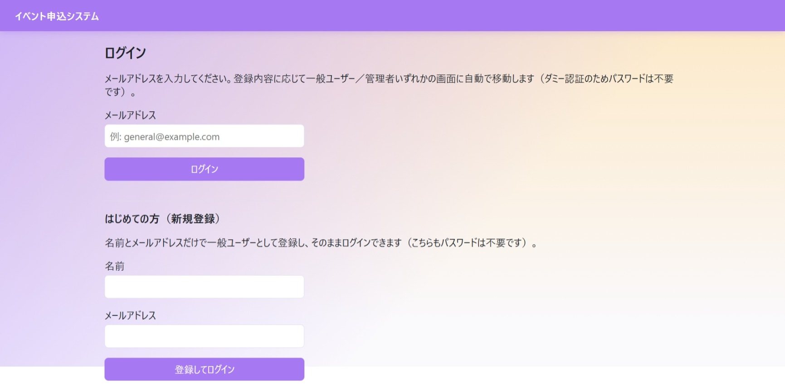

- **目的**：メールアドレスによるログイン、または名前・メールアドレスによる新規利用者登録と、そのままのログイン。
- **表示項目**：ログインフォーム、新規登録フォーム。
- **入力項目**：ログイン（メールアドレス）、新規登録（名前、メールアドレス）。
- **ボタン**：「ログイン」、「登録してログイン」。
- **操作**：利用者がメールアドレスを入力して「ログイン」を押下すると、ログインAPI（AP-01）を呼び出す。初めて利用する利用者が名前・メールアドレスを入力して「登録してログイン」を押下すると、利用者登録API（AP-02）を呼び出し、成功後は登録内容でログイン状態とする。
- **バリデーション**：ログインのメールアドレスが未入力の場合、APIを呼び出さずに入力を促すメッセージを表示する。それ以外の項目はAPIから返される検証結果に従う。
- **API**：AP-01（ログイン）、AP-02（利用者登録）。
- **正常時**：ログイン・登録に成功すると、管理者はSC-07（ダッシュボード）へ、一般利用者はSC-02（イベント一覧）へ遷移する。
- **異常時**：登録済みでないメールアドレスでのログインは、その旨のメッセージを表示する。登録時にメールアドレスが重複している場合、入力項目ごとにエラーを表示する。

### SC-02 イベント一覧

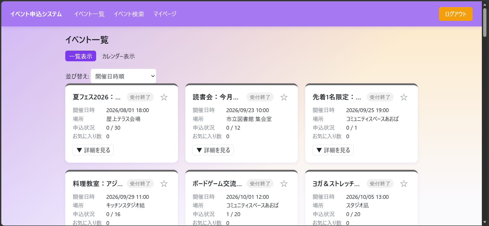

*一覧表示・カード展開時（定員・残り枠・申込締切・説明を表示）*
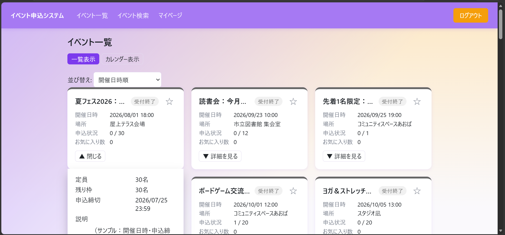

*カレンダー表示*
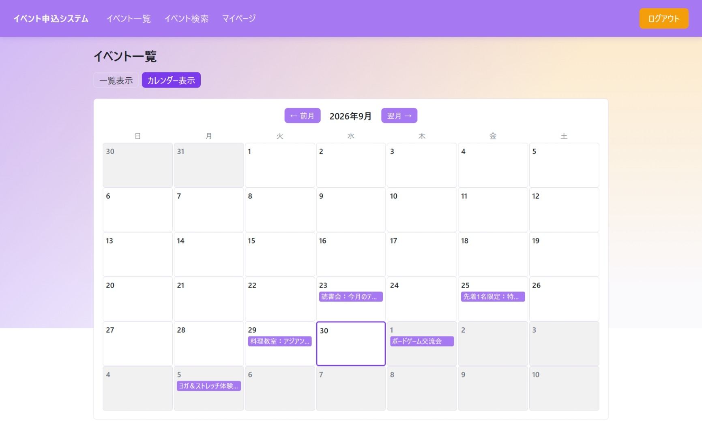

- **目的**：全てのイベントを一覧表示し、その場で詳細を確認しながら申込・お気に入り登録を行う。
- **表示項目**：表示形式の切替（一覧／カレンダー）。一覧形式ではイベント名、受付状況、お気に入りの状態、お気に入り数、開催日時、場所、申込状況（受付済数／定員）。カレンダー形式では月単位のカレンダーに、各開催日のイベントを表示する。
- **入力項目**：申込フォーム（詳細表示時）として、参加区分（区分が設定されたイベントのみ）、アンケート回答（アンケートが設定されたイベントのみ）。
- **ボタン**：表示形式切替、並び替え（一覧形式のみ。開催日時順／申込数の多い順／お気に入り数の多い順／申込締切が近い順）、お気に入りの登録・解除、詳細の展開・収納、申込（残り枠が無い場合は「キャンセル待ちで申し込む」と表示）、カレンダーの前月・翌月切替。
- **操作**：利用者がイベント名を選択するとSC-04（イベント詳細）へ遷移する。参加区分・アンケートを入力し「申し込む」を押下すると、申込API（AP-12）を呼び出す。お気に入りボタンを押下すると、お気に入り登録・解除API（AP-16／AP-17）を呼び出す。並び替えを選択すると、取得済みの一覧データを画面側で並び替えて再表示する（APIの再取得は行わない）。
- **バリデーション**：参加区分が必須のイベントで未選択のまま申込を行った場合、サーバーからの検証結果に従いエラーを表示する。
- **API**：AP-04（一覧取得）、AP-05（詳細取得）、AP-12（申込）、AP-16／AP-17（お気に入り登録・解除）、AP-18（お気に入り一覧取得）。
- **正常時**：申込に成功するとSC-05（申込完了）へ遷移する。お気に入りの状態は即座に画面へ反映する。並び替えは即座に一覧表示へ反映する。
- **異常時**：申込に失敗した場合は画面遷移せず、その場にエラーを表示する。
- **管理者の場合**：申込フォームは表示せず、管理者は申込できない旨を表示する。

### SC-03 イベント検索

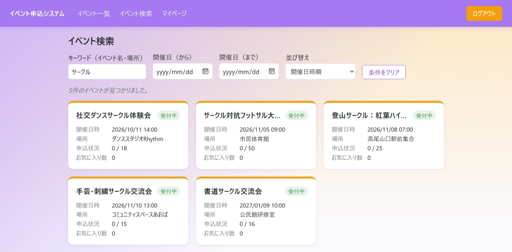

- **目的**：取得済みのイベント情報を、キーワード・開催日の範囲で絞り込んで確認する。
- **表示項目**：検索フォーム、該当件数、イベントのカード一覧（イベント名、開催日時、場所、受付状況、お気に入り数を含み、詳細確認・申込への導線のみを持ち、その場での申込操作は行わない）。
- **入力項目**：キーワード（イベント名・場所を対象、任意）、開催日（から・まで、任意）。
- **ボタン**：「条件をクリア」、並び替え（開催日時順／申込数の多い順／お気に入り数の多い順／申込締切が近い順）。
- **操作**：利用者が検索条件を入力すると、画面上で該当するイベントに絞り込んで表示する。並び替えを選択すると、絞り込み結果を画面側で並び替えて再表示する（APIの再取得は行わない）。イベント名を選択するとSC-04（イベント詳細）へ遷移する。
- **バリデーション**：全項目任意であり、必須入力はない。
- **API**：AP-04（一覧取得）。
- **正常時**：条件に合致するイベントを一覧表示する。
- **異常時**：一覧の取得に失敗した場合はエラーを表示する。
- **遷移**：この画面から遷移した場合、SC-04の「戻る」導線はこの画面に戻る。

### SC-04 イベント詳細・申込

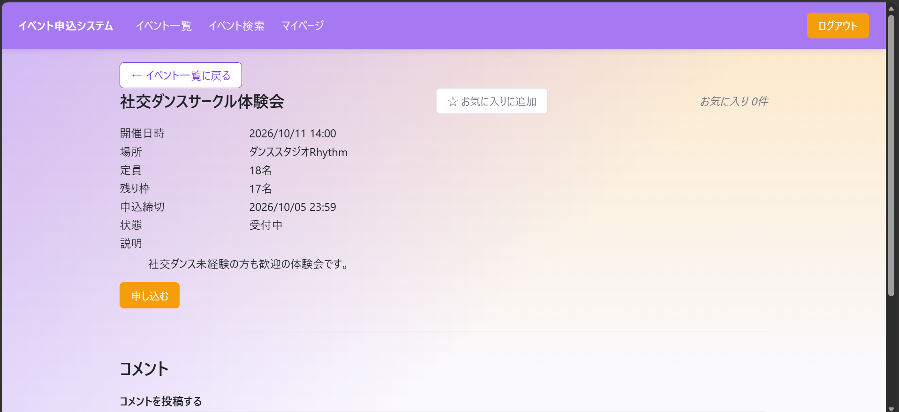

- **目的**：イベントの詳細情報を確認し、申込・お気に入り登録・コメントの投稿や削除を行う。
- **表示項目**：戻る導線（遷移元に応じてSC-02またはSC-03）、イベント名、お気に入りの状態、お気に入り数、イベント画像（設定時）、主催者名（設定時）、開催日時、場所、定員、残り枠、申込締切、受付状況、説明、コメント一覧（投稿者名・本文・投稿日時。自分の投稿または管理者には削除導線を表示。返信は親コメントの下にインデントして表示し、階層数に制限は無い。削除済みのコメントは本文が「このコメントは削除されました」等の表示に置き換わるが、投稿者名・返信は表示したまま残る、D-18）。
- **入力項目**：参加区分（区分が設定されたイベントのみ）、アンケート回答（アンケートが設定されたイベントのみ）、コメント本文、返信本文（各コメントの「返信」導線を開いた場合）。
- **ボタン**：お気に入りの登録・解除、申込（残り枠が無い場合は「キャンセル待ちで申し込む」）、コメント「投稿」、各コメントの「返信」（返信入力欄の開閉）、各コメントの「削除」（本人または管理者のみ表示。削除済みのコメントには表示しない）。
- **操作**：利用者が参加区分・アンケートを入力し「申し込む」を押下すると申込API（AP-12）を呼び出す。コメント本文を入力し「投稿」を押下するとコメント投稿API（AP-20）を呼び出す。各コメントの「返信」を押下すると返信入力欄を開き、入力して投稿すると対象コメントを返信先としてAP-20を呼び出す。
- **バリデーション**：コメント本文・返信本文が空の場合、投稿ボタンを押下できない。それ以外の入力チェック（桁数等）はサーバーの検証結果に従う。
- **API**：AP-05（詳細取得）、AP-12（申込）、AP-16／AP-17（お気に入り登録・解除）、AP-19（コメント一覧取得）、AP-20（コメント投稿・返信）、AP-21（コメント削除）。
- **正常時**：申込に成功するとSC-05（申込完了）へ遷移する。コメント・返信の投稿・削除に成功すると一覧を更新する。
- **異常時**：詳細の取得に失敗した場合は画面全体にエラーを表示する。コメントの取得に失敗した場合は、イベント詳細本体の表示は継続する。返信先のコメントが存在しない場合はその旨を通知する。

### SC-05 申込完了

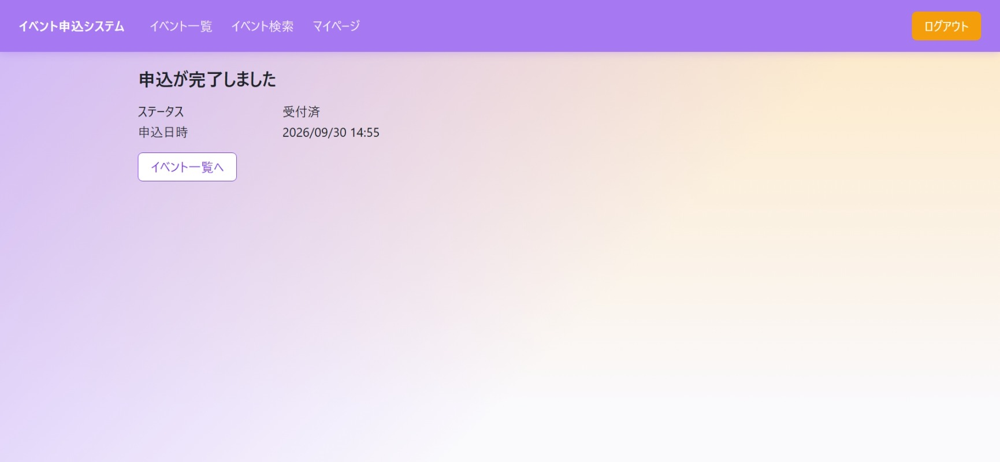

- **目的**：申込直後の結果（申込状況・申込日時）を表示する。
- **表示項目**：申込状況（受付済／キャンセル待ち）、申込日時。キャンセル待ちの場合は補足説明を表示する。
- **入力項目**：なし。
- **ボタン**：「イベント一覧へ」。
- **操作**：利用者が「イベント一覧へ」を押下するとSC-02（イベント一覧）へ遷移する。
- **API**：なし（直前の申込結果を表示する画面であり、専用の取得APIは持たない）。
- **異常時**：申込結果を直接参照できない状態（本画面への直接アクセスや再読み込みを行った場合等）でアクセスした場合、「申込結果を表示できません。イベント一覧からやり直してください。」と表示する。
- **制約**：本画面は、申込操作の直後に遷移してきた場合にのみ結果を表示できる画面とし、URLの直接指定や再読み込みからの結果復元には対応しない。

### SC-06 マイページ

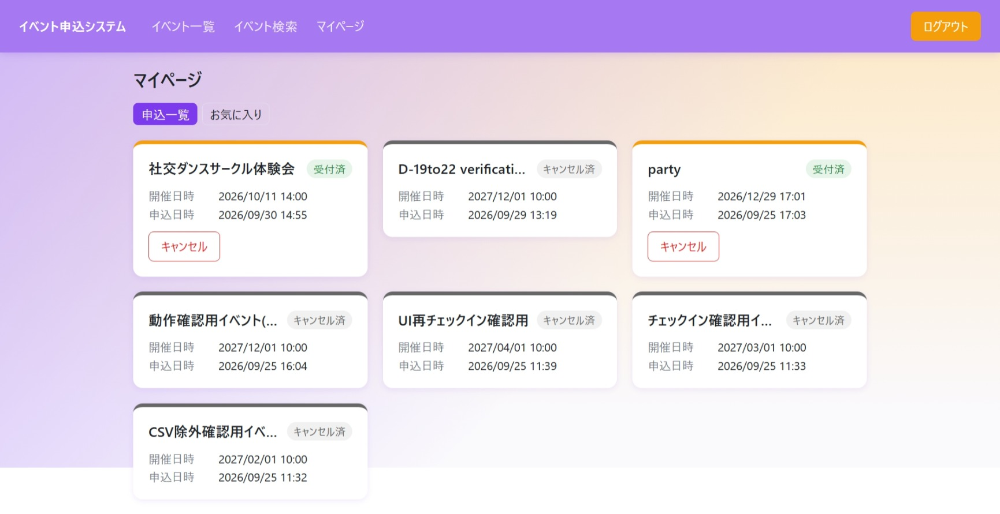

*お気に入りタブ*
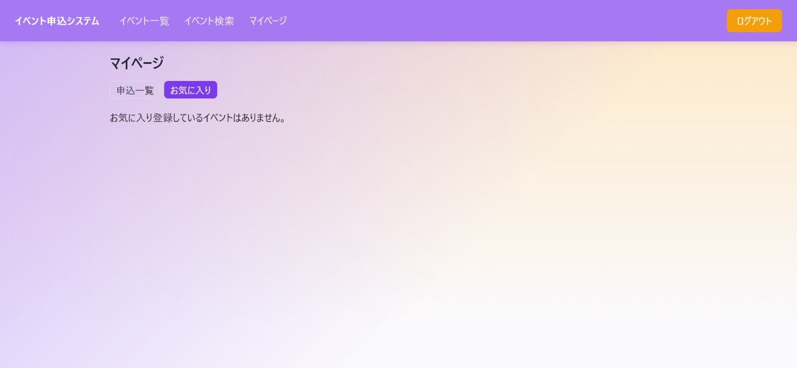

- **目的**：自分の申込状況の確認・キャンセル、自分のお気に入りの確認・解除。
- **表示項目**：タブ切替（申込一覧／お気に入り）。申込一覧タブでは、イベント名、状況（受付済／キャンセル待ち／キャンセル済。キャンセル待ちは順位も表示）、開催日時、申込日時。お気に入りタブでは、イベント名、受付状況、開催日時、場所。
- **入力項目**：なし。
- **ボタン**：タブ切替、「キャンセル」（受付済・キャンセル待ちの申込のみ表示）、「お気に入り解除」。
- **操作**：利用者が「キャンセル」を押下すると確認のうえ申込キャンセルAPI（AP-14）を呼び出す。「お気に入り解除」を押下するとお気に入り解除API（AP-17）を呼び出す。
- **API**：AP-13（自分の申込一覧取得）、AP-14（申込キャンセル）、AP-18（お気に入り一覧取得）、AP-17（お気に入り解除）。
- **正常時**：キャンセル・解除に成功すると該当タブの一覧を更新する。お気に入りの解除は、他画面の表示にも反映する。
- **異常時**：キャンセル・解除に失敗した場合はその旨を通知する。一覧の取得に失敗した場合はタブ内にエラーを表示する。
- **遷移**：イベント名を選択するとSC-04（イベント詳細）へ遷移する。

### SC-07 管理者ダッシュボード

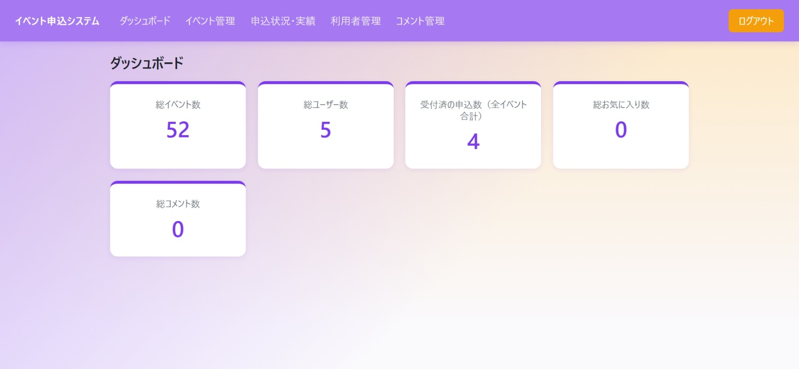

- **目的**：システム全体の概況（イベント数・利用者数・受付済申込数・お気に入り総数・コメント総数）を確認する。
- **表示項目**：総イベント数、総利用者数、受付済の申込数、総お気に入り数、総コメント数（D-20）。
- **入力項目**：なし。
- **API**：AP-04（イベント一覧取得）、AP-03（利用者一覧取得）、AP-22（申込実績取得）、AP-29（お気に入り総数取得）、AP-30（コメント総数取得）。
- **正常時**：5種の情報から集計した結果を表示する。
- **異常時**：いずれかの情報の取得に失敗した場合は、集計結果を表示せずエラーを表示する。

### SC-08 イベント管理

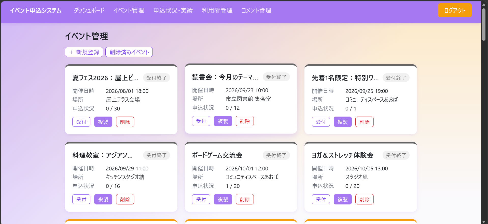

- **目的**：管理者向けのイベント一覧表示と、新規登録・削除・当日受付・削除済み一覧への導線を提供する。
- **表示項目**：「新規登録」「削除済みイベント」への導線、イベントの一覧（名称、受付状況、開催日時、場所、申込状況、当日受付への導線、複製ボタン、削除ボタン）。
- **ボタン**：「複製」（D-16。対象イベントの内容をSC-09の新規登録フォームへ複写する）、「削除」（確認のうえ実行し、削除済み一覧から後で復元できる旨を案内する）。
- **API**：AP-04（一覧取得）、AP-05（複製時、複製元イベントの詳細取得）、AP-09（イベント削除）。
- **正常時**：削除に成功すると一覧を更新する。複製操作自体はAPIを呼ばず、画面遷移のみを行う。
- **異常時**：削除に失敗した場合（受付済の申込が残っている等）は、その理由を通知する。複製元の詳細取得に失敗した場合はその旨を通知する。
- **遷移**：イベント名選択でSC-09（編集モード）、「新規登録」または「複製」でSC-09（新規登録モード。複製の場合は開催日時・申込締切を除く項目があらかじめ入力された状態）、「当日受付」導線でSC-11、「削除済みイベント」でSC-10へ遷移する。

### SC-09 イベント登録・編集

*編集モードの画面例（新規登録モードは見出しが「イベント登録」に変わる以外、同一のフォーム）*
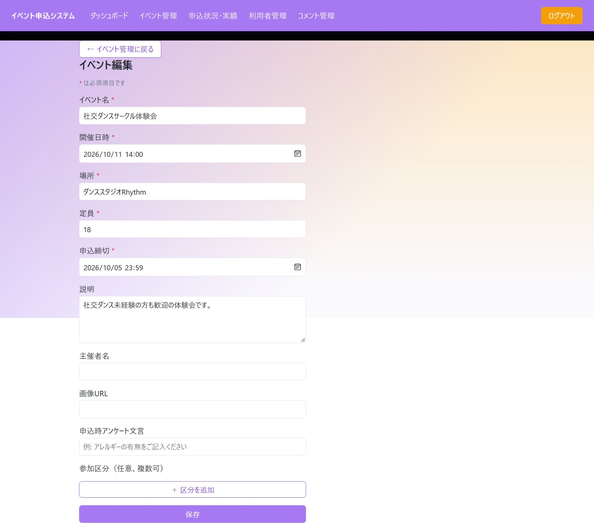

- **目的**：イベント情報および参加区分の新規登録・編集。同一画面を、新規登録・編集の両方の用途で使用する。SC-08・SC-10からの「複製」操作の複写先としても使用する（D-16）。
- **表示項目**：モードに応じた見出し（新規登録／編集）、必須項目の案内。複製元から遷移した場合は、複製元イベント名を示す案内文（開催日時・申込締切は未入力のため入力を促す旨）を表示する。
- **入力項目**：イベント名、開催日時、場所、定員（参加区分を1件以上設定した場合は自動算出され、直接入力はできない）、申込締切、説明、主催者名、画像URL、アンケート文言、参加区分（行の追加・削除、各行に区分名・定員）。
- **ボタン**：参加区分行ごとの「削除」、「区分を追加」、「保存」。
- **操作**：管理者が各項目を入力し「保存」を押下すると、新規登録時はイベント登録API（AP-07）、編集時はイベント更新API（AP-08）を呼び出す。区分の行を追加・削除すると、定員欄の表示に即座に反映する。
- **バリデーション**：必須項目の未入力・形式不正はサーバーの検証結果に従い、項目ごとにエラーを表示する。開催日時と申込締切の前後関係はサーバー側の検証結果に従う。
- **API**：AP-05（編集時の初期値取得）、AP-07（新規登録）、AP-08（更新）。
- **正常時**：保存に成功するとSC-08（イベント管理）へ遷移する。
- **異常時**：入力値エラーは項目ごとに表示する。権限エラー・データ未検出エラー・その他のエラーは、それぞれに応じたメッセージを表示する。

### SC-10 削除済みイベント

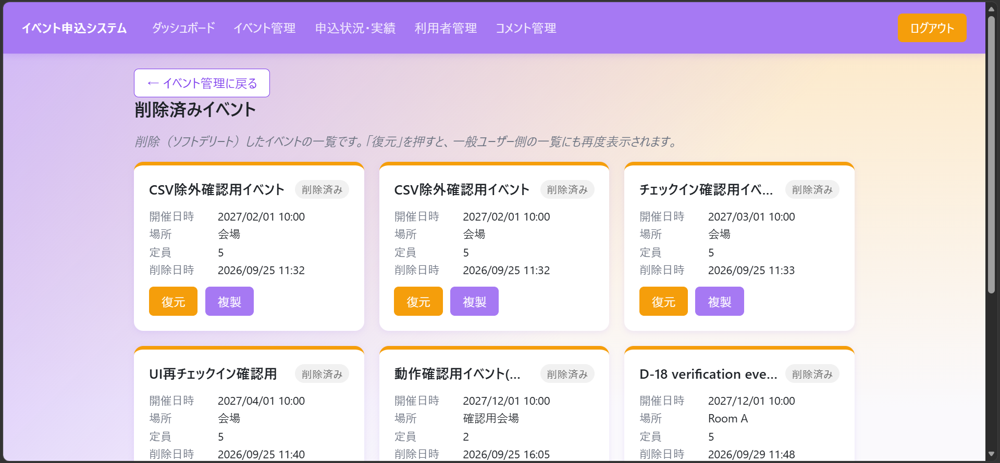

- **目的**：削除済みイベントの確認と復元。削除済みイベントを複製しての新規登録（D-16）にも対応する。
- **表示項目**：イベント名、削除済みである旨の表示、開催日時、場所、定員、削除日時。
- **ボタン**：「復元」（確認のうえ実行）、「複製」（D-16。対象イベントの内容をSC-09の新規登録フォームへ複写する）。
- **API**：AP-06（削除済み一覧取得。複製に必要な項目を含む）、AP-10（復元）。
- **正常時**：復元に成功すると一覧を更新する。複製操作自体はAPIを呼ばず、画面遷移のみを行う。
- **異常時**：復元に失敗した場合はその旨を通知する。

### SC-11 当日受付

*申込者が0名の状態。申込者がいる場合は一覧が表示される*
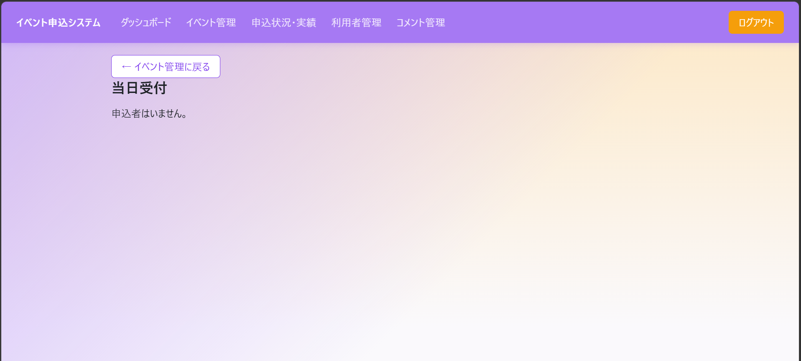

- **目的**：指定したイベントの申込者一覧表示とチェックイン。
- **表示項目**：アンケートの質問文言（対象イベントに設定がある場合のみ、一覧の見出しとして表示）、申込者名、参加区分（設定が無い場合は「-」）、状況、チェックイン日時（未実施の場合は「未チェックイン」）、アンケートへの回答（対象イベントにアンケート設定がある場合のみ列として表示。未回答の申込は空欄）。
- **ボタン**：「チェックイン」（状況が「受付済」の申込に表示。未チェックインの申込には常に表示し、チェックイン済みの申込にも再実行のために表示する）。
- **操作**：管理者が未チェックインの申込に対して「チェックイン」を押下すると、確認なしでチェックインAPI（AP-15）を呼び出す。既にチェックイン済みの申込に対して「チェックイン」を押下した場合は、再度チェックインしてよいかを確認したうえで、管理者が実行を選択した場合にのみAPI（AP-15）を呼び出す。
- **API**：AP-05（イベント詳細取得。アンケートの質問文言取得のため）、AP-11（申込者一覧取得）、AP-15（チェックイン）。
- **正常時**：チェックインに成功すると一覧を更新し、チェックイン日時を反映する。
- **異常時**：チェックインに失敗した場合（対象が「受付済」以外である等）はその理由を通知する。

### SC-12 申込状況・実績

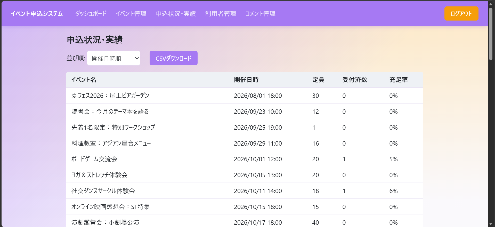

- **目的**：全イベントの申込状況（受付済数・充足率）の確認と、申込明細のCSVダウンロード。
- **表示項目**：並び順の選択、「CSVダウンロード」、集計テーブル（イベント名、開催日時、定員、受付済数、充足率）。ダウンロードするCSV明細には、申込ごとのアンケート回答列・参加区分列を含む（アンケート未設定のイベント、または回答が無い申込のアンケート回答列は空欄。参加区分が設定されていないイベントへの申込の参加区分列は空欄）。
- **入力項目**：並び順（開催日時順／受付数の多い順）。
- **API**：AP-22（申込実績取得。一覧取得・CSV取得の双方）。
- **正常時**：並び順の変更に応じて一覧を再表示する。CSVのダウンロードが完了する。
- **異常時**：一覧の取得に失敗した場合はエラーを表示する。CSVのダウンロードに失敗した場合はその旨を通知する。

### SC-13 利用者管理

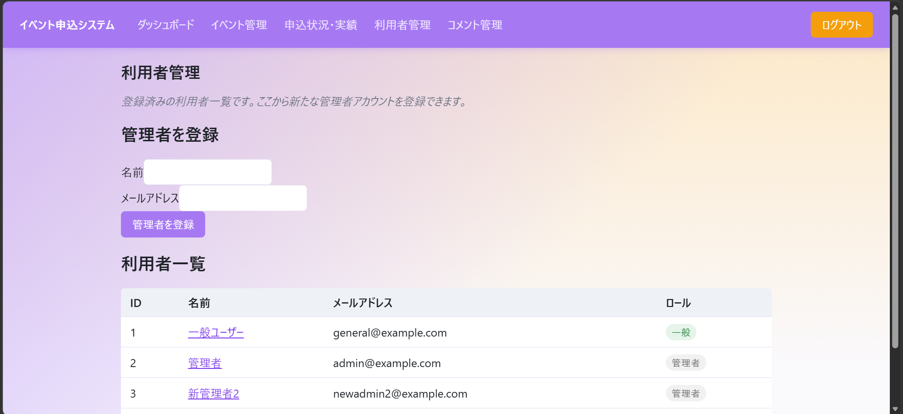

- **目的**：登録済み利用者の確認と、新たな管理者アカウントの登録。
- **表示項目**：利用者ID、名前、メールアドレス、利用者区分の一覧（各行に詳細への導線を持つ）。
- **入力項目**：管理者アカウント登録フォーム（名前、メールアドレス）。
- **ボタン**：「管理者を登録」。
- **操作**：管理者が名前・メールアドレスを入力し「管理者を登録」を押下すると、管理者アカウント登録API（AP-25）を呼び出す。一覧から利用者を選択するとSC-15（利用者詳細）へ遷移する。
- **バリデーション**：入力値エラーはサーバーの検証結果に従い、項目ごとに表示する。
- **API**：AP-03（利用者一覧取得）、AP-25（管理者アカウント登録）。
- **正常時**：登録に成功すると利用者一覧を更新する。
- **異常時**：取得に失敗した場合はエラーを表示する。登録するメールアドレスが既に登録済みの場合はその旨を表示する。

### SC-14 404（該当ページなし）

- **目的**：定義されていないURLへアクセスした際に表示する。
- **表示項目**：該当ページが無い旨のメッセージ。
- **ボタン**：「イベント一覧に戻る」。
- **操作**：利用者が「イベント一覧に戻る」を押下するとSC-02（イベント一覧）へ遷移する。
- **制約**：ログイン状態によらず表示できる画面とする。

### SC-15 利用者詳細

*申込・お気に入り・コメントがいずれも0件の利用者の例*
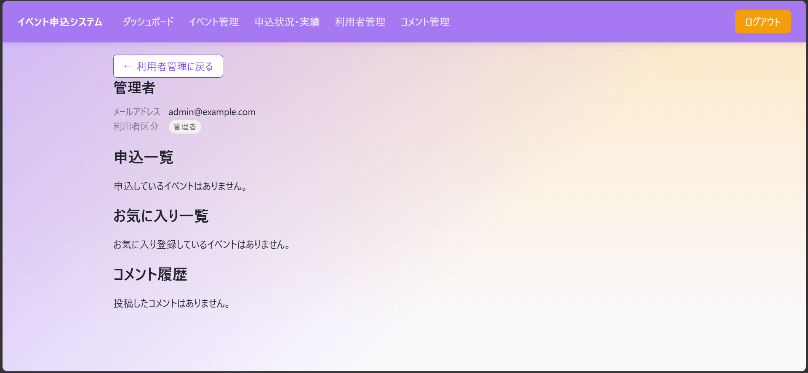

- **目的**：特定の利用者の基本情報・申込履歴・お気に入り履歴・コメント履歴を、管理者が確認する（D-13、D-21）。
- **表示項目**：利用者名・メールアドレス・利用者区分。申込一覧（イベント名、状況、開催日時、申込日時。キャンセル待ちの場合は順位も表示）。お気に入り一覧（イベント名、受付状況、開催日時、場所、登録日時）。コメント履歴（投稿先のイベント名、本文、投稿日時。論理削除済みのコメントも含み、その場合は本文が削除済み表示に置き換わる、D-21）。
- **入力項目**：なし。
- **ボタン**：「利用者管理に戻る」。
- **操作**：SC-13（利用者管理）の一覧から利用者を選択するとこの画面へ遷移する。「利用者管理に戻る」を押下するとSC-13へ遷移する。
- **API**：AP-26（利用者情報取得）、AP-27（申込一覧取得）、AP-28（お気に入り一覧取得）、AP-31（コメント履歴取得）。
- **正常時**：利用者の基本情報・申込一覧・お気に入り一覧・コメント履歴を表示する。
- **異常時**：対象の利用者が存在しない場合はその旨を表示する。いずれかの情報の取得に失敗した場合はエラーを表示する。
- **制約**：管理者以外はこの機能を利用できない。閲覧専用の画面とし、キャンセル・お気に入り解除・コメント削除等、対象利用者に代わる操作は行えない（利用者本人向けのSC-06マイページとは役割が異なる）。

### SC-16 コメントモデレーション

*コメントが0件の状態。有効なコメントが存在する場合は、その一覧が表示される*
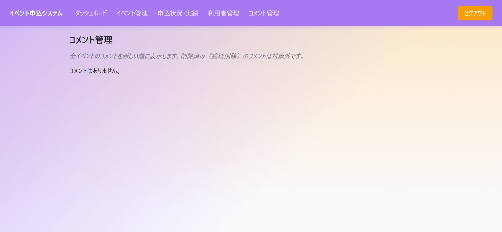

- **目的**：管理者が全イベント横断でコメントを確認し、不適切な投稿等を削除できる（D-22）。
- **表示項目**：コメント一覧（イベント名、投稿者名、本文、投稿日時）。投稿日時降順で表示し、有効な（論理削除されていない）コメントのみを対象とする。イベント別・投稿者別の絞り込みは設けない。
- **入力項目**：なし。
- **ボタン**：各コメントの「削除」。
- **操作**：管理者が「削除」を押下すると、確認のうえコメント削除API（AP-21）を呼び出す。
- **API**：AP-32（全コメント一覧取得）、AP-21（コメント削除）。
- **正常時**：削除に成功すると一覧を更新する。
- **異常時**：一覧の取得に失敗した場合はエラーを表示する。削除に失敗した場合はその旨を通知する。
- **制約**：管理者以外はこの機能を利用できない。絞り込み機能は提供しないが、各行にイベント名・投稿者名を表示することで、どのイベント・誰の投稿かが分かるようにする。
