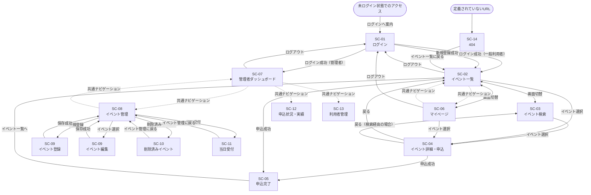
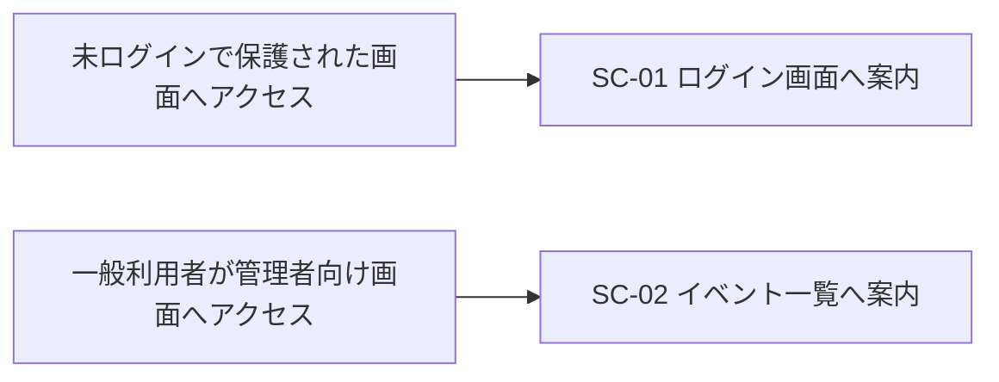
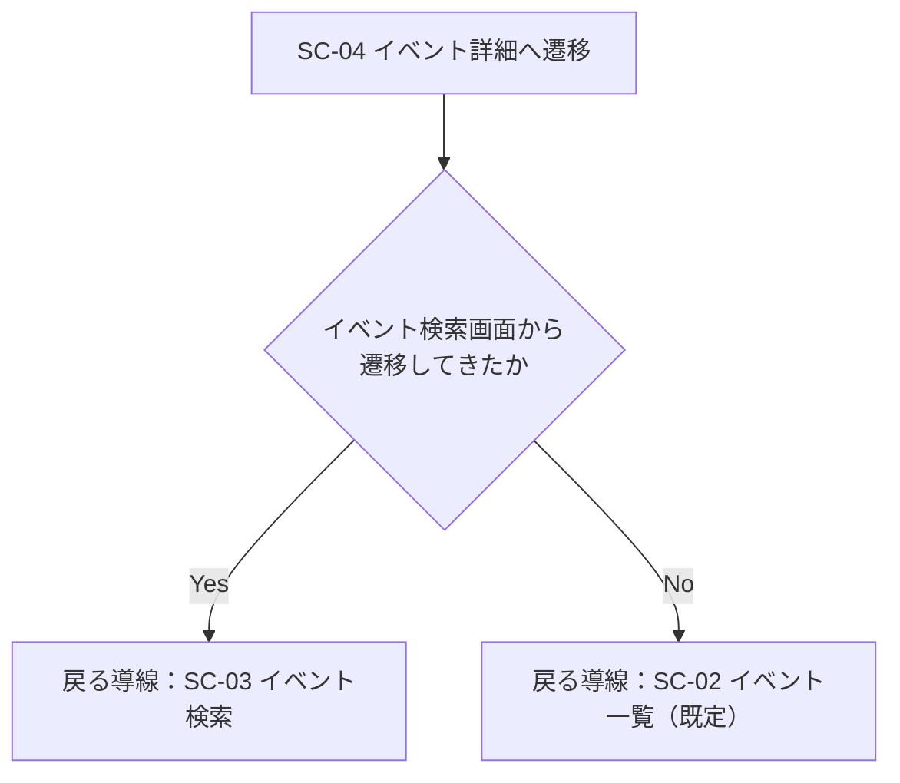

# 05_画面遷移図

## 1. 概要

本書は、利用者がイベント申込システムをどのような順序で利用するかを表す画面遷移図である。画面の詳細は`docs/04_画面設計書.md`を参照。

## 2. 画面遷移の制御方針

- ログイン画面（SC-01）を除く全ての画面は、ログイン状態でなければ利用できず、未ログインの場合はログイン画面へ案内する。
- 管理者向け画面（SC-07〜SC-13）は、管理者としてログインしている場合にのみ利用でき、一般利用者がアクセスした場合はイベント一覧画面（SC-02）へ案内する。
- 定義されていないURLへアクセスした場合は、404画面（SC-14）を表示する。

## 3. 全体画面遷移図

図中の実線は画面上の操作による遷移、点線は共通ナビゲーションからの遷移（どの画面からでも選択可能）を表す。「ログアウト」は共通ナビゲーションから全てのログイン中画面で行える（図では代表画面のみ記載）。

## 4. ログイン状態によるアクセス制御

## 5. イベント詳細画面の「戻る」導線

イベント詳細画面（SC-04）は、遷移元の画面に応じて「戻る」導線の遷移先を切り替える。

## 6. 申込完了画面への遷移

申込完了画面（SC-05）は、イベント一覧（SC-02）またはイベント詳細（SC-04）での申込成功に伴う遷移によってのみ、申込結果を表示できる画面とする。この遷移を経ずに本画面へ直接アクセスした場合は、`docs/04_画面設計書.md`SC-05に定める代替表示を行う。
