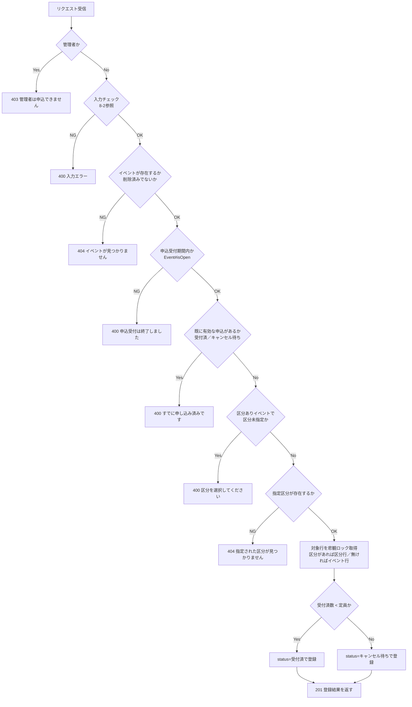
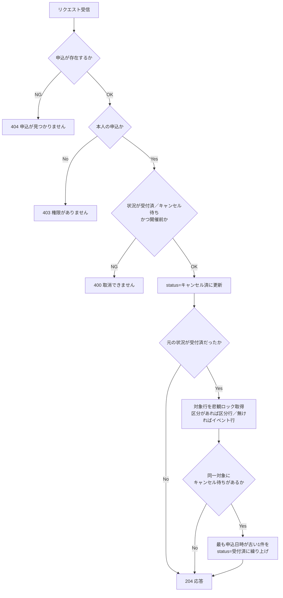
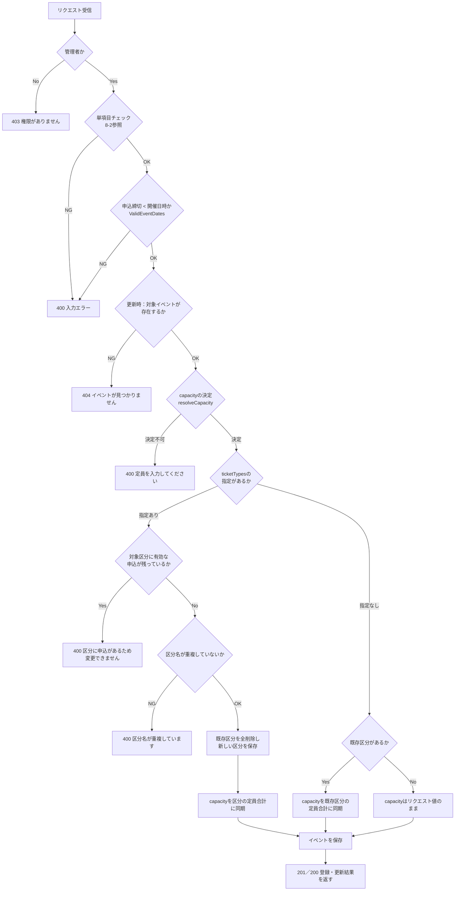
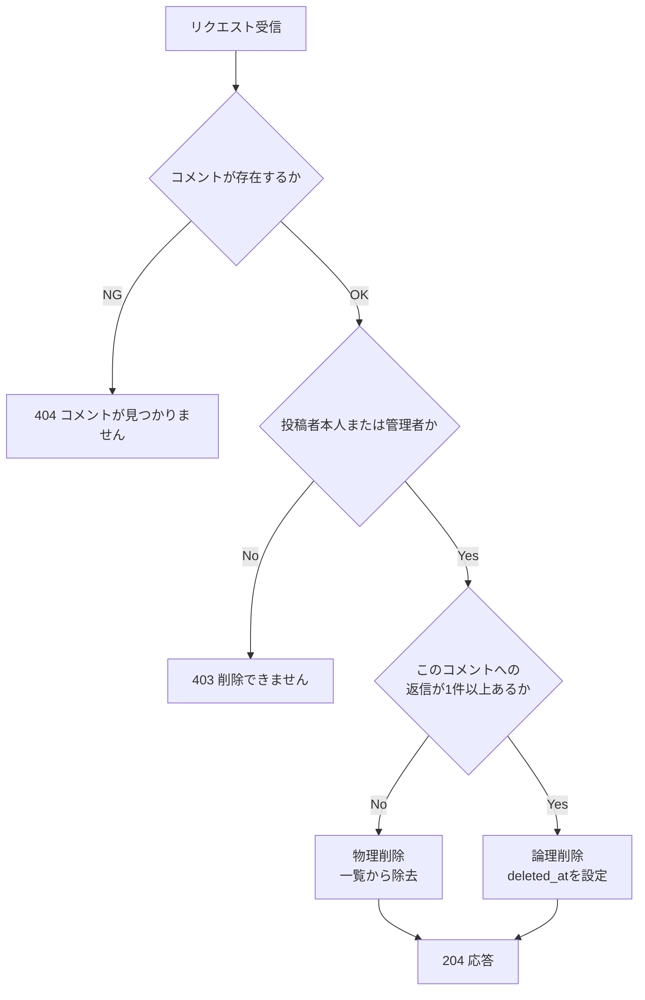
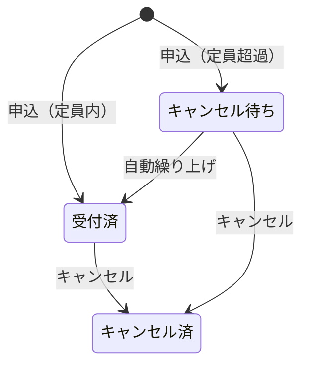
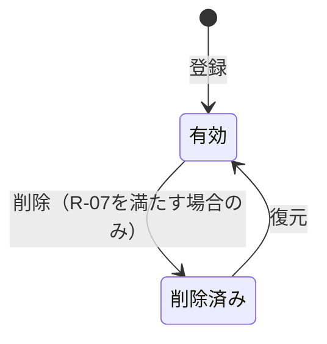
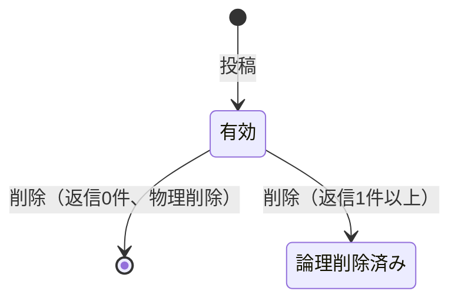

# 06_詳細設計書

## 1. 概要

本書は、`docs/01_要件定義書.md`の各機能（F-01〜F-17）を、Controller／Service／Repositoryのどのクラス・メソッドで実現するか、処理の順序・条件分岐・業務ルール・状態遷移・トランザクション制御をどう設計しているかを定義する詳細設計書である。`docs/03_API設計書.md`のAPI個別仕様（AP-01〜34）、`docs/02_テーブル定義書.md`のテーブル定義と矛盾しないものとする。

対象は現時点で実装済みのバックエンド（Spring Boot）の構成であり、実装（コード）を正とし、本書はその設計意図を説明する位置づけとする（`docs/03_API設計書.md`§1.1と同じ考え方）。

## 7-1 対象機能一覧

`docs/01_要件定義書.md`「5. システム機能」の機能ID（F-01〜F-17）と、対応する画面ID（`docs/04_画面設計書.md`）・API ID（`docs/03_API設計書.md`）の対応は次のとおり。1機能が複数画面・複数APIにまたがる場合はすべて列挙する。

| 機能ID | 機能名 | 画面ID | API ID |
|---|---|---|---|
| F-01 | ログイン | SC-01 | AP-01 |
| F-02 | 利用者登録 | SC-01 | AP-02 |
| F-03 | イベント一覧・検索 | SC-02, SC-03 | AP-04 |
| F-04 | イベント詳細確認 | SC-02, SC-04 | AP-05 |
| F-05 | イベント申込 | SC-02, SC-04 | AP-12 |
| F-06 | 申込確認・キャンセル | SC-06 | AP-13, AP-14 |
| F-07 | お気に入り管理 | SC-02, SC-03, SC-04, SC-06 | AP-16, AP-17, AP-18 |
| F-08 | イベントコメント | SC-04, SC-16 | AP-19, AP-20, AP-21, AP-30, AP-32 |
| F-09 | イベント登録・編集 | SC-08, SC-09, SC-10 | AP-04, AP-05, AP-06, AP-07, AP-08 |
| F-10 | イベント削除・復元 | SC-08, SC-10 | AP-09, AP-10 |
| F-11 | 当日受付 | SC-11 | AP-05, AP-11, AP-15 |
| F-12 | 申込実績確認・出力 | SC-12 | AP-22 |
| F-13 | 利用者一覧確認 | SC-13, SC-15 | AP-03, AP-26, AP-27, AP-28, AP-31 |
| F-14 | 管理者ダッシュボード | SC-07 | AP-04, AP-03, AP-22, AP-29, AP-30 |
| F-15 | 管理者アカウント登録 | SC-13 | AP-25 |
| F-16 | 管理者権限の降格 | SC-15 | AP-33 |
| F-17 | 利用者の退会（匿名化） | SC-06, SC-15 | AP-34 |

このほか、AP-23（ログイン中利用者情報取得）・AP-24（稼働確認）は特定の機能ID・画面には対応しない、開発・動作確認用の横断的なAPIである。

## 7-2 クラス構成

各APIを処理するController・Service・Repositoryのメソッドは次のとおり。業務ロジックはService層に置き、Controllerは認可チェックの起動・入力チェックの起動・レスポンスの整形に限定する（7-8参照）。

| API ID | Controller#メソッド | Service#メソッド | Repository#メソッド（主なもの） |
|---|---|---|---|
| AP-01 | `UserController#login` | `UserService#login` | `UserRepository#findByEmail` |
| AP-02 | `UserController#register` | `UserService#register` | `UserRepository#existsByEmail`／`#save` |
| AP-03 | `UserController#list` | `UserService#list` | `UserRepository#findAllByOrderByIdAsc` |
| AP-04 | `EventController#list` | `EventService#list` | `EventRepository#findAllByDeletedAtIsNullOrderByStartAtAsc`、`ApplicationRepository#countByEvent_IdAndStatus`、`FavoriteRepository#countByEvent_Id` |
| AP-05 | `EventController#detail` | `EventService#getDetail` | `EventRepository#findByIdAndDeletedAtIsNull`、`TicketTypeRepository#findByEvent_Id`、上記の集計系 |
| AP-06 | `EventController#listDeleted` | `EventService#listDeleted` | `EventRepository#findAllByDeletedAtIsNotNullOrderByStartAtAsc`、`TicketTypeRepository#findByEvent_Id` |
| AP-07 | `EventController#create` | `EventService#create`（内部で`resolveCapacity`／`saveTicketTypes`） | `EventRepository#save`、`TicketTypeRepository#save`、`ApplicationRepository#existsByEvent_IdAndStatusIn` |
| AP-08 | `EventController#update` | `EventService#update`（同上） | `EventRepository#findByIdAndDeletedAtIsNull`、上記に同じ |
| AP-09 | `EventController#delete` | `EventService#delete` | `EventRepository#findByIdAndDeletedAtIsNull`、`ApplicationRepository#countByEvent_IdAndStatus` |
| AP-10 | `EventController#restore` | `EventService#restore` | `EventRepository#findByIdAndDeletedAtIsNotNull` |
| AP-11 | `EventController#attendees` | `ApplicationService#listAttendees` | `EventRepository#findByIdAndDeletedAtIsNull`、`ApplicationRepository#findByEvent_IdOrderByAppliedAtAsc` |
| AP-12 | `ApplicationController#apply` | `ApplicationService#apply`（内部で`resolveTicketType`） | `EventRepository#findByIdAndDeletedAtIsNull`／`#findByIdForUpdate`、`TicketTypeRepository#existsByEvent_Id`／`#findByIdAndEvent_IdForUpdate`、`ApplicationRepository#existsByUser_IdAndEvent_IdAndStatusIn`／`#countBy*`／`#save` |
| AP-13 | `ApplicationController#myApplications` | `ApplicationService#myApplications` | `ApplicationRepository#findByUser_IdOrderByAppliedAtDesc` |
| AP-14 | `ApplicationController#cancel` | `ApplicationService#cancel` | `ApplicationRepository#findById`、`TicketTypeRepository#findByIdForUpdate`、`EventRepository#findByIdForUpdate`、`ApplicationRepository#findFirstBy*` |
| AP-15 | `ApplicationController#checkIn` | `ApplicationService#checkIn` | `ApplicationRepository#findById` |
| AP-16 | `FavoriteController#add` | `FavoriteService#add` | `EventRepository#findByIdAndDeletedAtIsNull`、`FavoriteRepository#findByUser_IdAndEvent_Id`／`#save` |
| AP-17 | `FavoriteController#remove` | `FavoriteService#remove` | `FavoriteRepository#deleteByUser_IdAndEvent_Id` |
| AP-18 | `FavoriteController#myFavorites` | `FavoriteService#myFavorites` | `FavoriteRepository#findByUser_IdOrderByCreatedAtDesc`、`ApplicationRepository#countByEvent_IdAndStatus` |
| AP-19 | `CommentController#list` | `EventCommentService#list` | `EventRepository#findByIdAndDeletedAtIsNull`、`EventCommentRepository#findByEvent_IdOrderByCreatedAtAscIdAsc` |
| AP-20 | `CommentController#post` | `EventCommentService#post` | `EventRepository#findByIdAndDeletedAtIsNull`、`EventCommentRepository#findByIdAndEvent_Id`／`#save` |
| AP-21 | `CommentController#delete` | `EventCommentService#delete` | `EventCommentRepository#findById`／`#existsByParentComment_Id`／`#delete` |
| AP-22 | `ReportController#report` | `ReportService#summarize`／`#toCsv` | `EventRepository#findAllByDeletedAtIsNullOrderByStartAtAsc`、`ApplicationRepository#countByEvent_IdAndStatus`／`#findAllByEvent_DeletedAtIsNullOrderByEvent_StartAtAsc` |
| AP-23 | `PingController#whoami` | （なし。`AuthContext#getCurrentUser`を直接参照） | - |
| AP-24 | `PingController#ping` | `PingService#pong` | - |
| AP-25 | `UserController#registerAdmin` | `UserService#registerAdmin` | `UserRepository#existsByEmail`／`#save` |
| AP-26 | `UserController#getUser` | `UserService#getById` | `UserRepository#findById` |
| AP-27 | `UserController#applicationsOf` | `UserService#getById`＋`ApplicationService#myApplications` | `UserRepository#findById`、`ApplicationRepository#findByUser_IdOrderByAppliedAtDesc` |
| AP-28 | `UserController#favoritesOf` | `UserService#getById`＋`FavoriteService#myFavorites` | `UserRepository#findById`、`FavoriteRepository#findByUser_IdOrderByCreatedAtDesc` |
| AP-29 | `FavoriteController#count` | `FavoriteService#countAll` | `FavoriteRepository#count` |
| AP-30 | `CommentController#count` | `EventCommentService#countActive` | `EventCommentRepository#countByDeletedAtIsNull` |
| AP-31 | `UserController#commentsOf` | `UserService#getById`＋`EventCommentService#listByUser` | `UserRepository#findById`、`EventCommentRepository#findByUser_IdOrderByCreatedAtDescIdDesc` |
| AP-32 | `CommentController#listAll` | `EventCommentService#listAllActive` | `EventCommentRepository#findByDeletedAtIsNullOrderByCreatedAtDesc` |

**各層の責務**

| 層 | 書くこと | 書かないこと |
|---|---|---|
| Controller | リクエストの受け取り、認可チェックの起動（`AuthContext#requireAdmin`等）、入力チェックの起動、レスポンスの整形（HTTPステータスの決定を含む） | 業務ルールの判定、DBアクセス |
| Service | 業務ルールの判定、業務例外のスロー、トランザクション制御（`@Transactional`） | HTTPに関する処理 |
| Repository | DBの読み書き（Spring Data JPAのメソッドクエリ／`@Query`） | 業務ルールの判定 |

AP-23（ログイン中利用者情報取得）のみ、開発・動作確認用の単純な参照のためService層を経由しない例外である。

## 7-3 処理フロー

代表的な機能について、処理順序をフローチャートで示す。基本の順序は「認可チェック → 入力チェック → 存在チェック → 業務ルールチェック → 登録・更新 → レスポンス返却」であり、認可チェックを入力チェックより先に行う点が一般的なWeb APIの設計と異なる（理由は`docs/07_バリデーション設計書.md`8-1「権限チェックとバリデーションの順序」参照）。

### AP-12 イベント申込（`ApplicationService#apply`）

### AP-14 申込キャンセル（`ApplicationService#cancel`）

### AP-07／AP-08 イベント登録・編集（`EventService#create`／`#update`）

### AP-21 コメント削除（`EventCommentService#delete`）

## 7-4 条件分岐

7-3の各フローにおける判定を、条件・真偽の場合・エラーIDの対応として整理する（エラーIDは`docs/08_エラー設計書.md`8-3に登録する）。

### AP-12 イベント申込

| No | 条件 | 真の場合 | 偽の場合（例外／エラーID） |
|---|---|---|---|
| 1 | 申込者が管理者でない | 次へ | `ForbiddenException`／E-A-005 |
| 2 | 単項目チェックを満たす | 次へ | `ConstraintViolationException`／E-V-xxx |
| 3 | 対象イベントが存在し削除済みでない | 次へ | `NotFoundException`／E-B-001 |
| 4 | 申込受付期間内（`Event#isOpen`） | 次へ | `BusinessException`／E-B-002 |
| 5 | 有効な申込（受付済／キャンセル待ち）が無い | 次へ | `BusinessException`／E-B-003 |
| 6 | 区分ありイベントで区分が指定されている（区分無しなら本判定は行わない） | 次へ | `BusinessException`／E-B-004 |
| 7 | 指定した区分が対象イベントに存在する | 次へ | `NotFoundException`／E-B-005 |
| 8 | 受付済数 ＜ 定員 | status=受付済 | status=キャンセル待ち（エラーにはしない） |

### AP-07／AP-08 イベント登録・編集

| No | 条件 | 真の場合 | 偽の場合（例外／エラーID） |
|---|---|---|---|
| 1 | 管理者である | 次へ | `ForbiddenException`／E-A-002 |
| 2 | 単項目チェックを満たす（`@NotBlank`・`@Size`・`@Min`等） | 次へ | `ConstraintViolationException`／E-V-xxx |
| 3 | 申込締切が開催日時より前（`@ValidEventDates`） | 次へ | `ConstraintViolationException`／E-V-021 |
| 4 | （更新時）対象イベントが存在し削除済みでない | 次へ | `NotFoundException`／E-B-001 |
| 5 | capacityまたはticketTypesのいずれかから定員が決定できる | 次へ | `BusinessException`／E-B-006 |
| 6 | （区分指定時）対象区分に有効な申込が残っていない | 次へ | `BusinessException`／E-B-007 |
| 7 | （区分指定時）区分名が重複していない | 次へ | `BusinessException`／E-B-008 |
| 8 | （区分の全置換時）キャンセル済の申込が対象区分を参照したまま残っていない | 次へ | `BusinessException`／E-B-017（区分削除時のDB制約`fk_applications_ticket_type`のRESTRICT違反を検出） |

### AP-14 申込キャンセル

| No | 条件 | 真の場合 | 偽の場合（例外／エラーID） |
|---|---|---|---|
| 1 | 対象の申込が存在する | 次へ | `NotFoundException`／E-B-009 |
| 2 | 本人の申込である | 次へ | `ForbiddenException`／E-A-003 |
| 3 | 状況が受付済またはキャンセル待ち、かつ開催前である | 次へ | `BusinessException`／E-B-010 |

### AP-21 コメント削除

| No | 条件 | 真の場合 | 偽の場合（例外／エラーID） |
|---|---|---|---|
| 1 | 対象のコメントが存在する | 次へ | `NotFoundException`／E-B-011 |
| 2 | 投稿者本人または管理者である | 次へ | `ForbiddenException`／E-A-004 |
| 3 | 返信が1件以上ある | 論理削除（`deleted_at`設定） | 物理削除（一覧から除去） |

## 7-5 業務ルール

`docs/01_要件定義書.md`「7. 業務ルール」を、判定式・例外クラス・エラーID・適用機能の単位に具体化したものを次に示す。エラーIDは`docs/08_エラー設計書.md`8-3に登録する。

| No | 種類 | ルール | 判定式（概要） | 違反時の例外 | エラーID | 適用機能 |
|---|---|---|---|---|---|---|
| R-01 | 日付・状態 | 申込受付は申込締切以前かつ開催日時より前のみ | `Event#isOpen(now)` | `BusinessException` | E-B-002 | F-05 |
| R-02 | 上限・妥当性 | 定員（区分があれば区分単位）を超えたら受付済にせずキャンセル待ちにする | `acceptedCount < capacity` | （エラーにしない） | - | F-05 |
| R-03 | 上限・妥当性 | 同一利用者・同一イベントで有効な申込（受付済／キャンセル待ち）は1件まで | `existsByUser_IdAndEvent_IdAndStatusIn` | `BusinessException` | E-B-003 | F-05 |
| R-04 | 日付・状態 | キャンセルは本人の申込かつ受付済／キャンセル待ちかつ開催前のみ | `ACTIVE_STATUSES.contains(status) && now.isBefore(startAt)` | `BusinessException` | E-B-010 | F-06 |
| R-05 | 上限・妥当性 | 受付済のキャンセル発生時、同一対象で最も申込日時が古いキャンセル待ちを1件繰り上げる | `findFirstBy...OrderByAppliedAtAsc` | （自動処理） | - | F-06 |
| R-06 | 日付・状態 | チェックインは状況が「受付済」の申込のみ | `status == 受付済` | `BusinessException` | E-B-012 | F-11 |
| R-07 | 上限・妥当性 | 受付済の申込が1件でも存在するイベントは削除できない | `countByEvent_IdAndStatus(受付済) > 0` | `BusinessException` | E-B-013 | F-10 |
| R-08 | 日付・状態 | 削除済みでないイベントは復元できない | `findByIdAndDeletedAtIsNotNull` | `NotFoundException` | E-B-014 | F-10 |
| R-09 | 上限・妥当性 | 参加区分に有効な申込が残っている状態での区分変更は拒否する | `existsByEvent_IdAndStatusIn` | `BusinessException` | E-B-007 | F-09 |
| R-10 | 上限・妥当性 | 同一イベント内で参加区分名の重複を禁止する | `distinctNames < requests.size()` | `BusinessException` | E-B-008 | F-09 |
| R-11 | 上限・妥当性 | 定員は「参加区分が1件も無い場合のみ」必須。区分がある場合は区分の定員合計を用いる | `resolveCapacity()` | `BusinessException` | E-B-006 | F-09 |
| R-12 | 上限・妥当性 | 同一利用者・同一イベントのお気に入りは重複登録しない（冪等） | `findByUser_IdAndEvent_Id`の有無で新規／既存を分岐 | （エラーにしない） | - | F-07 |
| R-13 | 日付・状態 | コメントの削除は投稿者本人または管理者のみ | `isOwnedBy(userId) \|\| isAdmin` | `ForbiddenException` | E-A-004 | F-08 |
| R-14 | 上限・妥当性 | 返信が1件以上あるコメントは物理削除せず論理削除する | `existsByParentComment_Id` | （自動判定） | - | F-08 |
| R-15 | 上限・妥当性 | メールアドレスの重複登録は禁止する（利用者登録・管理者登録とも） | `existsByEmail` | `BusinessException` | E-B-015 | F-02, F-15 |
| R-16 | 上限・妥当性 | 降格の対象利用者が管理者であること（既に一般利用者は降格できない） | `User#isAdmin()` | `BusinessException` | E-B-019 | F-16 |
| R-17 | 上限・妥当性 | システム全体で管理者が対象利用者1人のみの場合、その管理者を降格できない | `countByRole("admin") <= 1` | `BusinessException` | E-B-020 | F-16 |
| R-18 | 上限・妥当性 | 退会（匿名化）の対象利用者が管理者でないこと（管理者は先に降格が必要） | `User#isAdmin()` | `BusinessException` | E-B-021 | F-17 |
| R-19 | 上限・妥当性 | 既に退会済みの利用者を再度退会させることはできない | `User#isAnonymized()` | `BusinessException` | E-B-022 | F-17 |
| R-20 | 日付・状態 | 退会（匿名化）は対象利用者本人、または管理者のみ実行できる | `requestingIsAdmin \|\| requestingUserId.equals(id)` | `ForbiddenException` | E-A-007 | F-17 |

## 7-6 状態遷移

### applications.status（申込状況）

| status値 | 意味 |
|---|---|
| `受付済` | 定員内で受け付けられた申込 |
| `キャンセル待ち` | 定員超過により繰り上げ待ちとなっている申込 |
| `キャンセル済` | 利用者が取り消した申込 |

| 遷移元 | 遷移先 | 操作（機能ID） | 実行できるロール | 条件（7-5参照） |
|---|---|---|---|---|
| （なし） | `受付済` | イベント申込（F-05） | 一般利用者 | R-02（受付済数＜定員） |
| （なし） | `キャンセル待ち` | イベント申込（F-05） | 一般利用者 | R-02（受付済数≧定員） |
| `キャンセル待ち` | `受付済` | 自動繰り上げ（F-06に付随） | （システムが自動実行） | R-05（受付済のキャンセル発生） |
| `受付済` | `キャンセル済` | 申込キャンセル（F-06） | 一般利用者（本人）、管理者（F-11のチェックインとは別に本人操作のみ許可） | R-04 |
| `キャンセル待ち` | `キャンセル済` | 申込キャンセル（F-06） | 同上 | R-04 |

許可されていない遷移（例：`キャンセル済`から`受付済`への復帰、開催後のキャンセル）は、いずれもR-04の判定により`BusinessException`（400、E-B-010）で拒否する。

### events.deleted_at（イベントの有効・削除状態）

| 状態 | 意味 |
|---|---|
| 有効（`deleted_at IS NULL`） | 一覧・検索・申込の対象 |
| 削除済み（`deleted_at`に日時あり） | 一覧・検索・申込の対象外。履歴として申込等は保持したまま |

### event_comments.deleted_at（コメントの有効・削除状態）

コメントは他の2つと異なり、「削除」操作の結果が返信の有無によって物理削除／論理削除の2通りに分岐する（R-14）。論理削除されたコメントに復元操作は無い。

## 7-7 トランザクション・排他制御

複数テーブルを更新する処理、および同時実行時に定員超過などの不整合が起きうる処理について、トランザクション範囲と排他制御は次のとおり（`docs/01_要件定義書.md`10.4節）。

| 機能ID | トランザクション範囲 | 排他制御 | 理由 |
|---|---|---|---|
| F-05 | `ApplicationService#apply`（定員判定〜申込登録） | 悲観ロック（区分があれば`TicketTypeRepository#findByIdAndEvent_IdForUpdate`、無ければ`EventRepository#findByIdForUpdate`で対象行を`SELECT ... FOR UPDATE`） | 同時申込で定員判定が競合し、受付済件数が定員を超えるのを防ぐ |
| F-06（キャンセルに伴う繰り上げ） | `ApplicationService#cancel`（キャンセル〜繰り上げ判定） | 悲観ロック（同上。区分があれば`TicketTypeRepository#findByIdForUpdate`、無ければ`EventRepository#findByIdForUpdate`） | 同時キャンセル・同時申込との間で、繰り上げの二重実行や取りこぼしを防ぐ |
| F-09 | `EventService#create`／`#update`（イベント本体と参加区分の保存） | 明示的なロックは取得しない | 管理者操作のみが対象であり、同一イベントへの同時編集は運用上想定しない（`docs/01_要件定義書.md`10.1節） |

ロックの範囲は「定員判定から申込登録・繰り上げまでの間」に限定し、当該メソッドのトランザクション終了（コミット）時に解放される。参加区分の無いイベントはイベント行、参加区分があるイベントは対象区分行をロック対象とする。

## 7-8 共通処理

複数の機能で共通して使われる処理は次のとおり。同じチェックを業務ロジックと共通処理の両方に重複定義しないよう、認可チェックは`AuthContext`に、エラー整形は`GlobalExceptionHandler`に集約している。

| 共通処理名 | 用途 | 実装単位（クラス名） | 利用する機能ID／API |
|---|---|---|---|
| エラーレスポンス組み立て | エラーを統一形式（`ErrorResponse`）で返す | `GlobalExceptionHandler`（`@RestControllerAdvice`） | 全API（`docs/08_エラー設計書.md`参照） |
| ダミー認証（利用者の特定） | `X-User-Id`ヘッダから利用者を解決する | `AuthInterceptor`（`HandlerInterceptor`） | `/api/**`のうちログイン・利用者登録・稼働確認を除く全API |
| ログイン中利用者情報の受け渡し | Controller／Serviceがログイン中利用者を参照できるようにする | `AuthContext`（リクエストスコープBean） | 同上 |
| 管理者権限チェック | 管理者専用APIで一般利用者を拒否する | `AuthContext#requireAdmin` | 管理者専用の全API |
| 定員の決定 | リクエストのcapacity・参加区分から実際の定員を決定する（R-11） | `EventService#resolveCapacity`（private） | AP-07, AP-08 |
| 申込区分の解決 | 対象イベントの区分有無・指定区分の存在を検証する | `ApplicationService#resolveTicketType`（private） | AP-12 |
| CSVフィールドのエスケープ | カンマ・改行・ダブルクォートを含む値を引用符で囲む | `ReportService#csvField`（private） | AP-22（CSV） |
| Swagger UIへの認証ヘッダ欄自動追加 | `X-User-Id`の入力欄をSwagger UI上に追加する | `SwaggerAuthHeaderCustomizer`（`OperationCustomizer`） | Swagger UI（認証不要な3 APIを除く） |
| 未ログイン・権限なし時のルート制御（フロントエンド） | 保護ルートへの直接アクセス、管理者専用ルートへの一般利用者アクセスを制御する | `authGuard`／`adminGuard`（`CanActivateFn`） | 全画面（`docs/09_認証認可設計書.md`9-7参照） |
| 認証ヘッダの自動付与（フロントエンド） | 全HTTPリクエストに`X-User-Id`を付与する | `dummyAuthInterceptor`（`HttpInterceptorFn`） | 全API呼び出し |
| 通信エラーの正規化（フロントエンド） | サーバーに接続できない場合のメッセージを統一する | `httpErrorInterceptor`（`HttpInterceptorFn`） | 全API呼び出し |
| コメントの木構造への組み立て（フロントエンド） | フラットな配列を`parentCommentId`から親子構造に組み立てる | `buildCommentTree`（`core/comment-api.ts`） | SC-04 |

## 7-9 使用するデータ（CRUD表）

各機能が、6テーブル（`docs/02_テーブル定義書.md`）をそれぞれ作成（C）・参照（R）・更新（U）・削除（D）のどれで使うかを示す。

| 機能ID | users | events | ticket_types | applications | favorites | event_comments |
|---|:--:|:--:|:--:|:--:|:--:|:--:|
| F-01 | R | | | | | |
| F-02 | C・R | | | | | |
| F-03 | | R | | R | R | |
| F-04 | | R | R | R | R | R |
| F-05 | R | R | R | C・R | | |
| F-06 | | R | | R・U | | |
| F-07 | | R | | R | C・R・D | |
| F-08 | R | R | | | | C・R・U・D |
| F-09 | | C・R・U | C・R・U・D | R | | |
| F-10 | | R・U | | R | | |
| F-11 | | R | | R・U | | |
| F-12 | | R | | R | | |
| F-13 | R | | | R | R | R |
| F-14 | R | R | | R | R | R |
| F-15 | C・R | | | | | |
| F-16 | R・U | | | | | |
| F-17 | R・U | | | | | |

「物理削除（D）」は`ticket_types`（区分の全置換時、F-09）と`event_comments`（返信の無いコメントの削除、F-08）のみで発生する。`events`の削除（F-10）は論理削除（`deleted_at`の更新＝U）であり、物理削除は行わない（`docs/02_テーブル定義書.md`§6）。
