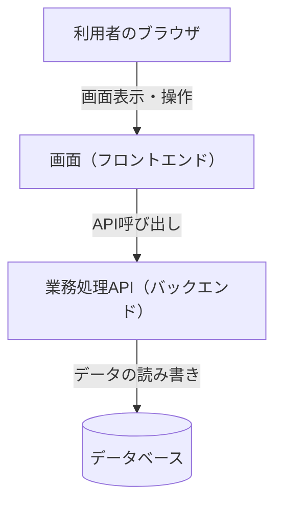
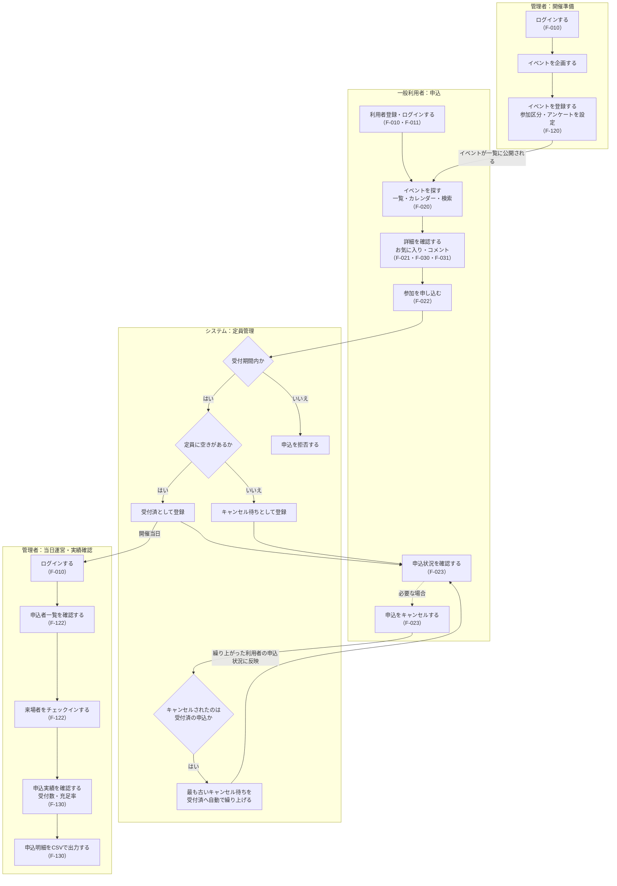
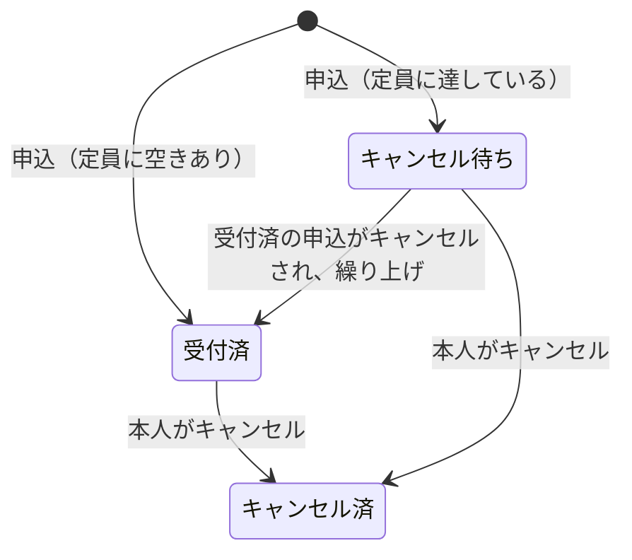
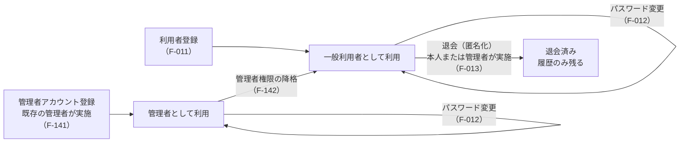

# 10_要件定義書

## 1. 文書概要

| 項目 | 内容 |
|---|---|
| 文書名 | イベント申込システム 要件定義書 |
| 対象システム | イベント申込システム |
| 作成目的 | 本システムで実現する業務の流れ・提供する機能・業務ルール・非機能の要求を定義し、今後の設計・開発・改修における判断基準とする。 |
| 対象範囲 | 一般利用者向け機能（イベント閲覧・申込・お気に入り・コメント）、管理者向け機能（イベント管理・当日受付・実績確認・利用者管理）、およびこれらを支える共通機能（ログイン・利用者登録・パスワード変更） |

本書は「何を・なぜ実現するか」を定める文書であり、基本設計書・詳細設計書（`docs/20_基本設計/`・`docs/30_詳細設計/`）の上位文書として位置づける。各設計書は本書の内容と矛盾しないものとする。

本書と設計書の記載範囲は次のとおり分担する。

| 本書に記載すること | 設計書に記載すること（本書には記載しない） |
|---|---|
| 業務の流れ（業務フロー）、利用者の区分 | 画面の項目・レイアウト・遷移（`docs/20_基本設計/21_画面基本設計書.md`・`docs/30_詳細設計/30_画面詳細設計書.md`） |
| 機能の一覧、機能ごとの目的・利用者ができること・制約 | APIの一覧・入出力・HTTPステータス（`docs/20_基本設計/23_API基本設計書.md`・`docs/30_詳細設計/31_API詳細設計書.md`）、処理の順序・判定式・クラス構成（`docs/30_詳細設計/32_処理詳細設計書.md`） |
| 業務ルール（業務として守るべき決まり） | 入力項目の桁数・形式・チェック内容（`docs/30_詳細設計/30_画面詳細設計書.md`・`docs/30_詳細設計/31_API詳細設計書.md`）、データの型・制約（`docs/20_基本設計/22_テーブル定義書.md`） |
| エラーの区分と利用者への通知方針 | エラーID・メッセージ文言（`docs/30_詳細設計/33_共通詳細設計書.md`） |
| 非機能の要求（何を満たすべきか） | 非機能の実現方法（`docs/20_基本設計/24_方式設計書.md`） |

## 2. システム概要

### 2.1 システムの目的

本システムは、イベントの募集・申込受付・当日運営・実績集計に関する一連の業務を一元的に管理するWebアプリケーションである。一般利用者に対してはイベント情報の閲覧と参加申込の手段を提供し、管理者に対してはイベントの企画・管理と申込状況の把握・運営を行う手段を提供する。

### 2.2 背景・解決する課題

イベントの募集・申込管理を人手や個別の手段（メール、紙、表計算ソフト等）で行う場合、以下のような課題が生じやすい。

- 申込状況（受付数・残り枠）をリアルタイムに把握しづらい
- 定員超過時のキャンセル待ち管理や、キャンセル発生時の繰り上げ処理が煩雑になる
- 当日の参加者受付（本人確認・出欠記録）に手間がかかる
- 複数イベントの申込実績を横断的に集計する作業に時間を要する

本システムは、申込受付から定員管理、キャンセル待ちの繰り上げ、当日受付、実績集計までを一つの仕組みで扱うことで、これらの課題を解消することを目的とする。

### 2.3 システムの概要

本システムは、利用者が操作するブラウザ画面（フロントエンド）と、データの管理・業務処理を担うサーバー（バックエンド）、その情報を永続化するデータベースの3層構成をとる。利用者はブラウザを通じて画面を操作し、画面はサーバーが提供するAPIを通じてデータの取得・登録・更新を行う。

技術基盤・実行環境に関する標準は「10. 非機能要件」に定める。

## 3. 想定利用者

本システムの利用者は、次の2種類に区分する。

| 利用者区分 | 役割 |
|---|---|
| 一般利用者 | イベント情報を閲覧し、参加申込・キャンセル・お気に入り登録・コメント投稿を行う利用者。 |
| 管理者 | 一般利用者の機能に加え、イベントの登録・変更・削除・復元、当日受付、申込実績の確認・出力、利用者情報の確認を行う利用者。 |

利用者は、いずれか一方の区分に属する。管理者は参加申込を行う対象ではなく、イベントへの申込操作はできない。

管理者アカウントは、初期データとして投入された1件に加え、既存の管理者が新たな管理者アカウントを登録することで追加できる（詳細は「7. 業務ルール」参照）。

## 4. 業務フロー・利用シーン

### 4.1 業務全体の流れ

イベントの企画から実績確認までの業務を、担当（管理者・一般利用者・システム）ごとに示す。管理者・一般利用者とも、システムを利用する際は最初にログインする。括弧内は対応する機能ID（「5. システム機能」）である。

### 4.2 申込状況の移り変わり

1件の申込がたどる状況を示す。業務上の条件は「7. 業務ルール」に定める。

当日のチェックインは受付済の申込に対して日時を記録するものであり、申込状況は「受付済」のまま変わらない。キャンセル済の申込は元に戻せない。再度参加したい場合は、新たに申込を行う。

### 4.3 利用者アカウントに関する流れ

管理者は直接退会できず、先に一般利用者へ降格する必要がある。一般利用者を管理者へ昇格させる機能は提供しない（管理者が必要な場合は、管理者アカウントを新たに登録する）。

### 4.4 利用シーン

一般利用者・管理者それぞれの主な利用シーンを次に示す。

**一般利用者**

1. メールアドレスとパスワードを入力してログインする。初めて利用する場合は、名前・メールアドレス・パスワードを入力して利用者登録を行い、そのままログイン状態となる。
2. イベント一覧（一覧表示・カレンダー表示の切替が可能）、またはキーワード・開催日による検索からイベントを探す。
3. イベント詳細を確認し、参加区分やアンケート項目が設定されている場合はこれらを入力したうえで参加を申し込む。
4. 定員に達しているイベントに申し込んだ場合は、キャンセル待ちとして登録され、マイページで順位を確認できる。
5. 気になるイベントをお気に入り登録し、マイページからまとめて確認できる。
6. イベント詳細画面でコメントを投稿・閲覧し、他の利用者のコメントに返信する。自分が投稿したコメントを削除できる。
7. マイページから自分の申込状況を確認し、必要に応じて申込をキャンセルする。
8. 必要に応じて、自分のパスワードを変更する。利用をやめる場合は退会する。

**管理者**

1. ログインし、管理者向けダッシュボードで全体状況（イベント数・利用者数・受付済申込数・お気に入り総数・コメント総数）を把握する。
2. イベントを新規登録し、参加区分（複数枠に分けた定員管理）やアンケート項目を設定する。既存イベントを複製して、内容を流用しながら新規登録することもできる。
3. 登録済みイベントの内容を編集し、必要に応じて削除する。削除したイベントは一覧から確認し、復元できる。
4. イベント当日、申込者一覧を確認しながら受付（チェックイン）を行う。
5. イベントごとの申込実績（受付数・充足率）を確認し、申込明細をCSV形式で出力する。
6. 登録されている利用者の一覧を確認し、個々の利用者の申込・お気に入り・コメント履歴を確認する。必要に応じて、管理者アカウントの登録、管理者権限の降格、利用者の退会を行う。
7. 全イベント横断のコメント一覧から、不適切な投稿等を確認・削除する（F-150）。

## 5. システム機能

機能IDは「F-」＋3桁の番号とし、機能のまとまりごとに10番単位で割り当てる。百の位は利用者の範囲（0：全利用者向け、1：管理者向け）を表す。機能を追加する場合は、該当するまとまりの空き番号を使用し、既存の番号は変更・再利用しない。

| 番号の範囲 | 機能のまとまり |
|---|---|
| 010番台 | 認証・アカウント |
| 020番台 | イベントの閲覧・申込 |
| 030番台 | お気に入り・コメント |
| 110番台 | 管理：概況 |
| 120番台 | 管理：イベント |
| 130番台 | 管理：実績 |
| 140番台 | 管理：利用者 |
| 150番台 | 管理：コメント |

| 機能ID | 機能名 | 概要 | 利用者 |
|---|---|---|---|
| F-010 | ログイン | メールアドレスとパスワードによる本人確認と、以降の操作のための認証状態の確立 | 一般利用者・管理者 |
| F-011 | 利用者登録 | 名前・メールアドレス・パスワードによる新規利用者登録（登録後は自動的にログイン状態となる） | 一般利用者（新規） |
| F-012 | パスワード変更 | ログイン中の利用者本人による、自分のパスワードの変更 | 一般利用者・管理者 |
| F-013 | 利用者の退会（匿名化） | 利用者本人、または管理者による、対象利用者（一般利用者）の退会。名前・メールアドレスを置き換え、申込等の履歴は残す | 一般利用者・管理者 |
| F-020 | イベント一覧・検索 | イベントの一覧表示（一覧形式／カレンダー形式）、キーワード・開催日による絞り込み、並び替え | 一般利用者・管理者 |
| F-021 | イベント詳細確認 | 個別イベントの詳細情報・残り枠・申込可否・コメントの確認 | 一般利用者・管理者 |
| F-022 | イベント申込 | 参加区分の選択・アンケート回答を含む参加申込の受付、定員超過時のキャンセル待ち登録 | 一般利用者 |
| F-023 | 申込確認・キャンセル | 自分の申込状況の確認、キャンセル待ち順位の確認、申込のキャンセル | 一般利用者・管理者 |
| F-030 | お気に入り管理 | イベントのお気に入り登録・解除・一覧確認 | 一般利用者・管理者 |
| F-031 | イベントコメント | イベントに対するコメントの投稿・閲覧・削除（コメントへの返信を含む） | 一般利用者・管理者 |
| F-110 | 管理者ダッシュボード | イベント数・利用者数・受付済申込数・お気に入り総数・コメント総数の概況表示 | 管理者 |
| F-120 | イベント登録・編集 | イベント情報および参加区分の新規登録・編集（既存イベントを複製しての新規登録を含む） | 管理者 |
| F-121 | イベント削除・復元 | イベントの削除（履歴を保持した無効化）、削除済みイベントの確認・復元 | 管理者 |
| F-122 | 当日受付 | イベント当日の申込者一覧確認とチェックイン処理 | 管理者 |
| F-130 | 申込実績確認・出力 | イベントごとの申込実績（受付数・充足率）の確認、申込明細のCSV出力 | 管理者 |
| F-140 | 利用者一覧確認 | 登録済み利用者の一覧確認、個々の利用者の申込・お気に入り・コメント履歴の確認 | 管理者 |
| F-141 | 管理者アカウント登録 | 既存の管理者による、新たな管理者アカウントの登録 | 管理者 |
| F-142 | 管理者権限の降格 | 既存の管理者による、対象利用者（管理者）の一般利用者への変更 | 管理者 |
| F-150 | コメント管理 | 全イベント横断でのコメントの確認と、不適切な投稿の削除 | 管理者 |

各機能に対応する画面・API・テーブルは`docs/20_基本設計/20_機能設計書.md`を参照。

## 6. 機能要件

各機能について、目的、利用者ができること、制約（できないこと・守るべき条件）を定める。画面の項目、APIの入出力、処理の順序、入力項目の桁数は各設計書に定める（「1. 文書概要」参照）。

### F-010 ログイン

- **目的**：登録済みの利用者が本人であることを確認し、以降の操作を行える状態（認証状態）にする。
- **できること**：メールアドレスとパスワードを入力してログインする。ログイン後、管理者は管理者向けダッシュボード、一般利用者はイベント一覧から利用を開始する。
- **制約**：メールアドレスとパスワードの組み合わせが正しくない場合はログインできない。その際、メールアドレスの登録有無や、どちらの入力が誤っているかは利用者に伝えない。退会済みの利用者はログインできない。

### F-011 利用者登録

- **目的**：初めて利用する者が自分で利用者登録を行い、そのまま利用を開始できる。
- **できること**：名前・メールアドレス・パスワードを入力して登録する。登録と同時にログイン状態となる。
- **制約**：この機能で登録される利用者は常に一般利用者とし、管理者として登録することはできない。登録済みのメールアドレスでは登録できない。その際、メールアドレスが登録済みである事実は直接伝えず、ログインを案内する。パスワードは「7. 業務ルール」の条件を満たす必要がある。

### F-012 パスワード変更

- **目的**：利用者が自分のパスワードを変更できる。
- **できること**：現在のパスワードと新しいパスワードを入力して、自分のパスワードを変更する。
- **制約**：変更できるのは本人のパスワードに限る（管理者であっても他人のパスワードは変更できない）。現在のパスワードが正しくない場合は変更できない。新しいパスワードは「7. 業務ルール」の条件を満たす必要がある。パスワードを忘れた場合の再設定機能は提供しない。

### F-013 利用者の退会（匿名化）

- **目的**：個人情報を取り除きつつ、申込・お気に入り・コメント等の履歴は残したまま、利用者を退会させられる。
- **できること**：一般利用者は自分自身を退会させる。管理者は対象の一般利用者を退会させる。
- **制約**：本人・管理者以外は実行できない。管理者は退会できない（先にF-142で降格する必要がある）。退会済みの利用者を再度退会させることはできない。退会後は、名前・メールアドレスを固定の内容に置き換え、パスワードを無効にする。退会した利用者は以後ログインできず、退会前からログインしていた場合も以後の操作はできない。同じメールアドレスで再度利用する場合は、新規登録からやり直す。

### F-020 イベント一覧・検索

- **目的**：開催予定・開催中のイベントを俯瞰し、関心のあるイベントを見つけられる。
- **できること**：一覧形式とカレンダー形式を切り替えて閲覧する。キーワード（イベント名・場所）や開催日の範囲で絞り込む。開催日時順／申込数の多い順／お気に入り数の多い順／申込締切が近い順に並び替える。各イベントについて、開催日時・場所・定員に対する申込状況・お気に入り登録件数・受付中か否かを確認する。
- **制約**：削除されたイベントは、一覧・検索のいずれにも表示しない。一覧形式および検索結果では、これから開催されるイベントを探しやすいよう、開催済みのイベントを並び順によらず末尾に表示する（カレンダー形式は開催日のとおりに表示する）。

### F-021 イベント詳細確認

- **目的**：申込等の判断に必要な情報を、イベントごとに確認できる。
- **できること**：イベントの開催情報、定員と残り枠（参加区分がある場合は区分ごと）、申込締切、受付状況、説明、主催者、投稿済みコメントを確認する。
- **制約**：存在しない、または削除済みのイベントは表示できない。

### F-022 イベント申込

- **目的**：利用者がイベントへの参加意思を登録する。
- **できること**：参加区分（設定されている場合）を選択し、アンケート（設定されている場合）に回答して申し込む。申込結果（受付済／キャンセル待ちの別、申込日時）を確認する。
- **制約**：管理者は申込できない。受付期間外のイベント、参加区分が未選択のイベント（区分が設定されている場合）、既に有効な申込があるイベントには申込できない。定員に達している場合は拒否せず、キャンセル待ちとして登録する。

### F-023 申込確認・キャンセル

- **目的**：利用者が自分の申込状況を把握し、必要に応じて取り消せる。
- **できること**：自分の申込一覧（イベント、状況、開催日時、申込日時、キャンセル待ちの場合は順位）を確認する。申込をキャンセルする。
- **制約**：キャンセルできるのは本人の申込に限る。開催後の申込、既にキャンセル済みの申込はキャンセルできない。受付済の申込がキャンセルされた場合は、キャンセル待ちの申込を自動的に繰り上げる。

### F-030 お気に入り管理

- **目的**：利用者が関心のあるイベントを記録し、後から一覧で参照できる。
- **できること**：イベント一覧・検索結果・詳細からお気に入りを登録・解除する。自分のお気に入り一覧を確認する。
- **制約**：同じイベントを重複して登録することはない（登録済みのイベントへの登録操作、未登録のイベントへの解除操作は、いずれもエラーとしない）。

### F-031 イベントコメント

- **目的**：イベントについて利用者間で情報共有・質問ができる。
- **できること**：コメントを投稿・閲覧する。既存のコメントに返信する（返信の階層数に制限は設けない）。自分の投稿を削除する。管理者は全ての投稿を削除できる。
- **制約**：コメントの編集機能は提供しない。投稿者本人・管理者以外は削除できない。受付期間の内外を問わず投稿できる。返信があるコメントを削除した場合は、返信を参照できるよう、本文を削除済みの表示に置き換えて残す。

### F-110 管理者ダッシュボード

- **目的**：管理者がシステム全体の概況を一目で把握できる。
- **できること**：総イベント数、総利用者数、受付済申込数、総お気に入り数、総コメント数を確認する。
- **制約**：管理者のみ利用できる。コメント総数は、削除済みの表示に置き換えられたコメントを含めない。

### F-120 イベント登録・編集

- **目的**：管理者がイベント情報を新規に登録し、内容を更新できる。既存イベントを複製して、登録の手間を減らせる。
- **できること**：イベント情報（名称、開催日時、場所、定員、申込締切、説明、主催者名、画像、アンケート文言）と参加区分（区分名・定員）を登録・編集する。既存のイベント（削除済みを含む）を複製し、開催日時・申込締切以外の内容が入力された状態から新規登録を始める。
- **制約**：管理者のみ利用できる。開催日時は未来の日時、申込締切は開催日時より前とする。参加区分を設定した場合、イベント全体の定員は区分の定員合計とする。有効な申込が残っている参加区分は変更できない。複製は入力内容の複写のみであり、複製元の申込・コメント・お気に入りは引き継がない。

### F-121 イベント削除・復元

- **目的**：不要になったイベントを一覧から除外しつつ、誤って削除した場合に復元できる。
- **できること**：イベントを削除する。削除済みイベントの一覧を確認し、復元する。
- **制約**：管理者のみ利用できる。受付済の申込が1件でも存在するイベントは削除できない。削除後も申込等の履歴は保持する。

### F-122 当日受付

- **目的**：イベント当日、申込者の来場確認（チェックイン）を行える。
- **できること**：対象イベントの申込者一覧（申込者名、参加区分、状況、チェックイン日時、アンケートへの回答）を確認する。来場した申込者をチェックインする。
- **制約**：管理者のみ利用できる。チェックインできるのは状況が「受付済」の申込に限る。チェックイン済みの申込に再度チェックインする場合は、実行前に確認を求める。

### F-130 申込実績確認・出力

- **目的**：管理者がイベントごとの申込状況を横断的に把握し、必要に応じて明細データを取得できる。
- **できること**：イベントごとの受付数・定員充足率を確認し、開催日時順／受付数の多い順に並び替える。申込明細（イベント名・申込者名・申込日時・状況・アンケート回答・参加区分）をCSV形式で出力する。
- **制約**：管理者のみ利用できる。削除済みイベントは集計・CSVのいずれにも含めない。CSVは状況を問わず全ての申込を対象とする。

### F-140 利用者一覧確認

- **目的**：管理者が登録済み利用者の状況と、個々の利用者の利用履歴を確認できる。
- **できること**：利用者の一覧（名前、メールアドレス、利用者区分、退会済みか否か）を確認する。利用者を選択し、その利用者の申込・お気に入り・コメントの履歴を確認する。
- **制約**：管理者のみ利用できる。パスワードは表示しない。履歴は閲覧専用とし、管理者が対象利用者に代わって申込のキャンセル・お気に入りの解除・コメントの削除を行うことはできない。

### F-141 管理者アカウント登録

- **目的**：既存の管理者が、新たな管理者アカウントを登録できる。
- **できること**：名前・メールアドレス・初期パスワードを入力して、管理者アカウントを登録する。
- **制約**：管理者のみ利用できる。登録済みのメールアドレスでは登録できない。パスワードは「7. 業務ルール」の条件を満たす必要がある。

### F-142 管理者権限の降格

- **目的**：既存の管理者が、対象の管理者を一般利用者に変更できる。
- **できること**：利用者一覧から対象の管理者を選択し、一般利用者へ降格する。自分自身も対象にできる。
- **制約**：管理者のみ利用できる。管理者が0人になる降格はできない。既に一般利用者である利用者は降格できない。

### F-150 コメント管理

- **目的**：管理者が、不適切な投稿等をイベントをまたいで見つけ、削除できる。
- **できること**：全イベントのコメントを新しい順に一覧で確認する（イベント名・投稿者名・本文・投稿日時）。コメントを削除する。
- **制約**：管理者のみ利用できる。一覧の対象は有効なコメントとし、削除済みの表示に置き換えられたコメントは含めない。削除時の扱いはF-031と同じとする。

## 7. 業務ルール

- **申込受付可否**：イベントは、現在時刻が申込締切以前であり、かつ開催日時より前である場合にのみ、申込を受け付ける。いずれか一方でも満たさない場合は受付を締め切る。
- **参加区分の要否**：イベントに参加区分が1つ以上設定されている場合、申込時に参加区分の選択を必須とする。参加区分が設定されていないイベントでは、参加区分の指定を行わない。
- **定員判定とキャンセル待ち**：申込時点で対象（参加区分がある場合はその区分、無い場合はイベント全体）の受付済件数が定員未満であれば「受付済」、定員に達していれば「キャンセル待ち」として登録する。定員超過を理由に申込自体を拒否することはない。
- **二重申込の防止**：同一利用者が同一イベントに対して、「受付済」または「キャンセル待ち」の申込を既に持っている場合、新たな申込はできない。過去にキャンセルした履歴がある場合は、再度申込むことができる。
- **キャンセルの可否**：申込のキャンセルは、申込者本人のみが行える。対象の申込が「受付済」または「キャンセル待ち」であり、かつイベント開催前である場合にのみキャンセルできる。
- **キャンセル時の自動繰り上げ**：「受付済」の申込がキャンセルされた場合、同一イベント（参加区分がある場合は同一区分）内で最も申込日時が古い「キャンセル待ち」の申込を1件、自動的に「受付済」へ繰り上げる。
- **キャンセル待ち順位**：キャンセル待ちの申込には、同一対象（イベント、区分がある場合は区分）内で自分より申込日時が古いキャンセル待ちの件数+1を順位として提示する。
- **イベント削除の制約**：「受付済」の申込が1件でも存在するイベントは削除できない。「キャンセル待ち」「キャンセル済」のみの場合は削除できる。削除は申込等の履歴を保持したまま行う（記録を残す削除）。
- **イベント復元**：削除済みのイベントのみを復元の対象とする。
- **イベントの日時**：開催日時は未来の日時とする。申込締切は開催日時より前とする（同じ日時は不可）。
- **定員**：定員は1以上とする。参加区分が設定されている間、イベント全体の定員は区分の定員合計とする。参加区分が無い場合は、イベントの定員の入力を必須とする。
- **参加区分の変更**：対象の区分に有効な申込（「受付済」または「キャンセル待ち」）が残っている場合、その区分の変更・削除はできない。参加区分の無いイベントに有効な申込が残っている場合、参加区分を新たに追加することもできない。
- **参加区分名の一意性**：同一イベント内で、同じ名称の参加区分を重複して登録することはできない。
- **お気に入りの重複防止**：同一利用者・同一イベントの組み合わせでお気に入りが重複して登録されることはない。
- **コメントの削除権限**：コメントの削除は、投稿者本人、または管理者のみが行える。返信が1件以上ある場合は、削除してもコメント自体を一覧から除去せず、内容を「このコメントは削除されました」等の表示に置き換えたうえで残す（返信を参照できる状態を保つため）。返信が無い場合は一覧から除去する。
- **コメントの返信**：コメントには返信でき、返信できる階層数に制限は設けない。返信も通常のコメントと同様に扱い、投稿者本人または管理者が削除できる（削除時の扱いは前項と同じ）。削除済みのコメントに対しても返信できる。
- **チェックインの記録**：状況が「受付済」である申込に限り、チェックインを行える。チェックイン済みの申込に対して再度チェックインを行おうとした場合は、管理者に確認を求め、承認した場合に限りチェックイン日時を最新の実行時刻に更新する。
- **申込実績の集計対象**：申込状況の集計（受付数・充足率）および申込明細のCSV出力は、いずれも削除済みのイベントを対象に含めない。CSV出力は、状況（受付済・キャンセル待ち・キャンセル済）を問わず全ての申込を対象とする。
- **メールアドレスの一意性**：同じメールアドレスを複数の利用者が登録することはできない。大文字・小文字の違い、前後の空白の有無は同じメールアドレスとして扱う。
- **パスワードの条件**：パスワードは8文字以上72文字以下とし、英字と数字をそれぞれ1文字以上含むものとする。利用者登録（F-011）・管理者アカウント登録（F-141）・パスワード変更（F-012）のいずれにも同じ条件を適用する。
- **パスワードの取り扱い**：パスワードは、元の値を復元できない形式に変換して保存する。画面・CSV・ログのいずれにも出力しない。管理者を含め、他人のパスワードを参照・変更することはできない。
- **管理者アカウント**：管理者アカウントは、運用開始時に用意された1件に加え、既存の管理者が新たに登録することで追加できる。管理者アカウントの登録は、管理者のみが行える。
- **管理者権限の降格**：管理者は、対象利用者（管理者。自分自身を含む）を一般利用者に変更できる。ただし、システム全体で管理者が対象利用者1人のみの場合は、その管理者を降格できない（管理者が0人になる状態を防ぐため）。すでに一般利用者である利用者を降格することはできない。
- **利用者の退会（匿名化）**：利用者本人、または管理者は、対象利用者（一般利用者）を退会させられる。退会は名前・メールアドレスの置き換えとパスワードの無効化による匿名化とし、利用者の記録そのものは削除しない（申込等の履歴を保持するため）。対象が管理者の場合は退会できない（先に管理者権限の降格が必要）。既に退会済みの利用者を再度退会させることはできない。
- **利用者詳細の閲覧**：管理者による利用者ごとの申込・お気に入り・コメント履歴の確認は閲覧のみを目的とし、管理者が対象利用者に代わって申込のキャンセルやお気に入りの解除等の操作を行うことはできない。

## 8. 入力要件

利用者が入力する項目と、業務上の必須・任意の別を次に示す。各項目の桁数・形式・チェック内容は`docs/30_詳細設計/30_画面詳細設計書.md`、データの型は`docs/20_基本設計/22_テーブル定義書.md`に定める。項目間の条件（日時の前後関係、定員の要否、パスワードの条件等）は「7. 業務ルール」に定める。

| 対象 | 必須の項目 | 任意の項目 |
|---|---|---|
| ログイン | メールアドレス、パスワード | - |
| 利用者登録 | 名前、メールアドレス、パスワード | - |
| イベント登録・編集 | イベント名、開催日時、場所、申込締切、定員（参加区分が無い場合） | 説明、主催者名、画像URL、アンケート文言、参加区分（区分名・定員の組。登録する場合は両方必須） |
| イベント申込 | 参加区分（区分が設定されたイベントの場合） | アンケート回答 |
| コメント投稿 | 本文 | 返信先のコメント |
| 管理者アカウント登録 | 名前、メールアドレス、初期パスワード | - |
| パスワード変更 | 現在のパスワード、新しいパスワード | - |

入力に関する共通の要求は次のとおり。

- 画像URLは、Web上の画像を指すURL（httpまたはhttps）のみを受け付け、プログラムとして実行されうる形式のものは受け付けない。
- 文字列項目には、画面上で見えない文字（制御文字等）のみによる入力や混入を認めない。
- 入力内容に誤りがある場合は、どの項目をどう直せばよいかを項目ごとに示す。

## 9. エラー要件

利用者に通知するエラーは、発生要因に応じて次のように区分する。個々のエラーの発生条件・メッセージは`docs/30_詳細設計/33_共通詳細設計書.md`に定める。

| エラー区分 | 発生条件の例 | 利用者への通知方針 |
|---|---|---|
| 認証エラー | ログイン未完了の状態での操作、ログインの失敗、退会済みの利用者による操作 | ログイン画面へ案内し、再ログインを促す。 |
| 権限エラー | 一般利用者による管理者専用機能の利用、他人の申込・コメントへの操作 | 権限がない旨を通知し、操作を行わせない。 |
| 入力エラー | 必須項目の未入力、桁数超過、形式不正 | 該当する入力項目ごとに、修正すべき内容を明示する。 |
| 業務ルール違反エラー | 申込締切超過、二重申込、キャンセル不可の状態での取消、削除不可の状態での削除等 | 業務ルール上できない理由を通知する。 |
| データ未検出エラー | 存在しない、または削除済みのイベント・申込等の指定 | 対象が見つからない旨を通知する。 |
| リクエスト過多エラー | 同一の接続元からの登録・変更・削除の操作が短時間に集中した場合 | 時間をおいて再度操作するよう通知する。 |
| 通信エラー | サーバーとの通信が行えない場合 | サーバーへ接続できない旨を通知する。 |

## 10. 非機能要件

本システムの非機能要件のうち、現時点で定めるものを次に示す。実現方法は`docs/20_基本設計/24_方式設計書.md`に定める。項目によっては、定量的な目標値・詳細方針を今後も定めない方針として確定している。

### 10.1 セキュリティ・認証

- 本システムの利用範囲は、学内（自組織内）の利用者に限定する運用を前提とする。
- 利用者の本人確認は、メールアドレスとパスワードによって行う。パスワードの条件と取り扱いは「7. 業務ルール」に定める。
- 権限のない操作は、画面上の制御だけに頼らず、サーバー側で必ず拒否する。
- ログイン・利用者登録の失敗時は、特定のメールアドレスが登録済みかどうかを第三者が判別できる情報を返さない。
- ログインの総当たりや大量投稿を抑止するため、短時間に集中した登録・変更・削除の操作を制限する。
- 利用者が入力した内容を画面やCSVに出力する際は、プログラムや数式として実行されないようにする。
- ログイン後の利用者の識別方式には既知の制約がある（`docs/20_基本設計/24_方式設計書.md`参照）。学外からのアクセスを許容する等、利用範囲を拡大する場合は、この方式を改めて検討する。
- 通信の暗号化方式、ログイン状態の有効期限は、今後も定めない方針として確定している。
- APIドキュメント（自動生成）の閲覧・試験実行は、学内利用限定の前提のもと、認証無しでの利用を許容する。

### 10.2 技術基盤

今後の開発における標準として、以下の技術基盤を用いる。

| 区分 | 標準 |
|---|---|
| バックエンド言語 | Java |
| バックエンドフレームワーク | Spring Boot |
| データベース | MySQL |
| フロントエンド | Angular（TypeScript） |
| データ交換方式 | HTTPによるREST API、JSON形式 |
| 文字コード | UTF-8 |
| APIドキュメント | 実装から自動生成するAPIドキュメントを提供する。`docs/30_詳細設計/31_API詳細設計書.md`と役割分担のうえ併存する |

### 10.3 性能・可用性

- 応答時間、同時アクセス数、稼働率等の定量目標は、今後も定めない方針として確定している。
- 複数の利用者が同時に申込・キャンセルを行った場合でも、受付済の件数が定員を超えないこと、キャンセル待ちの繰り上げが重複・欠落しないことを保証する。

### 10.4 データ整合性

- イベントの削除、利用者の退会は、申込等の履歴を保持したまま行い、記録そのものは削除しない。
- 定員・申込状況の判定は、申込データから都度算出し、集計値を別途保持しない。
- 利用者区分・申込状況等の区分値は、表示名の変更や値の追加がデータの修正を伴わずに行えるよう、コードで管理する。

### 10.5 運用・ログ

- 障害調査のためのログ出力（種類・レベル・出力項目）は`docs/20_基本設計/24_方式設計書.md`・`docs/30_詳細設計/33_共通詳細設計書.md`に定める。ログの保管期間・監査目的での保持については、今後も定めない方針として確定している。
- ログには、パスワード、メールアドレス等の個人情報を出力しない。
- スキーマ変更の管理方法（マイグレーション手順を含む）は、今後も定めない方針として確定している。

### 10.6 環境

- 想定される稼働環境（サーバー構成、コンテナ化、CI/CDの要否等）は、今後も定めない方針として確定している。
