# 21_画面基本設計書

## 1. 概要

本書は、イベント申込システムが提供する画面の一覧、画面間の遷移、および各画面の目的・表示内容・できる操作を定義する基本設計書である。`docs/10_要件定義/10_要件定義書.md`の各機能を、どのような画面で提供するかを定める。

各画面の項目定義（部品の種類、必須、桁数、初期値、データの取得元）、イベント処理、入力チェック、エラー時の表示は`docs/30_詳細設計/30_画面詳細設計書.md`に定める。機能・APIとの対応、画面ごとの権限は`docs/20_基本設計/20_機能設計書.md`に定める。

## 2. 共通仕様

- **ログイン制御**：SC-010（ログイン・利用者登録）とSC-900（該当ページなし）を除く全ての画面は、ログイン状態でなければ利用できない。未ログインでアクセスした場合はSC-010へ案内する。
- **管理者専用画面の制御**：管理者向け画面（SC-110〜SC-150）は、管理者としてログインしている場合にのみ利用できる。一般利用者がアクセスした場合はSC-020（イベント一覧）へ案内する。
- **共通ナビゲーション**：ログイン中は画面上部に共通のナビゲーションを表示する。

  | 利用者区分 | 表示する導線 |
  |---|---|
  | 一般利用者 | イベント一覧（SC-020）／イベント検索（SC-021）／マイページ（SC-030）／パスワード変更（SC-011）／ログアウト |
  | 管理者 | ダッシュボード（SC-110）／イベント管理（SC-120）／申込状況・実績（SC-130）／利用者管理（SC-140）／コメント管理（SC-150）／パスワード変更（SC-011）／ログアウト |

- **エラー表示**：API呼び出しに失敗した場合、サーバーから返されたメッセージを優先して表示し、無い場合は画面ごとに定めた既定のメッセージを表示する。
- **通信不可時の表示**：サーバーと通信できない場合は、「サーバーに接続できません。バックエンドが起動しているか確認してください。」と表示する。
- **区分値の表示**：利用者区分・申込状況は、APIが返す表示名をそのまま表示する（`docs/20_基本設計/23_API基本設計書.md`2.8）。
- **確認**：取り消せない、または影響の大きい操作（申込キャンセル、イベント削除・復元、コメント削除、退会、管理者権限の降格、チェックインの再実行）は、実行前に確認を求める。

## 3. 画面一覧

### 3.1 画面IDの採番ルール

画面IDは「SC-」＋3桁の番号とし、画面のまとまりごとに10番単位で割り当てる。百の位は利用者の範囲（0：全利用者向け、1：管理者向け、9：共通）を表す。画面を追加する場合は、該当するまとまりの空き番号を使用し、既存の番号は変更・再利用しない。

| 番号の範囲 | 画面のまとまり |
|---|---|
| 010番台 | 認証・アカウント |
| 020番台 | イベントの閲覧・申込 |
| 030番台 | マイページ |
| 110番台 | 管理：概況 |
| 120番台 | 管理：イベント |
| 130番台 | 管理：実績 |
| 140番台 | 管理：利用者 |
| 150番台 | 管理：コメント |
| 900番台 | 共通 |

### 3.2 一覧

| 画面ID | 画面名 | URL | 利用者 |
|---|---|---|---|
| SC-010 | ログイン・利用者登録 | `/login` | 未ログイン |
| SC-011 | パスワード変更 | `/my/password` | 一般利用者・管理者 |
| SC-020 | イベント一覧 | `/events` | 一般利用者・管理者 |
| SC-021 | イベント検索 | `/events/search` | 一般利用者・管理者 |
| SC-022 | イベント詳細・申込 | `/events/:id` | 一般利用者・管理者 |
| SC-023 | 申込完了 | `/events/:id/done` | 一般利用者 |
| SC-030 | マイページ | `/my/applications` | 一般利用者・管理者 |
| SC-110 | 管理者ダッシュボード | `/admin/dashboard` | 管理者 |
| SC-120 | イベント管理 | `/admin/events` | 管理者 |
| SC-121 | イベント登録・編集 | `/admin/events/new`、`/admin/events/:id/edit` | 管理者 |
| SC-122 | 削除済みイベント | `/admin/events/deleted` | 管理者 |
| SC-123 | 当日受付 | `/admin/events/:id/checkin` | 管理者 |
| SC-130 | 申込状況・実績 | `/admin/reports` | 管理者 |
| SC-140 | 利用者管理 | `/admin/users` | 管理者 |
| SC-141 | 利用者詳細 | `/admin/users/:id` | 管理者 |
| SC-150 | コメント管理 | `/admin/comments` | 管理者 |
| SC-900 | 該当ページなし | 上記以外の全URL | 制限なし |

## 4. 画面遷移

### 4.1 全体の画面遷移

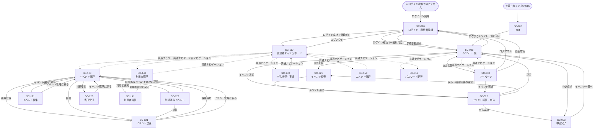
```mermaid
flowchart TD
    Start(["未ログイン状態でのアクセス"]) -->|ログインへ案内| Login["SC-010<br/>ログイン・利用者登録"]

    Login -->|"ログイン成功（管理者）"| AdminDash["SC-110<br/>管理者ダッシュボード"]
    Login -->|"ログイン成功（一般利用者）"| EvList["SC-020<br/>イベント一覧"]
    Login -->|"新規登録成功"| EvList

    EvList <-->|画面切替| EvSearch["SC-021<br/>イベント検索"]
    EvList <-->|画面切替| My["SC-030<br/>マイページ"]
    EvSearch -->|イベント選択| EvDetail["SC-022<br/>イベント詳細・申込"]
    EvList -->|イベント選択| EvDetail
    EvDetail -->|戻る| EvList
    EvDetail -->|"戻る（検索経由の場合）"| EvSearch
    EvDetail -->|申込成功| Done["SC-023<br/>申込完了"]
    EvList -->|申込成功| Done
    Done -->|イベント一覧へ| EvList
    My -->|イベント選択| EvDetail

    EvList -.->|共通ナビゲーション| My
    My -.->|共通ナビゲーション| EvList

    AdminDash -.->|共通ナビゲーション| AdmList["SC-120<br/>イベント管理"]
    AdminDash -.->|共通ナビゲーション| AdmReport["SC-130<br/>申込状況・実績"]
    AdminDash -.->|共通ナビゲーション| AdmUsers["SC-140<br/>利用者管理"]
    AdminDash -.->|共通ナビゲーション| AdmComments["SC-150<br/>コメント管理"]
    AdmList -.->|共通ナビゲーション| AdminDash
    AdmReport -.->|共通ナビゲーション| AdminDash
    AdmUsers -.->|共通ナビゲーション| AdminDash
    AdmComments -.->|共通ナビゲーション| AdminDash
    AdmList -->|新規登録| AdmNew["SC-121<br/>イベント登録"]
    AdmList -->|イベント選択| AdmEdit["SC-121<br/>イベント編集"]
    AdmList -->|削除済みイベント| AdmDeleted["SC-122<br/>削除済みイベント"]
    AdmList -->|当日受付| AdmCheckin["SC-123<br/>当日受付"]
    AdmList -->|"複製"| AdmNew
    AdmDeleted -->|"複製"| AdmNew
    AdmNew -->|保存成功| AdmList
    AdmEdit -->|保存成功| AdmList
    AdmNew -->|イベント管理に戻る| AdmList
    AdmEdit -->|イベント管理に戻る| AdmList
    AdmDeleted -->|イベント管理に戻る| AdmList
    AdmCheckin -->|イベント管理に戻る| AdmList

    AdmUsers -->|利用者選択| AdmUserDetail["SC-141<br/>利用者詳細"]
    AdmUserDetail -->|利用者管理に戻る| AdmUsers

    EvList -->|ログアウト| Login
    My -->|ログアウト| Login
    AdminDash -->|ログアウト| Login
    My -->|退会成功| Login

    EvList -.->|共通ナビゲーション| Pw["SC-011<br/>パスワード変更"]
    AdminDash -.->|共通ナビゲーション| Pw

    AnyURL(["定義されていないURL"]) --> NotFound["SC-900<br/>404"]
    NotFound -->|イベント一覧に戻る| EvList
```

図中の実線は画面上の操作による遷移、点線は共通ナビゲーションからの遷移（同じ利用者区分のどの画面からでも選択可能。図では代表画面のみ記載）を表す。「ログアウト」は共通ナビゲーションから全てのログイン中の画面で行える。「退会成功」は、SC-030（マイページ）で自分のアカウントを退会した場合に、ログアウトと同様にSC-010へ遷移することを表す。

### 4.2 イベント詳細画面の「戻る」導線

SC-022（イベント詳細・申込）は、遷移元の画面に応じて「戻る」導線の遷移先を切り替える。SC-021（イベント検索）から遷移してきた場合はSC-021へ、それ以外の場合はSC-020（イベント一覧）へ戻る。

### 4.3 申込完了画面への遷移

SC-023（申込完了）は、SC-020またはSC-022での申込成功に伴う遷移によってのみ、申込結果を表示できる。この遷移を経ずに直接アクセスした場合は、申込結果を表示できない旨を表示する。申込直後の画面をそのまま再読み込みした場合は、申込結果を引き続き表示する。

### 4.4 管理者によるイベント一覧・詳細の閲覧

管理者向けの共通ナビゲーションには、SC-020（イベント一覧）・SC-021（イベント検索）・SC-030（マイページ）への導線を設けない。ただし管理者もログイン中の利用者であるため、URLを直接指定すればこれらの画面を閲覧できる。SC-020・SC-022では申込フォームを表示せず、管理者は申込できない旨を表示する。

## 5. 画面ごとの概要

各画面について、画面イメージ、目的、表示項目、入力項目、ボタン、操作、使用するAPIを示す。画面イメージ上の丸数字は、`docs/30_詳細設計/30_画面詳細設計書.md`の項目定義のNoに対応する。項目ごとの詳細、入力チェック、エラー時の表示は`docs/30_詳細設計/30_画面詳細設計書.md`に定める。

### SC-010 ログイン・利用者登録

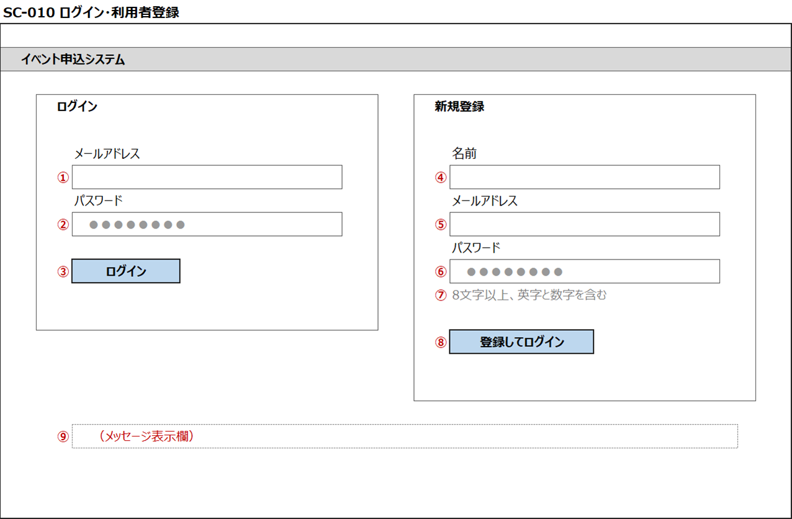

- **目的**：メールアドレスとパスワードによるログイン、または名前・メールアドレス・パスワードによる新規利用者登録と、そのままのログイン。
- **表示項目**：ログインフォーム、新規登録フォーム。
- **入力項目**：ログイン（メールアドレス、パスワード）、新規登録（名前、メールアドレス、パスワード）。パスワードは入力した文字を伏せて表示する。
- **ボタン**：「ログイン」、「登録してログイン」。
- **操作**：利用者がメールアドレスとパスワードを入力して「ログイン」を押下すると、ログインAPI（AP-010）を呼び出す。初めて利用する利用者が名前・メールアドレス・パスワードを入力して「登録してログイン」を押下すると、利用者登録API（AP-011）を呼び出し、成功後は登録内容でログイン状態とする。
- **API**：AP-010（ログイン）、AP-011（利用者登録）。
- **正常時**：ログイン・登録に成功すると、管理者はSC-110（ダッシュボード）へ、一般利用者はSC-020（イベント一覧）へ遷移する。

### SC-011 パスワード変更

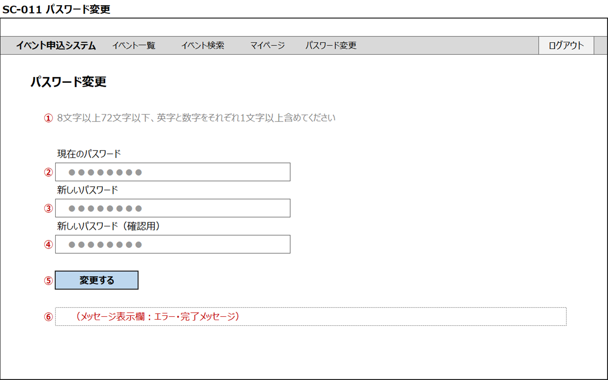

- **目的**：ログイン中の利用者が、自分のパスワードを変更する。
- **表示項目**：パスワードの条件（8文字以上72文字以下、英字と数字をそれぞれ1文字以上）の案内。
- **入力項目**：現在のパスワード、新しいパスワード、新しいパスワード（確認用）。いずれも入力した文字を伏せて表示する。
- **ボタン**：「変更する」。
- **操作**：利用者が各項目を入力して「変更する」を押下すると、パスワード変更API（AP-012）を呼び出す。
- **API**：AP-012（パスワード変更）。
- **正常時**：変更が完了した旨を表示する。ログイン状態は維持する。
- **遷移**：共通ナビゲーションの「パスワード変更」から遷移する（一般利用者・管理者とも）。

### SC-020 イベント一覧

*一覧表示。2件目は詳細を展開した状態、3件目は開催済みのイベント*

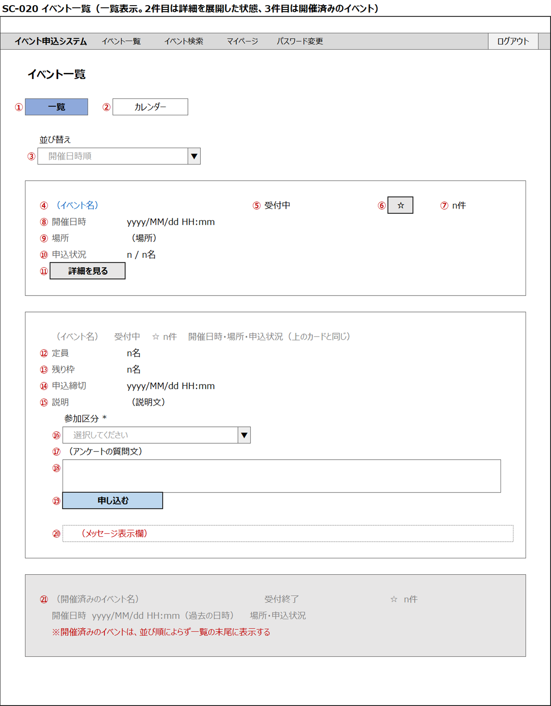

*カレンダー表示*

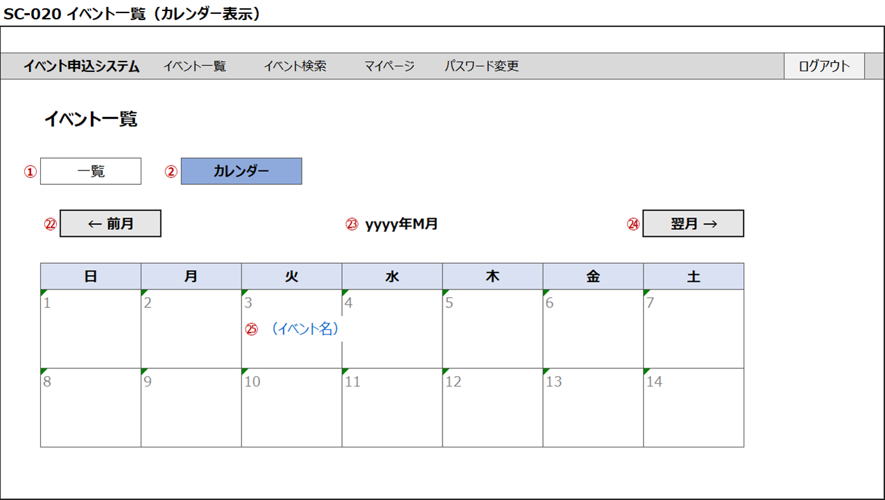

- **目的**：全てのイベントを一覧表示し、その場で詳細を確認しながら申込・お気に入り登録を行う。
- **並び順**：一覧形式では、開催前のイベントを先に、開催済み（開催日時が現在時刻以前）のイベントを末尾にまとめて表示する。開催前・開催済みそれぞれの中では、選択した並び順（既定は開催日時順）に従う。カレンダー形式には適用しない。
- **表示項目**：表示形式の切替（一覧／カレンダー）。一覧形式ではイベント名、受付状況、お気に入りの状態、お気に入り数、開催日時、場所、申込状況（受付済数／定員）。カレンダー形式では月単位のカレンダーに、各開催日のイベントを表示する。
- **入力項目**：申込フォーム（詳細表示時）として、参加区分（区分が設定されたイベントのみ）、アンケート回答（アンケートが設定されたイベントのみ）。
- **ボタン**：表示形式切替、並び替え（一覧形式のみ。開催日時順／申込数の多い順／お気に入り数の多い順／申込締切が近い順）、お気に入りの登録・解除、詳細の展開・収納、申込（残り枠が無い場合は「キャンセル待ちで申し込む」と表示）、カレンダーの前月・翌月切替。
- **操作**：利用者がイベント名を選択するとSC-022（イベント詳細）へ遷移する。参加区分・アンケートを入力し「申し込む」を押下すると、申込API（AP-030）を呼び出す。お気に入りボタンを押下すると、お気に入り登録・解除API（AP-040／AP-041）を呼び出す。並び替えを選択すると、取得済みの一覧データを画面側で並び替えて再表示する（APIの再取得は行わない）。
- **API**：AP-020（一覧取得）、AP-021（詳細取得）、AP-030（申込）、AP-040／AP-041（お気に入り登録・解除）、AP-042（お気に入り一覧取得）。
- **正常時**：申込に成功するとSC-023（申込完了）へ遷移する。お気に入りの状態とお気に入り数は、登録・解除に成功した時点で即座に画面へ反映する（一覧の再取得は行わず、表示中のお気に入り数を1増減する）。並び替えは即座に一覧表示へ反映する。
- **管理者の場合**：申込フォームは表示せず、管理者は申込できない旨を表示する。

### SC-021 イベント検索

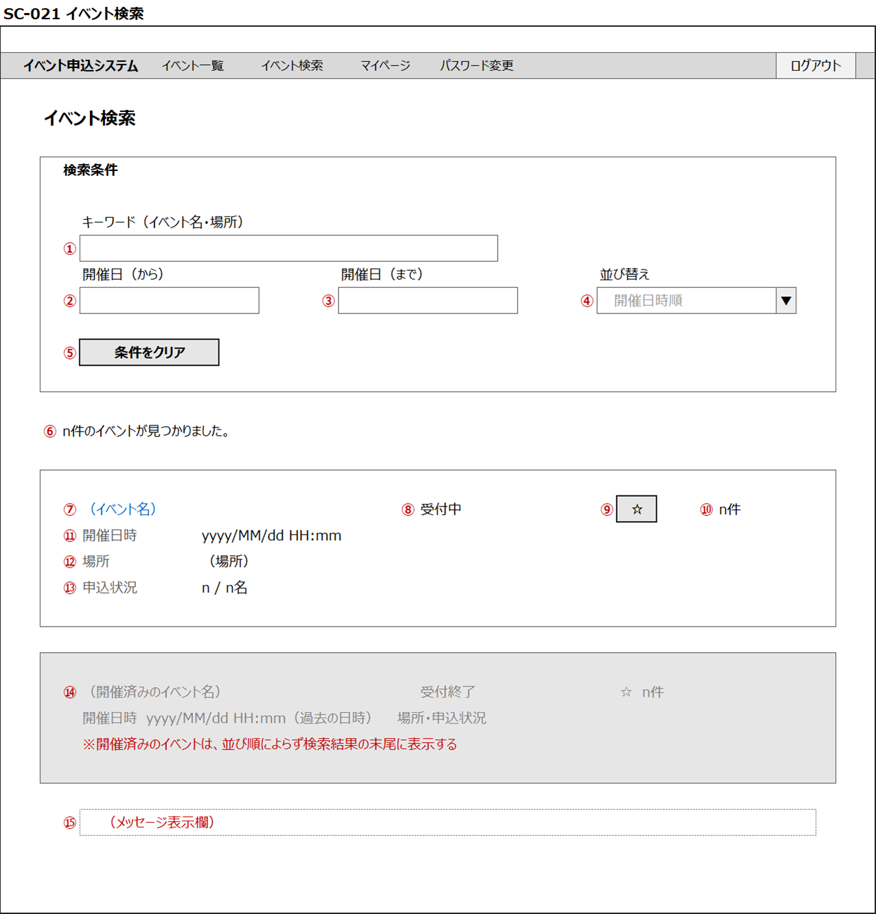

- **目的**：取得済みのイベント情報を、キーワード・開催日の範囲で絞り込んで確認する。
- **並び順**：イベント一覧（SC-020）と同じく、開催前のイベントを先に、開催済み（開催日時が現在時刻以前）のイベントを末尾にまとめて表示する。開催前・開催済みそれぞれの中では、選択した並び順（既定は開催日時順）に従う。
- **表示項目**：検索フォーム、該当件数、イベントのカード一覧（イベント名、開催日時、場所、受付状況、お気に入り数を含み、詳細確認・申込への導線のみを持ち、その場での申込操作は行わない）。
- **入力項目**：キーワード（イベント名・場所を対象、任意）、開催日（から・まで、任意）。
- **ボタン**：「条件をクリア」、並び替え（開催日時順／申込数の多い順／お気に入り数の多い順／申込締切が近い順）。
- **操作**：利用者が検索条件を入力すると、画面上で該当するイベントに絞り込んで表示する。並び替えを選択すると、絞り込み結果を画面側で並び替えて再表示する（APIの再取得は行わない）。イベント名を選択するとSC-022（イベント詳細）へ遷移する。
- **API**：AP-020（一覧取得）、AP-040／AP-041（お気に入り登録・解除）、AP-042（お気に入り一覧取得）。
- **正常時**：条件に合致するイベントを一覧表示する。
- **遷移**：この画面から遷移した場合、SC-022の「戻る」導線はこの画面に戻る。

### SC-022 イベント詳細・申込

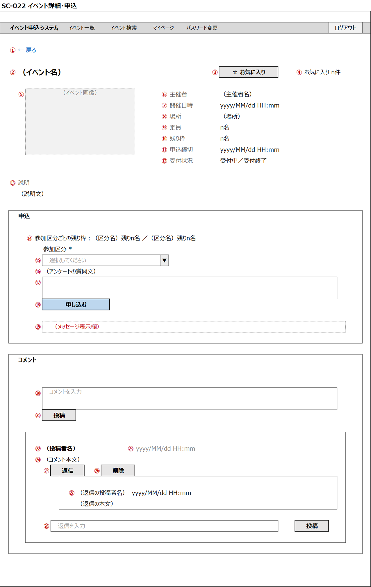

- **目的**：イベントの詳細情報を確認し、申込・お気に入り登録・コメントの投稿や削除を行う。
- **表示項目**：戻る導線（遷移元に応じてSC-020またはSC-021）、イベント名、お気に入りの状態、お気に入り数、イベント画像（設定時）、主催者名（設定時）、開催日時、場所、定員、残り枠、申込締切、受付状況、説明、コメント一覧（投稿者名・本文・投稿日時。自分の投稿または管理者には削除導線を表示。返信は親コメントの下にインデントして表示し、階層数に制限は無い。削除済みのコメントは本文が「このコメントは削除されました」等の表示に置き換わるが、投稿者名・返信は表示したまま残る）。
- **入力項目**：参加区分（区分が設定されたイベントのみ）、アンケート回答（アンケートが設定されたイベントのみ）、コメント本文、返信本文（各コメントの「返信」導線を開いた場合）。
- **ボタン**：お気に入りの登録・解除、申込（残り枠が無い場合は「キャンセル待ちで申し込む」）、コメント「投稿」、各コメントの「返信」（返信入力欄の開閉）、各コメントの「削除」（本人または管理者のみ表示。削除済みのコメントには表示しない）。
- **操作**：利用者が参加区分・アンケートを入力し「申し込む」を押下すると申込API（AP-030）を呼び出す。コメント本文を入力し「投稿」を押下するとコメント投稿API（AP-051）を呼び出す。各コメントの「返信」を押下すると返信入力欄を開き、入力して投稿すると対象コメントを返信先としてAP-051を呼び出す。
- **API**：AP-021（詳細取得）、AP-030（申込）、AP-040／AP-041（お気に入り登録・解除）、AP-050（コメント一覧取得）、AP-051（コメント投稿・返信）、AP-052（コメント削除）。
- **正常時**：申込に成功するとSC-023（申込完了）へ遷移する。お気に入りの状態とお気に入り数は、登録・解除に成功した時点で即座に画面へ反映する。コメント・返信の投稿・削除に成功すると一覧を更新する。

### SC-023 申込完了

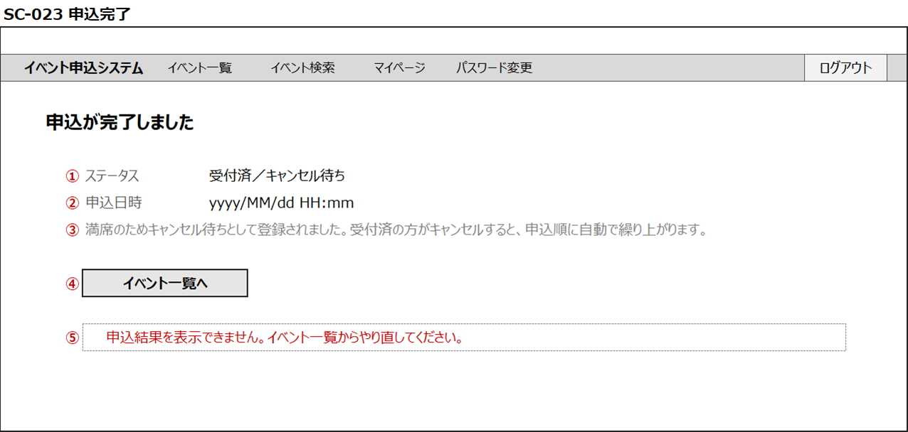

- **目的**：申込直後の結果（申込状況・申込日時）を表示する。
- **表示項目**：申込状況（受付済／キャンセル待ち）、申込日時。キャンセル待ちの場合は補足説明を表示する。
- **入力項目**：なし。
- **ボタン**：「イベント一覧へ」。
- **操作**：利用者が「イベント一覧へ」を押下するとSC-020（イベント一覧）へ遷移する。
- **API**：なし（直前の申込結果を表示する画面であり、専用の取得APIは持たない）。
- **制約**：本画面は、申込操作の直後に遷移してきた場合にのみ結果を表示できる画面とし、URLの直接指定からの結果復元には対応しない。申込直後の画面をそのまま再読み込みした場合は、遷移時に受け取った申込結果がブラウザの履歴に保持されているため、同じ結果を引き続き表示する（申込結果をサーバーから取り直すことはしない）。

### SC-030 マイページ

*申込一覧タブ*

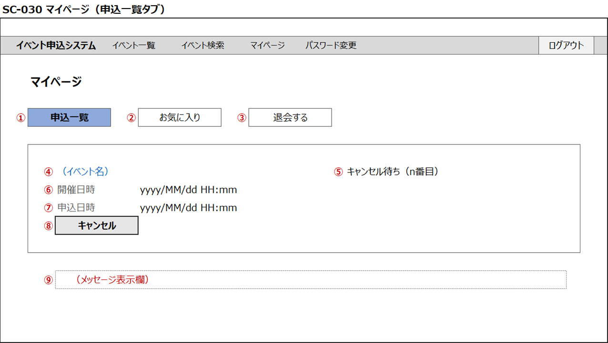

*お気に入りタブ*

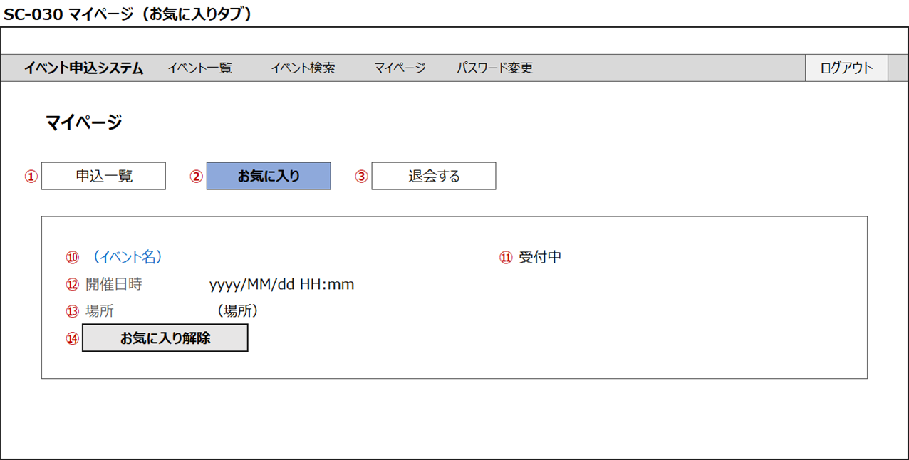

- **目的**：自分の申込状況の確認・キャンセル、自分のお気に入りの確認・解除、自分のアカウントの退会。
- **表示項目**：タブ切替（申込一覧／お気に入り）。申込一覧タブでは、イベント名、状況（受付済／キャンセル待ち／キャンセル済。キャンセル待ちは順位も表示）、開催日時、申込日時。お気に入りタブでは、イベント名、受付状況、開催日時、場所。
- **入力項目**：なし。
- **ボタン**：タブ切替（「申込一覧」「お気に入り」）と同じ並びに「退会する」を表示する（機能追加。タブ切替とは異なり、押下しても表示タブは切り替わらず退会処理を行う）、「キャンセル」（受付済・キャンセル待ちの申込のみ表示）、「お気に入り解除」。
- **操作**：利用者が「キャンセル」を押下すると確認のうえ申込キャンセルAPI（AP-032）を呼び出す。「お気に入り解除」を押下するとお気に入り解除API（AP-041）を呼び出す。「退会する」を押下すると、確認のうえ退会（匿名化）API（AP-013）を呼び出す。
- **API**：AP-031（自分の申込一覧取得）、AP-032（申込キャンセル）、AP-042（お気に入り一覧取得）、AP-041（お気に入り解除）、AP-013（利用者の退会）。
- **正常時**：キャンセル・解除に成功すると該当タブの一覧を更新する。お気に入りの解除は、他画面の表示にも反映する。退会に成功すると、ログイン状態を解除しSC-010（ログイン）へ遷移する。
- **遷移**：イベント名を選択するとSC-022（イベント詳細）へ遷移する。退会に成功するとSC-010（ログイン）へ遷移する。

### SC-110 管理者ダッシュボード

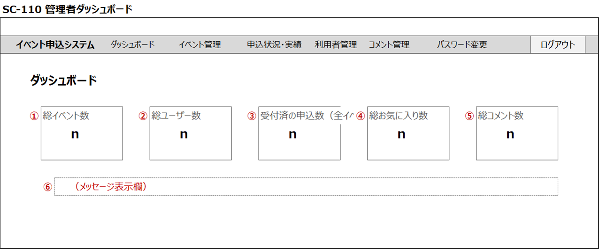

- **目的**：システム全体の概況（イベント数・利用者数・受付済申込数・お気に入り総数・コメント総数）を確認する。
- **表示項目**：総イベント数、総利用者数、受付済の申込数、総お気に入り数、総コメント数。
- **入力項目**：なし。
- **API**：AP-020（イベント一覧取得）、AP-140（利用者一覧取得）、AP-130（申込実績取得）、AP-131（お気に入り総数取得）、AP-132（コメント総数取得）。
- **正常時**：5種の情報から集計した結果を表示する。

### SC-120 イベント管理

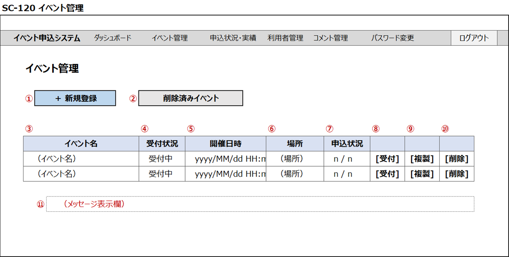

- **目的**：管理者向けのイベント一覧表示と、新規登録・削除・当日受付・削除済み一覧への導線を提供する。
- **表示項目**：「新規登録」「削除済みイベント」への導線、イベントの一覧（名称、受付状況、開催日時、場所、申込状況、当日受付への導線、複製ボタン、削除ボタン）。
- **ボタン**：「複製」（対象イベントの内容をSC-121の新規登録フォームへ複写する）、「削除」（確認のうえ実行し、削除済み一覧から後で復元できる旨を案内する）。
- **API**：AP-020（一覧取得）、AP-021（複製時、複製元イベントの詳細取得）、AP-122（イベント削除）。
- **正常時**：削除に成功すると一覧を更新する。複製操作自体はAPIを呼ばず、画面遷移のみを行う。
- **遷移**：イベント名選択でSC-121（編集モード）、「新規登録」または「複製」でSC-121（新規登録モード。複製の場合は開催日時・申込締切を除く項目があらかじめ入力された状態）、「当日受付」導線でSC-123、「削除済みイベント」でSC-122へ遷移する。

### SC-121 イベント登録・編集

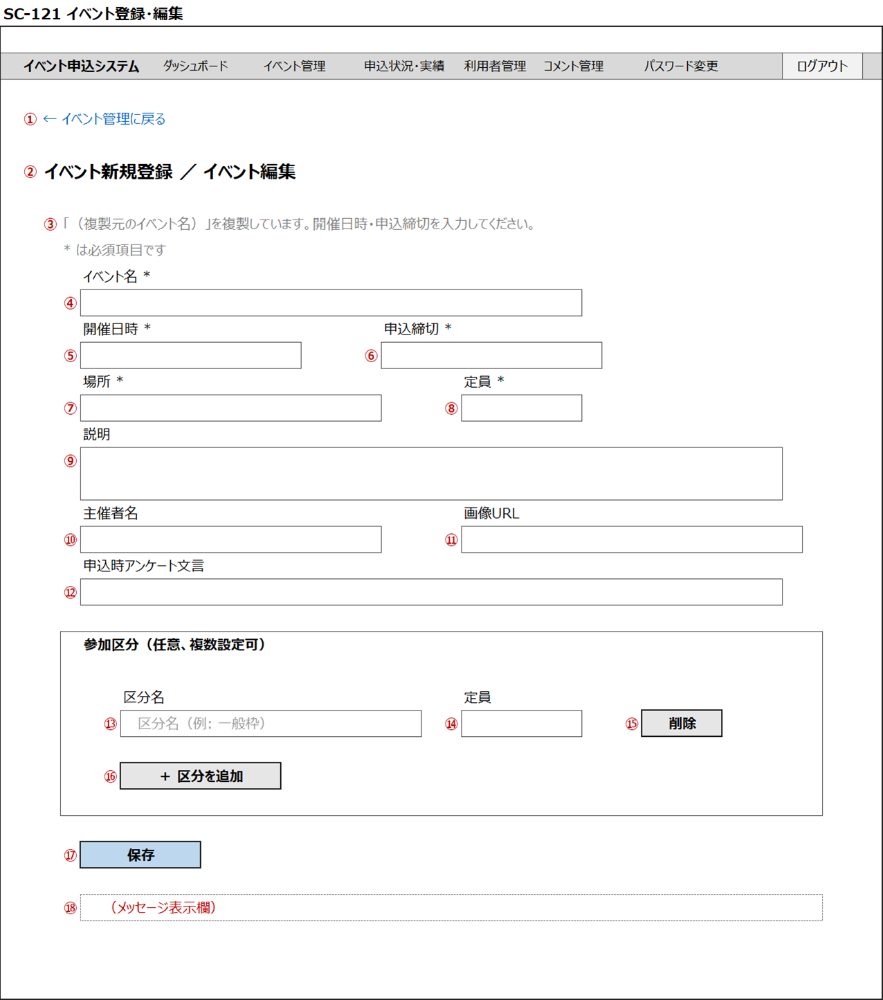

- **目的**：イベント情報および参加区分の新規登録・編集。同一画面を、新規登録・編集の両方の用途で使用する。SC-120・SC-122からの「複製」操作の複写先としても使用する。
- **表示項目**：モードに応じた見出し（新規登録／編集）、必須項目の案内。複製元から遷移した場合は、複製元イベント名を示す案内文（開催日時・申込締切は未入力のため入力を促す旨）を表示する。
- **入力項目**：イベント名、開催日時、場所、定員（参加区分を1件以上設定した場合は自動算出され、直接入力はできない）、申込締切、説明、主催者名、画像URL、アンケート文言、参加区分（行の追加・削除、各行に区分名・定員）。
- **ボタン**：「イベント管理に戻る」、参加区分行ごとの「削除」、「区分を追加」、「保存」。
- **操作**：管理者が各項目を入力し「保存」を押下すると、新規登録時はイベント登録API（AP-120）、編集時はイベント更新API（AP-121）を呼び出す。区分の行を追加・削除すると、定員欄の表示に即座に反映する。
- **API**：AP-021（編集時の初期値取得）、AP-120（新規登録）、AP-121（更新）。
- **正常時**：保存に成功するとSC-120（イベント管理）へ遷移する。

### SC-122 削除済みイベント

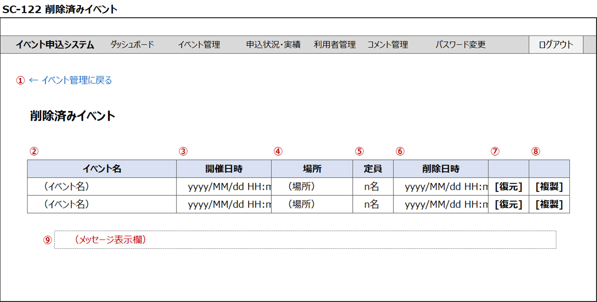

- **目的**：削除済みイベントの確認と復元。削除済みイベントを複製しての新規登録にも対応する。
- **表示項目**：イベント名、削除済みである旨の表示、開催日時、場所、定員、削除日時。
- **ボタン**：「イベント管理に戻る」、「復元」（確認のうえ実行）、「複製」（対象イベントの内容をSC-121の新規登録フォームへ複写する）。
- **API**：AP-123（削除済み一覧取得。複製に必要な項目を含む）、AP-124（復元）。
- **正常時**：復元に成功すると一覧を更新する。複製操作自体はAPIを呼ばず、画面遷移のみを行う。

### SC-123 当日受付

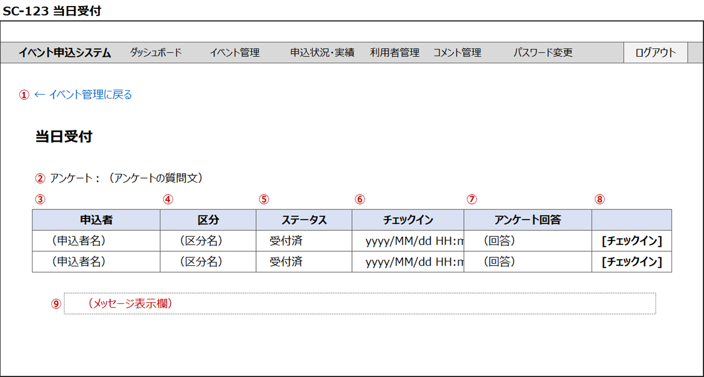

- **目的**：指定したイベントの申込者一覧表示とチェックイン。
- **表示項目**：アンケートの質問文言（対象イベントに設定がある場合のみ、一覧の見出しとして表示）、申込者名、参加区分（設定が無い場合は「-」）、状況、チェックイン日時（未実施の場合は「未チェックイン」）、アンケートへの回答（対象イベントにアンケート設定がある場合のみ列として表示。未回答の申込は空欄）。
- **ボタン**：「イベント管理に戻る」、「チェックイン」（状況が「受付済」の申込に表示。未チェックインの申込には常に表示し、チェックイン済みの申込にも再実行のために表示する）。
- **操作**：管理者が未チェックインの申込に対して「チェックイン」を押下すると、確認なしでチェックインAPI（AP-126）を呼び出す。既にチェックイン済みの申込に対して「チェックイン」を押下した場合は、再度チェックインしてよいかを確認したうえで、管理者が実行を選択した場合にのみAPI（AP-126）を呼び出す。
- **API**：AP-021（イベント詳細取得。アンケートの質問文言取得のため）、AP-125（申込者一覧取得）、AP-126（チェックイン）。
- **正常時**：チェックインに成功すると一覧を更新し、チェックイン日時を反映する。

### SC-130 申込状況・実績

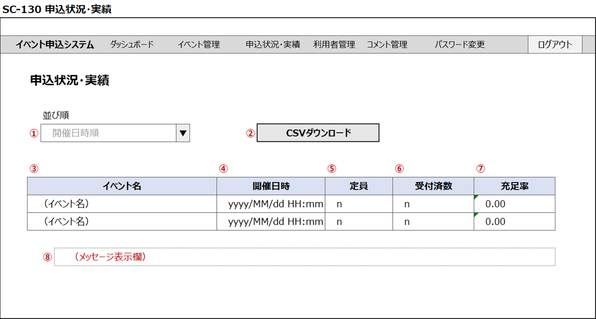

- **目的**：全イベントの申込状況（受付済数・充足率）の確認と、申込明細のCSVダウンロード。
- **表示項目**：並び順の選択、「CSVダウンロード」、集計テーブル（イベント名、開催日時、定員、受付済数、充足率）。ダウンロードするCSV明細には、申込ごとのアンケート回答列・参加区分列を含む（アンケート未設定のイベント、または回答が無い申込のアンケート回答列は空欄。参加区分が設定されていないイベントへの申込の参加区分列は空欄）。
- **入力項目**：並び順（開催日時順／受付数の多い順）。
- **API**：AP-130（申込実績取得。一覧取得・CSV取得の双方）。
- **正常時**：並び順の変更に応じて一覧を再表示する。CSVのダウンロードが完了する。

### SC-140 利用者管理

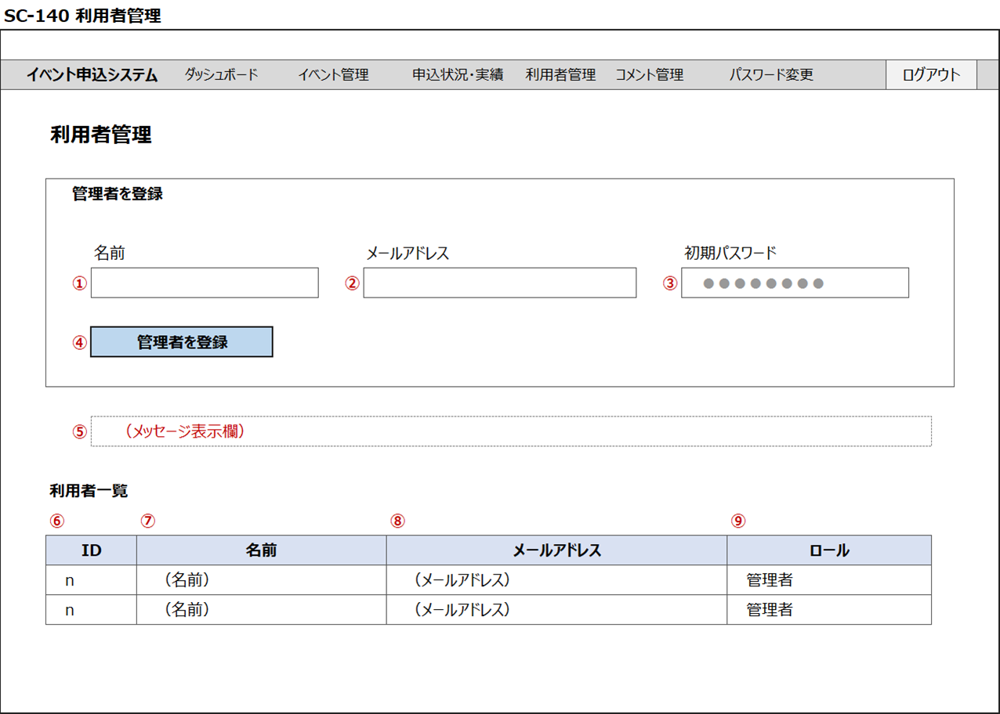

- **目的**：登録済み利用者の確認と、新たな管理者アカウントの登録。
- **表示項目**：利用者ID、名前、メールアドレス、利用者区分の一覧（各行に詳細への導線を持つ）。退会（匿名化）済みの利用者には、その旨を示す表示を加える。
- **入力項目**：管理者アカウント登録フォーム（名前、メールアドレス）。
- **ボタン**：「管理者を登録」。
- **操作**：管理者が名前・メールアドレスを入力し「管理者を登録」を押下すると、管理者アカウント登録API（AP-145）を呼び出す。一覧から利用者を選択するとSC-141（利用者詳細）へ遷移する。
- **API**：AP-140（利用者一覧取得）、AP-145（管理者アカウント登録）。
- **正常時**：登録に成功すると利用者一覧を更新する。

### SC-141 利用者詳細

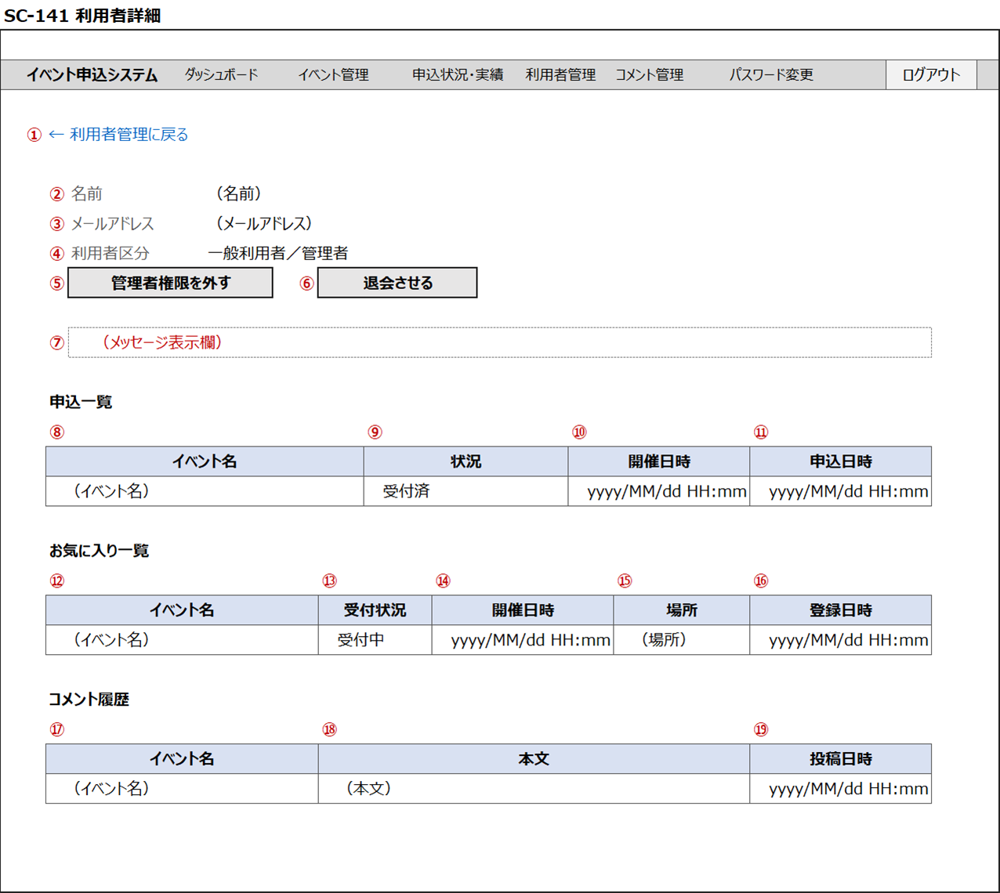

- **目的**：特定の利用者の基本情報・申込履歴・お気に入り履歴・コメント履歴を、管理者が確認する。対象が管理者の場合は管理者権限の降格、対象が一般利用者（未退会）の場合は退会（匿名化）も、この画面から行う。
- **表示項目**：利用者名・メールアドレス・利用者区分（退会済みの場合はその旨も表示）。申込一覧（イベント名、状況、開催日時、申込日時。キャンセル待ちの場合は順位も表示）。お気に入り一覧（イベント名、受付状況、開催日時、場所、登録日時）。コメント履歴（投稿先のイベント名、本文、投稿日時。論理削除済みのコメントも含み、その場合は本文が削除済み表示に置き換わる）。
- **入力項目**：なし。
- **ボタン**：「利用者管理に戻る」。対象の利用者区分が管理者の場合のみ「管理者権限を外す」。対象が一般利用者かつ未退会の場合のみ「退会させる」。
- **操作**：SC-140（利用者管理）の一覧から利用者を選択するとこの画面へ遷移する。「利用者管理に戻る」を押下するとSC-140へ遷移する。「管理者権限を外す」を押下すると、確認のうえ管理者権限の降格API（AP-146）を呼び出す。「退会させる」を押下すると、確認のうえ退会（匿名化）API（AP-013）を呼び出す。
- **API**：AP-141（利用者情報取得）、AP-142（申込一覧取得）、AP-143（お気に入り一覧取得）、AP-144（コメント履歴取得）、AP-146（管理者権限の降格）、AP-013（利用者の退会）。
- **正常時**：利用者の基本情報・申込一覧・お気に入り一覧・コメント履歴を表示する。降格に成功すると、この画面の利用者区分表示を一般利用者に更新する。退会に成功すると、この画面の名前・メールアドレス・利用者区分表示を退会済みの状態に更新する。
- **制約**：管理者以外はこの機能を利用できない。申込のキャンセル・お気に入り解除・コメント削除等、対象利用者に代わる操作は行えない（利用者本人向けのSC-030マイページとは役割が異なる）。管理者権限の降格・利用者の退会のみ、この画面から実行できる例外的な操作とする。

### SC-150 コメント管理

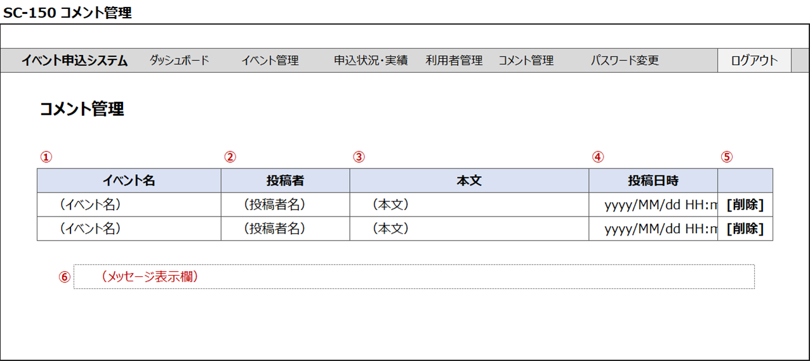

- **目的**：管理者が全イベント横断でコメントを確認し、不適切な投稿等を削除できる。
- **表示項目**：コメント一覧（イベント名、投稿者名、本文、投稿日時）。投稿日時降順で表示し、有効な（論理削除されていない）コメントのみを対象とする。イベント別・投稿者別の絞り込みは設けない。
- **入力項目**：なし。
- **ボタン**：各コメントの「削除」。
- **操作**：管理者が「削除」を押下すると、確認のうえコメント削除API（AP-052）を呼び出す。
- **API**：AP-150（全コメント一覧取得）、AP-052（コメント削除）。
- **正常時**：削除に成功すると一覧を更新する。
- **制約**：管理者以外はこの機能を利用できない。絞り込み機能は提供しないが、各行にイベント名・投稿者名を表示することで、どのイベント・誰の投稿かが分かるようにする。

### SC-900 該当ページなし

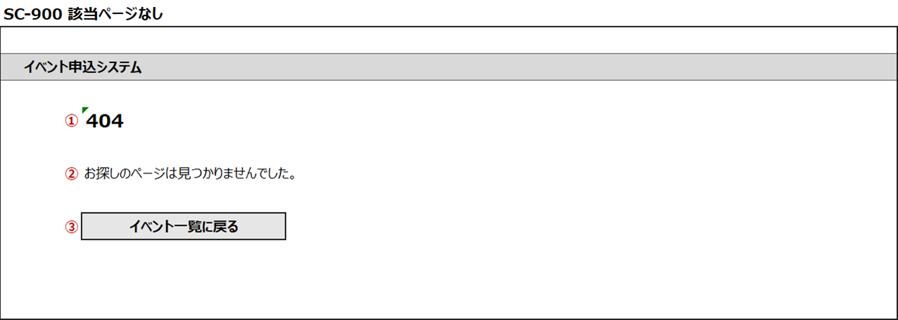

- **目的**：定義されていないURLへアクセスした際に表示する。
- **表示項目**：該当ページが無い旨のメッセージ。
- **ボタン**：「イベント一覧に戻る」。
- **操作**：利用者が「イベント一覧に戻る」を押下するとSC-020（イベント一覧）へ遷移する。
- **制約**：ログイン状態によらず表示できる画面とする。
