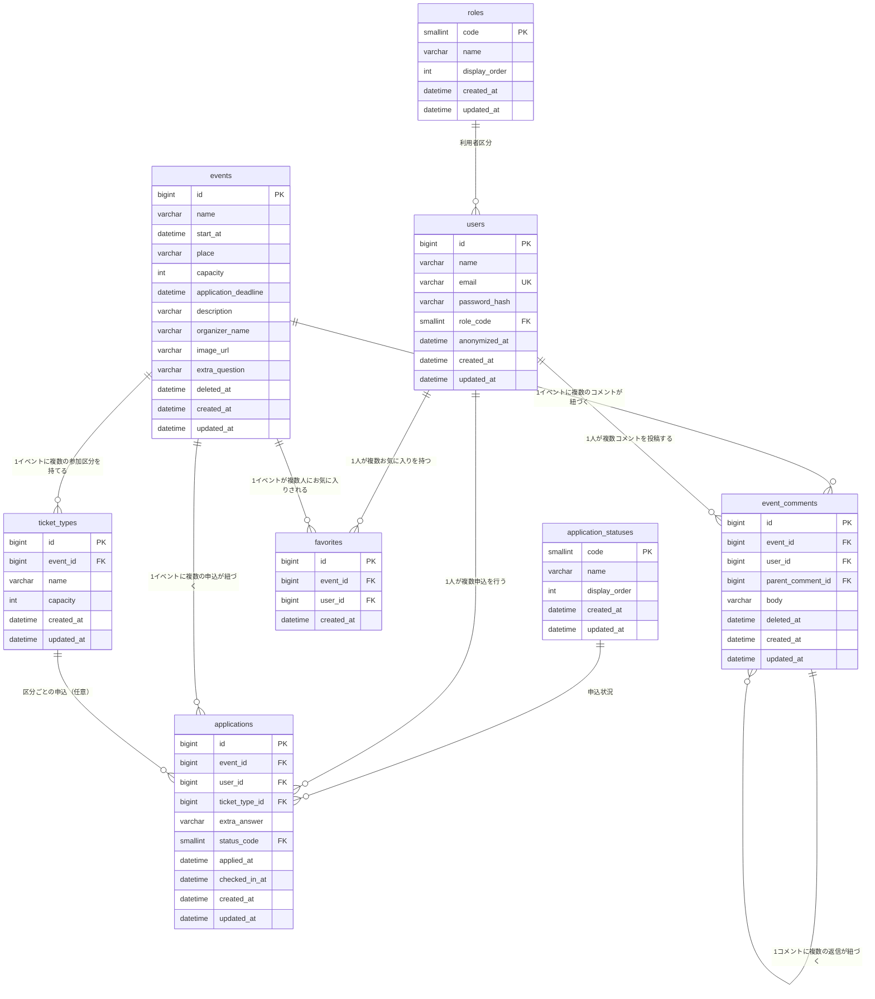

# 22_テーブル定義書

## 1. 概要

本書は、イベント申込システムが扱うデータの構造を定義するテーブル定義書である。`docs/10_要件定義/10_要件定義書.md`に定めた機能・業務ルールを実現するために必要なデータをテーブルとして定義し、データベース設計・実装の基準とする。

- データベース管理システムはMySQL（8.0系）を使用する。
- 文字コードはUTF-8（utf8mb4）を使用する。

### 1.1 命名ルール

| 対象 | ルール | 例 |
|---|---|---|
| テーブル名 | 英小文字のsnake_case、複数形 | `events`、`ticket_types` |
| カラム名 | 英小文字のsnake_case | `start_at` |
| 主キー | 業務テーブルは`id`、コードマスタは`code` | - |
| 外部キー | 参照先テーブル名の単数形＋`_id`。コードマスタを参照する場合は区分名＋`_code` | `event_id`、`status_code` |
| 日時 | 過去分詞または名詞＋`_at` | `applied_at`、`deleted_at` |
| 制約・インデックス | 一意制約は`uk_`、外部キーは`fk_`、検査制約は`chk_`、インデックスは`idx_`で始める | `uk_users_email` |

### 1.2 主キーの方針

- **業務テーブル**（`users`・`events`・`ticket_types`・`applications`・`favorites`・`event_comments`）は、業務上の意味を持たない連番（`id`、BIGINT、自動採番）を単一の主キーとする。
  - 理由1：業務項目（メールアドレス、区分名等）は変更されうるため、主キーにすると参照元すべての更新が必要になる。
  - 理由2：他テーブルやAPIから1つの値で行を特定でき、外部キー・URLが単純になる。
  - 理由3：同じ組み合わせの行が複数存在しうるテーブルがある（`applications`は、キャンセル後の再申込により同一利用者・同一イベントの行が複数になる）。
- **業務上の一意性**は、主キーではなく一意制約で保証する（`users.email`、`favorites`の`(user_id, event_id)`、`ticket_types`の`(event_id, name)`）。
- **コードマスタ**（`roles`・`application_statuses`）は、コード値そのもの（`code`）を主キーとする。コードは一度定めたら意味を変えないため、連番の`id`を別に持たない。
- 複合主キーは採用しない。`favorites`は`(user_id, event_id)`を主キーにすることもできるが、全業務テーブルで行の特定方法を揃えることを優先する。

### 1.3 カラムの並び順

全テーブルで、次の順にカラムを並べる。

1. 主キー（`id`または`code`）
2. 外部キー（イベント→利用者→その他の順。例：`event_id`、`user_id`、`ticket_type_id`）
3. 業務項目
4. 区分コード（`role_code`、`status_code`）
5. 業務上の日時（`applied_at`、`checked_in_at`）
6. 削除・匿名化の日時（`deleted_at`、`anonymized_at`）
7. 監査用の日時（`created_at`、`updated_at`）

### 1.4 データ型の表記

「4. テーブル定義」では、設計上の型（論理型）とデータベース上の型（物理型）を併記する。対応は次のとおり。

| 論理型 | 意味 | 物理型 |
|---|---|---|
| ID | 行を識別する連番 | BIGINT |
| 文字列(n) | 最大n文字の文字列（バイト数ではなく文字数） | VARCHAR(n) |
| 整数 | 件数・人数等の整数 | INT |
| コード | コードマスタで意味を管理する区分値 | SMALLINT |
| 日時 | 年月日・時分秒（日本時間。秒未満は保持しない） | DATETIME |

### 1.5 区分値（コード）の方針

- 利用者区分・申込状況のように、取りうる値があらかじめ決まっている項目は、数値のコードで保持する。コードの意味（表示名）はコードマスタで管理する。
- 業務テーブルの区分コードには、コードマスタへの外部キーを設け、マスタに無い値を登録できないようにする。
- コードは1からの連番とする。取消・終了を表す値は、後から途中の状態を追加しても並びが崩れないよう`9`とする。
- **変更時のルール**：表示名・表示順の変更は、コードマスタの更新のみで行える。値の追加は、コードマスタへの行追加に加え、その値に応じた処理（定員判定への算入の要否等）の実装が必要である。一度使用したコードの意味の変更・再利用は行わない。
- 画面に表示する名称は、コードマスタの表示名を用いる（APIがコードと表示名の両方を返す。`docs/20_基本設計/23_API基本設計書.md`参照）。

### 1.6 日時項目の方針

| 項目 | 意味 | 設定・更新の契機 |
|---|---|---|
| `created_at` | 行を登録した日時 | 登録時にデータベースが自動設定する。以後変更しない |
| `updated_at` | 行を最後に更新した日時 | 登録時および行のいずれかのカラムが更新されるたびに、データベースが自動設定する（`ON UPDATE CURRENT_TIMESTAMP`）。アプリケーションからは書き込まない |
| `applied_at`等の業務上の日時 | 業務上の出来事が起きた日時 | アプリケーションが業務処理の中で設定する |
| `deleted_at`・`anonymized_at` | 削除・退会した日時 | アプリケーションが削除・退会の処理の中で設定する。NULLは未削除・未退会を表す |

- `created_at`は全テーブルに持つ。`updated_at`は、登録後に更新が発生するテーブルにのみ持つ（登録と削除しか行わない`favorites`には持たない）。
- 業務上の日時と監査用の日時は意味が異なるため、値が同じになる場合でも別のカラムとして保持する。例えば退会時は`anonymized_at`の設定によって行が更新されるため、`updated_at`も同時刻になる。その後に行が更新されることはないため、退会済みの利用者では両者が同じ日時のまま残る。これは意図した動作である。

## 2. テーブル一覧

| 種別 | テーブル名 | 論理名 | 用途 |
|---|---|---|---|
| 業務 | `users` | 利用者 | 利用者（一般利用者・管理者）を管理する。 |
| 業務 | `events` | イベント | イベント情報を管理する。 |
| 業務 | `ticket_types` | 参加区分 | イベントの参加区分（定員を分けた申込枠）を管理する。 |
| 業務 | `applications` | 申込 | イベントへの申込を管理する。 |
| 業務 | `favorites` | お気に入り | 利用者によるイベントのお気に入り登録を管理する。 |
| 業務 | `event_comments` | イベントコメント | イベントに対するコメントを管理する。 |
| マスタ | `roles` | 利用者区分マスタ | 利用者区分のコードと表示名を管理する。 |
| マスタ | `application_statuses` | 申込状況マスタ | 申込状況のコードと表示名を管理する。 |

## 3. ER図

## 4. テーブル定義

「型」は論理型（1.4）、「物理型」はデータベース上の型を示す。

### 4.1 users（利用者）

利用者（一般利用者・管理者）を管理する。

| 論理名 | カラム名 | 型 | 物理型 | NULL | キー | デフォルト | 備考 |
|---|---|---|---|---|---|---|---|
| 利用者ID | id | ID | BIGINT | NOT NULL | PK、自動採番 | - | 利用者を一意に識別するID |
| 名前 | name | 文字列(100) | VARCHAR(100) | NOT NULL | - | - | 退会時は固定の文言「退会済み利用者」に置き換える |
| メールアドレス | email | 文字列(255) | VARCHAR(255) | NOT NULL | UNIQUE | - | ログインに使用する。前後の空白を除去し小文字化した値を保存する。退会時は`withdrawn-{id}@invalid.example`に置き換える |
| パスワードハッシュ | password_hash | 文字列(100) | VARCHAR(100) | NULL | - | - | パスワードをハッシュ化した値（元の値は復元できない）。パスワードそのものは保存しない。退会時はNULLに設定し、以後ログインできないようにする。未退会の利用者では必ず値を持つ |
| 利用者区分コード | role_code | コード | SMALLINT | NOT NULL | FK → roles.code（削除時RESTRICT） | - | 「7. コード値一覧」参照 |
| 退会日時 | anonymized_at | 日時 | DATETIME | NULL | - | - | 退会（匿名化）した日時。NULLなら未退会。行は削除せず残す |
| 登録日時 | created_at | 日時 | DATETIME | NOT NULL | - | 登録時の日時 | 1.6参照 |
| 更新日時 | updated_at | 日時 | DATETIME | NOT NULL | - | 登録時の日時（更新時に自動更新） | 1.6参照 |

制約：`email`に一意制約を設け、同一メールアドレスの重複登録を防止する。退会時は`email`を利用者IDに基づく一意な文字列に置き換えることで、この一意制約を満たしたまま個人情報を取り除く。

備考：`password_hash`の桁数は、ハッシュ方式を将来変更しても収まるよう余裕を持たせている。ハッシュ方式は`docs/20_基本設計/24_方式設計書.md`に定める。

### 4.2 events（イベント）

イベントの開催情報を管理する。

| 論理名 | カラム名 | 型 | 物理型 | NULL | キー | デフォルト | 備考 |
|---|---|---|---|---|---|---|---|
| イベントID | id | ID | BIGINT | NOT NULL | PK、自動採番 | - | イベントを一意に識別するID |
| イベント名 | name | 文字列(100) | VARCHAR(100) | NOT NULL | - | - | - |
| 開催日時 | start_at | 日時 | DATETIME | NOT NULL | INDEX | - | - |
| 開催場所 | place | 文字列(100) | VARCHAR(100) | NOT NULL | - | - | - |
| 定員 | capacity | 整数 | INT | NOT NULL | - | - | 1以上。参加区分を設定している間は、区分の定員合計を反映する |
| 申込締切日時 | application_deadline | 日時 | DATETIME | NOT NULL | - | - | 開催日時より前であることを要する（アプリケーションで検証する） |
| 説明 | description | 文字列(1000) | VARCHAR(1000) | NULL | - | - | - |
| 主催者名 | organizer_name | 文字列(100) | VARCHAR(100) | NULL | - | - | - |
| 画像URL | image_url | 文字列(500) | VARCHAR(500) | NULL | - | - | - |
| アンケート文言 | extra_question | 文字列(200) | VARCHAR(200) | NULL | - | - | 申込時アンケートの質問文。NULLの場合はアンケートを行わない |
| 削除日時 | deleted_at | 日時 | DATETIME | NULL | - | - | NULLの場合は有効なイベント、日時が設定されている場合は削除済み（論理削除） |
| 登録日時 | created_at | 日時 | DATETIME | NOT NULL | - | 登録時の日時 | 1.6参照 |
| 更新日時 | updated_at | 日時 | DATETIME | NOT NULL | - | 登録時の日時（更新時に自動更新） | 1.6参照 |

制約：`capacity`は1以上であることを要する（CHECK制約）。

### 4.3 ticket_types（参加区分）

イベントを複数の枠に分けて定員管理する場合の、区分ごとの情報を管理する。イベントに区分を設定しない場合、本テーブルにレコードは存在しない。

| 論理名 | カラム名 | 型 | 物理型 | NULL | キー | デフォルト | 備考 |
|---|---|---|---|---|---|---|---|
| 参加区分ID | id | ID | BIGINT | NOT NULL | PK、自動採番 | - | 参加区分を一意に識別するID |
| イベントID | event_id | ID | BIGINT | NOT NULL | FK → events.id（削除時CASCADE） | - | 対象イベント |
| 区分名 | name | 文字列(50) | VARCHAR(50) | NOT NULL | - | - | 例：一般枠、会員枠 |
| 定員 | capacity | 整数 | INT | NOT NULL | - | - | 当該区分の定員（1以上） |
| 登録日時 | created_at | 日時 | DATETIME | NOT NULL | - | 登録時の日時 | 1.6参照 |
| 更新日時 | updated_at | 日時 | DATETIME | NOT NULL | - | 登録時の日時（更新時に自動更新） | 1.6参照 |

制約：`capacity`は1以上であることを要する（CHECK制約）。`(event_id, name)`の組み合わせに一意制約を設け、同一イベント内での区分名の重複を禁止する。

### 4.4 applications（申込）

イベントへの参加申込を管理する。

| 論理名 | カラム名 | 型 | 物理型 | NULL | キー | デフォルト | 備考 |
|---|---|---|---|---|---|---|---|
| 申込ID | id | ID | BIGINT | NOT NULL | PK、自動採番 | - | 申込を一意に識別するID |
| イベントID | event_id | ID | BIGINT | NOT NULL | FK → events.id（削除時CASCADE） | - | 対象イベント |
| 利用者ID | user_id | ID | BIGINT | NOT NULL | FK → users.id（削除時RESTRICT） | - | 申込者 |
| 参加区分ID | ticket_type_id | ID | BIGINT | NULL | FK → ticket_types.id（削除時RESTRICT） | - | 対象の参加区分。区分が設定されていないイベントへの申込ではNULL |
| アンケート回答 | extra_answer | 文字列(500) | VARCHAR(500) | NULL | - | - | 申込時アンケートへの回答 |
| 申込状況コード | status_code | コード | SMALLINT | NOT NULL | FK → application_statuses.code（削除時RESTRICT） | `1`（受付済） | 「7. コード値一覧」参照 |
| 申込日時 | applied_at | 日時 | DATETIME | NOT NULL | - | 登録時の日時 | キャンセル待ちの順位・繰り上げの順序の基準とする |
| チェックイン日時 | checked_in_at | 日時 | DATETIME | NULL | - | - | 当日受付を行った日時。NULLの場合は未受付。再チェックイン時は最新の実行時刻に更新する |
| 登録日時 | created_at | 日時 | DATETIME | NOT NULL | - | 登録時の日時 | 1.6参照 |
| 更新日時 | updated_at | 日時 | DATETIME | NOT NULL | - | 登録時の日時（更新時に自動更新） | 1.6参照。キャンセル・繰り上げ・チェックインのいずれでも更新される |

制約：`(user_id, event_id)`の組み合わせに一意制約は設けない。キャンセル後の再申込を業務上許容するため、有効な申込の有無は`status_code`の値（受付済またはキャンセル待ち）によって判定する。

備考：キャンセルした日時を表す専用のカラムは持たない。キャンセル済の申込はその後更新されないため、`updated_at`がキャンセル日時に相当する。

### 4.5 favorites（お気に入り）

利用者によるイベントのお気に入り登録を管理する。

| 論理名 | カラム名 | 型 | 物理型 | NULL | キー | デフォルト | 備考 |
|---|---|---|---|---|---|---|---|
| お気に入りID | id | ID | BIGINT | NOT NULL | PK、自動採番 | - | お気に入り登録を一意に識別するID |
| イベントID | event_id | ID | BIGINT | NOT NULL | FK → events.id（削除時CASCADE） | - | 対象イベント |
| 利用者ID | user_id | ID | BIGINT | NOT NULL | FK → users.id（削除時RESTRICT） | - | 登録した利用者 |
| 登録日時 | created_at | 日時 | DATETIME | NOT NULL | - | 登録時の日時 | お気に入りに登録した日時 |

制約：`(user_id, event_id)`の組み合わせに一意制約を設け、同一利用者・同一イベントの重複登録を防止する。

備考：お気に入りは登録（行の追加）と解除（行の削除）のみで、登録後に内容を更新することがないため、`updated_at`を持たない（1.6）。削除済みのイベントに対するお気に入り登録も履歴として保持し、一覧から自動的には除外しない。

### 4.6 event_comments（イベントコメント）

イベントに対するコメントを管理する。

| 論理名 | カラム名 | 型 | 物理型 | NULL | キー | デフォルト | 備考 |
|---|---|---|---|---|---|---|---|
| コメントID | id | ID | BIGINT | NOT NULL | PK、自動採番 | - | コメントを一意に識別するID |
| イベントID | event_id | ID | BIGINT | NOT NULL | FK → events.id（削除時CASCADE） | - | 対象イベント |
| 利用者ID | user_id | ID | BIGINT | NOT NULL | FK → users.id（削除時RESTRICT） | - | 投稿者 |
| 返信先コメントID | parent_comment_id | ID | BIGINT | NULL | FK → event_comments.id（削除時RESTRICT） | - | 返信先のコメント。返信でない（通常の投稿）場合はNULL |
| 本文 | body | 文字列(500) | VARCHAR(500) | NOT NULL | - | - | - |
| 削除日時 | deleted_at | 日時 | DATETIME | NULL | - | - | NULLの場合は有効なコメント、日時が設定されている場合は論理削除済み（返信が残っているため行を残したもの） |
| 投稿日時 | created_at | 日時 | DATETIME | NOT NULL | INDEX（event_idとの複合） | 登録時の日時 | 1.6参照。投稿日時として表示・並び替えに用いる |
| 更新日時 | updated_at | 日時 | DATETIME | NOT NULL | - | 登録時の日時（更新時に自動更新） | 1.6参照。編集機能は無いため、更新されるのは論理削除時のみ |

制約：`parent_comment_id`は同一イベント内のコメントのみを参照できる（アプリケーションで検証する）。

備考：削除の扱いは「6. データ整合性に関する方針」の削除方針を参照。返信の階層数に制限は無く、削除済みのコメントに対しても返信できる。

### 4.7 roles（利用者区分マスタ）

利用者区分のコードと表示名を管理する。

| 論理名 | カラム名 | 型 | 物理型 | NULL | キー | デフォルト | 備考 |
|---|---|---|---|---|---|---|---|
| 利用者区分コード | code | コード | SMALLINT | NOT NULL | PK | - | 「7. コード値一覧」参照 |
| 表示名 | name | 文字列(20) | VARCHAR(20) | NOT NULL | UNIQUE | - | 画面に表示する名称 |
| 表示順 | display_order | 整数 | INT | NOT NULL | - | - | 一覧・選択肢に表示する際の順序（昇順） |
| 登録日時 | created_at | 日時 | DATETIME | NOT NULL | - | 登録時の日時 | 1.6参照 |
| 更新日時 | updated_at | 日時 | DATETIME | NOT NULL | - | 登録時の日時（更新時に自動更新） | 1.6参照 |

### 4.8 application_statuses（申込状況マスタ）

申込状況のコードと表示名を管理する。

| 論理名 | カラム名 | 型 | 物理型 | NULL | キー | デフォルト | 備考 |
|---|---|---|---|---|---|---|---|
| 申込状況コード | code | コード | SMALLINT | NOT NULL | PK | - | 「7. コード値一覧」参照 |
| 表示名 | name | 文字列(20) | VARCHAR(20) | NOT NULL | UNIQUE | - | 画面・CSVに表示する名称 |
| 表示順 | display_order | 整数 | INT | NOT NULL | - | - | 一覧・選択肢に表示する際の順序（昇順） |
| 登録日時 | created_at | 日時 | DATETIME | NOT NULL | - | 登録時の日時 | 1.6参照 |
| 更新日時 | updated_at | 日時 | DATETIME | NOT NULL | - | 登録時の日時（更新時に自動更新） | 1.6参照 |

備考：コードマスタの登録・変更を行う画面・APIは提供しない。初期データとして投入し、変更が必要な場合はデータベースを直接更新する。

## 5. テーブル間リレーション

| 親テーブル | 子テーブル | 親削除時の扱い | 備考 |
|---|---|---|---|
| roles | users | RESTRICT | 使用中のコードは削除できない。 |
| application_statuses | applications | RESTRICT | 同上。 |
| users | favorites | RESTRICT | 利用者の物理削除機能は提供しない（退会は匿名化で行うため、行自体は削除されない。§6参照）。 |
| users | applications | RESTRICT | 同上。 |
| users | event_comments | RESTRICT | 同上。 |
| events | ticket_types | CASCADE | イベントを物理的に削除した場合、紐づく参加区分も削除される。イベントの削除は論理削除（`deleted_at`の設定）を基本とするため、通常の運用では発生しない。 |
| events | applications | CASCADE | 同上。 |
| events | favorites | CASCADE | 同上。 |
| events | event_comments | CASCADE | 同上。 |
| ticket_types | applications | RESTRICT | 有効な申込が残っている参加区分は削除できないという業務ルールに対応する。 |
| event_comments（親） | event_comments（返信） | RESTRICT | 返信が1件でもあるコメントはアプリケーション側で物理削除せず論理削除（`deleted_at`）とするため、通常の運用では発生しない。 |

## 6. データ整合性に関する方針

### 削除方針

データの削除は、履歴として残す必要があるかどうかで方式を使い分ける。

| テーブル | 利用者から見た操作 | 方式 | 理由 |
|---|---|---|---|
| users | 退会 | 匿名化（行は残す。`name`・`email`を置き換え、`password_hash`をNULLにし、`anonymized_at`を設定） | 申込・お気に入り・コメントの履歴を残しつつ、個人情報を取り除くため |
| events | イベント削除 | 論理削除（`deleted_at`を設定）。復元時はNULLに戻す | 申込等の履歴を残し、誤削除時に復元できるようにするため |
| ticket_types | 参加区分の変更・解除 | 物理削除（行を削除） | 有効な申込が無い場合にのみ変更を許すため、残す履歴が無い |
| applications | 申込キャンセル | 削除しない（`status_code`をキャンセル済に更新） | 申込実績として全ての申込を残すため |
| favorites | お気に入り解除 | 物理削除（行を削除） | 履歴として残す必要が無いため |
| event_comments | コメント削除 | 返信が無い場合は物理削除、返信が1件以上ある場合は論理削除（`deleted_at`を設定。復元は不可） | 返信が参照する親コメントを残す必要がある場合に限り、行を残すため |
| roles・application_statuses | （操作なし） | 削除しない | 使用中のコードを失わないため |

- 論理削除・匿名化された行は、通常の一覧・検索の対象から除外する（除外の条件は`docs/30_詳細設計/31_API詳細設計書.md`の各APIに定める）。

### その他の方針

- 定員・申込状況（受付済件数、残り枠、充足率）は、`applications`テーブルの状況を都度集計することで算出し、別途の集計カラムは持たない。
- 利用者区分・申込状況は、コードマスタに登録された値のみを使用する（外部キーで保証する。「7. コード値一覧」参照）。

## 7. コード値一覧

コードマスタに初期データとして登録する値は次のとおり。

### roles（利用者区分）

| コード | 表示名 | 表示順 | 意味 |
|---|---|---|---|
| 1 | 一般利用者 | 1 | イベントの閲覧・申込等を行う利用者 |
| 2 | 管理者 | 2 | イベントの管理・運営を行う利用者 |

### application_statuses（申込状況）

| コード | 表示名 | 表示順 | 意味 | 定員への算入 |
|---|---|---|---|---|
| 1 | 受付済 | 1 | 定員内で受け付けられた申込 | 算入する |
| 2 | キャンセル待ち | 2 | 定員超過により繰り上げ待ちとなっている申込 | 算入しない |
| 9 | キャンセル済 | 3 | 利用者が取り消した申込 | 算入しない |

「有効な申込」とは、コードが1（受付済）または2（キャンセル待ち）の申込を指す。

## 8. インデックス一覧

主キー・一意制約・外部キーによって自動的に作成されるもの以外に、次のインデックスを設ける。

| テーブル | インデックス名 | 対象カラム | 用途 |
|---|---|---|---|
| events | idx_events_start_at | start_at | イベント一覧の開催日時順の並び替え |
| event_comments | idx_event_comments_event_created | event_id, created_at | イベントごとのコメント一覧（投稿日時順） |
| event_comments | idx_event_comments_parent | parent_comment_id | 返信の有無の判定 |
| applications | idx_app_event_status_user | event_id, status_code, user_id | 定員判定、充足率の集計、二重申込の判定 |
| applications | idx_app_user_applied | user_id, applied_at | 利用者ごとの申込一覧（申込日時順） |
| applications | idx_app_ticket_type_status | ticket_type_id, status_code | 参加区分単位の定員判定・受付済件数の集計 |

一意制約は次のとおり。

| テーブル | 制約名 | 対象カラム |
|---|---|---|
| users | uk_users_email | email |
| ticket_types | uk_ticket_types_event_name | event_id, name |
| favorites | uk_favorites_user_event | user_id, event_id |
| roles | uk_roles_name | name |
| application_statuses | uk_application_statuses_name | name |
