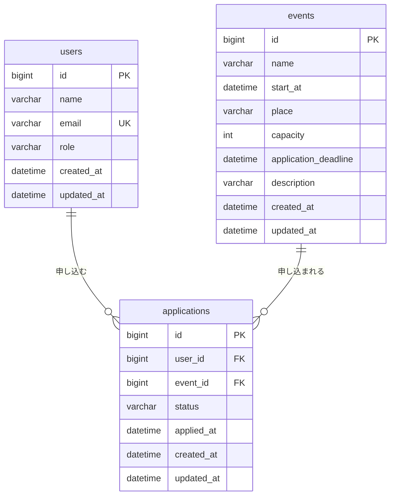

# イベント申込システム DB設計書

フェーズA-4 成果物 ／ v1.2（2026-09-16。更新: applications.statusに「キャンセル待ち」を追加、テーブル構造自体の変更は無し）

要件定義書 §9（主要データ項目）・API設計書（リクエスト/レスポンス定義）に対応。DBMSはMySQL（技術仕様書§2準拠）。
Excel「テーブル定義書」シート（AP-060手順のStep1〜5）をもとに、制約の誤りを修正しインデックス・削除時方針を補って清書。§7〜9でAP-062準拠のトレーサビリティ確認・同時実行方針・総括を追加し、DB設計書（AP-060テーブル設計＋AP-061 ER図＋AP-062 整合確認の統合）として完成させたもの。

---

## 1. テーブル一覧

| テーブル名 | 概要 | 主キー |
|---|---|---|
| `users` | 利用者（一般ユーザー・管理者） | `id` |
| `events` | イベント（管理者が登録するマスタ） | `id` |
| `applications` | 申込（利用者とイベントを結ぶ、申込という行為の実体） | `id` |

**関連**：`users` と `events` は多対多の関係にあり、`applications` がその関連を表す中間実体です。

---

## 2. カラム定義書

### 2.1 `users`（利用者）

| カラム名 | 型 | NULL | デフォルト | 制約 | 説明 |
|---|---|---|---|---|---|
| id | BIGINT | NOT NULL | AUTO_INCREMENT | PK | 利用者ID |
| name | VARCHAR(100) | NOT NULL | - | - | 氏名 |
| email | VARCHAR(255) | NOT NULL | - | **UNIQUE** | メールアドレス |
| role | VARCHAR(20) | NOT NULL | - | - | `general`／`admin` |
| created_at | DATETIME | NOT NULL | CURRENT_TIMESTAMP | - | 作成日時（監査カラム） |
| updated_at | DATETIME | NOT NULL | CURRENT_TIMESTAMP（更新時に自動更新） | - | 更新日時（監査カラム） |

### 2.2 `events`（イベント）

| カラム名 | 型 | NULL | デフォルト | 制約 | 説明 |
|---|---|---|---|---|---|
| id | BIGINT | NOT NULL | AUTO_INCREMENT | PK | イベントID |
| name | VARCHAR(100) | NOT NULL | - | - | イベント名 |
| start_at | DATETIME | NOT NULL | - | - | 開催日時 |
| place | VARCHAR(100) | NOT NULL | - | - | 場所 |
| capacity | INT | NOT NULL | - | CHECK (capacity >= 1) | 定員 |
| application_deadline | DATETIME | NOT NULL | - | - | 申込締切日時（`start_at`以前であることはアプリ側で担保、DB制約にはしない） |
| description | VARCHAR(1000) | NULL | - | - | 説明 |
| created_at | DATETIME | NOT NULL | CURRENT_TIMESTAMP | - | 作成日時（監査カラム） |
| updated_at | DATETIME | NOT NULL | CURRENT_TIMESTAMP（更新時に自動更新） | - | 更新日時（監査カラム） |

### 2.3 `applications`（申込）

| カラム名 | 型 | NULL | デフォルト | 制約 | 説明 |
|---|---|---|---|---|---|
| id | BIGINT | NOT NULL | AUTO_INCREMENT | PK | 申込ID |
| user_id | BIGINT | NOT NULL | - | FK → `users.id` | 申込者 |
| event_id | BIGINT | NOT NULL | - | FK → `events.id` | 対象イベント |
| status | VARCHAR(20) | NOT NULL | `'受付済'` | - | `受付済`／`キャンセル待ち`（機能追加）／`キャンセル済` |
| applied_at | DATETIME | NOT NULL | CURRENT_TIMESTAMP | - | 申込日時 |
| created_at | DATETIME | NOT NULL | CURRENT_TIMESTAMP | - | 作成日時（監査カラム） |
| updated_at | DATETIME | NOT NULL | CURRENT_TIMESTAMP（更新時に自動更新） | - | 更新日時（監査カラム） |

> `(user_id, event_id)` に UNIQUE制約は付けない。キャンセル後の再申込を許すため、同じ組み合わせの行が状態違いで複数存在してよい（二重申込チェックは `status='受付済'` の行の有無だけをアプリ側で見る）。

---

## 3. インデックス一覧

| テーブル | インデックス名 | 対象列 | 用途 |
|---|---|---|---|
| `events` | `idx_events_start_at` | `start_at` | 一覧の開催日時昇順ソート（API-01） |
| `applications` | `idx_app_event_status_user` | `event_id, status, user_id` | 定員超過チェック・充足率集計（`event_id`+`status`）、二重申込チェック（+`user_id`） |
| `applications` | `idx_app_user_applied` | `user_id, applied_at` | マイページの自分の申込一覧（API-04、申込日時順） |

`user_id`／`event_id` 単体には、FK制約により自動でインデックスが張られる（InnoDBの仕様）。

---

## 4. 外部キー・参照整合性

| FK | 参照先 | ON DELETE | 理由 |
|---|---|---|---|
| `applications.user_id` | `users.id` | RESTRICT | 利用者を削除する機能は無いため通常は発生しない |
| `applications.event_id` | `events.id` | **CASCADE**（要確認・推奨値） | イベント削除可否チェック（要件定義§8）は「`受付済`の申込が無ければ削除可」。`キャンセル済`の申込行は残り得るため、物理削除を成立させるには CASCADE が必要 |

---

## 5. カラムにしない「派生値」一覧

API・画面で使うが、DBには保存せずクエリ時に計算する値（二重管理を避けるため）。

| 値 | 対応API | 計算式 |
|---|---|---|
| `acceptedCount`（受付済数） | API-01, 02, 09 | `applications` を `event_id` かつ `status='受付済'` でCOUNT |
| `open`（受付中フラグ） | API-01, 02 | `NOW() <= application_deadline AND NOW() < start_at` |
| `remaining`（残り枠） | API-02 | `capacity - acceptedCount` |
| `fillRate`（充足率） | API-09 | `acceptedCount / capacity` |

---

## 6. 要件定義書・API設計書との整合確認結果

| 確認項目 | 結果 |
|---|---|
| `users`／`events`／`applications` のカラム構成 | 要件定義書§9と一致 |
| 各カラムの型・桁数 | API設計書のバリデーション（`@Size`/`@Min`/`@Future`等）と一致 |
| `status` の値 | `受付済`／`キャンセル待ち`（機能追加）／`キャンセル済`の3値で、要件定義書§4・API-03/04と一致 |
| 業務ロジック6件（要件定義書§8） | すべてこのテーブル構成で判定可能（下表） |

| 業務ロジック | 判定に使う列 |
|---|---|
| 定員超過チェック | `applications`（`event_id`,`status`のCOUNT）と `events.capacity` |
| 申込締切・日付チェック | `events.application_deadline`, `events.start_at` |
| 二重申込チェック | `applications.user_id`, `event_id`, `status` |
| 取消可否チェック | `applications.status`, `events.start_at` |
| イベント削除可否チェック | `applications`（`event_id`,`status='受付済'`のCOUNT） |
| 権限チェック | `users.role` |

### Excel版からの修正点

| 箇所 | Excel版 | 修正後 | 理由 |
|---|---|---|---|
| `events.description` の型 | `VARCHAR(100)` | `VARCHAR(1000)` | Step1・API設計書の「0〜1000文字」と矛盾していた（このままでは1000文字の入力欄でDBエラーになる） |
| `users.created_at` の型表記 | `DATATIME` | `DATETIME` | 誤記（DDLではそのままだとエラーになる） |
| インデックス | 未検討 | §3として追加 | AP-060 Step5「制約とインデックス」のうちインデックスが未記載だったため |
| `applications.event_id` の削除時方針 | 未記載 | `ON DELETE CASCADE`（要確認） | イベント削除可否チェックの仕様上、削除時にキャンセル済み申込行が孤立しないようにする方針が必要 |

---

## 7. 設計書間トレーサビリティ確認（AP-062準拠）

このDB設計書（テーブル定義書＋ER図）が、画面設計・API設計・ロジック設計（いずれも要件定義書・API設計書に記載）と矛盾していないかを、項目単位で確認する。

### 7.1 画面の入力項目 → DBカラム

| 画面 | 入力項目 | 変換パターン | 対応するDBカラム |
|---|---|---|---|
| SC-01 ログイン | ロール（選択） | 選択 → 検索キー | `users.role`（該当ユーザーの検索に使用。新規保存はしない） |
| SC-02 詳細・申込 | 申込対象イベント（一覧から選択） | **選択 → ID型の外部キー** | `applications.event_id` |
| SC-03 マイページ | 取消対象の申込（ボタン） | **選択 → ID型の主キー**（更新対象の特定） | `applications.id` |
| SC-04 登録・編集フォーム | イベント名／開催日時／場所／定員／申込締切日時／説明 | 直接対応 | `events.name/start_at/place/capacity/application_deadline/description` |
| SC-04 管理一覧 | 削除対象イベント（ボタン） | **選択 → ID型の主キー**（削除対象の特定） | `events.id` |

→ 全項目が対応。「選択式の入力はすべてID型のキー（PK/FK）に変換される」という一貫した変換パターンになっている。

### 7.2 APIのリクエスト/レスポンス → DBカラム

| API | 項目 | 対応するDBカラム | 備考 |
|---|---|---|---|
| API-01/02 | id, name, startAt, place, capacity, applicationDeadline, description | 各テーブルの同名列 | 直接対応 |
| API-01/02/09 | acceptedCount, open, remaining, fillRate | （非保存・派生値） | §5参照。集計・計算で都度生成 |
| API-03 | eventId（リクエスト） | `applications.event_id` | 直接対応 |
| API-03/04/05 | id, status, appliedAt | `applications.id/status/applied_at` | 直接対応 |
| API-03 レスポンス | userId | `applications.user_id` | **リクエストボディには含まれない**。ログイン中の`X-User-Id`ヘッダ（認証情報）からServiceが設定する |
| API-04 | eventName, startAt | `events.name/start_at` | `applications`自身の列ではなく`events`とのJOINで取得 |
| API-09 csv | 申込者名 | `users.name` | `applications`自身の列ではなく`users`とのJOINで取得 |
| API-06/07 | name, startAt, place, capacity, applicationDeadline, description | `events`の同名列 | 直接対応（`description`は修正後`VARCHAR(1000)`で一致） |
| API-10 | role（リクエスト） | `users.role` | 検索キーとして使用、新規保存なし |
| API-10 | userId, name, role（レスポンス） | `users.id/name/role` | 直接対応 |

→ 全項目が対応。`userId`のみ、AP-062が典型例として挙げる「認証情報経由でDBに入る、画面入力・APIリクエストボディには現れない項目」のパターンと一致する。

### 7.3 業務ロジックの状態値 → DBカラム

| ロジック／状態値（要件定義書§4・§8） | 対応するDBカラム |
|---|---|
| 申込ステータス（受付済／キャンセル済） | `applications.status` |
| 受付中／受付終了 | （非保存・派生）`events.application_deadline`, `events.start_at` と現在時刻の比較 |
| 定員超過チェック | `events.capacity` ／ `applications` のCOUNT（`event_id`,`status`で絞り込み） |
| 申込締切・日付チェック | `events.application_deadline`, `events.start_at` |
| 二重申込チェック | `applications.user_id, event_id, status` |
| 取消可否チェック | `applications.status`, `events.start_at` |
| イベント削除可否チェック | `applications` のCOUNT（`event_id`,`status='受付済'`） |
| 権限チェック | `users.role` |
| 充足率・人気度（独自機能） | （非保存・派生）`applications`のCOUNT ÷ `events.capacity` |

→ 全項目が対応。

### 7.4 画面・API・ロジックに対応が無いDBカラムの説明

| カラム | 分類 | 説明 |
|---|---|---|
| `users.id`, `events.id`, `applications.id` | 自動生成（PK） | `AUTO_INCREMENT`。画面・APIからは指定しない |
| 各テーブルの `created_at`／`updated_at` | 監査カラム | DBが自動設定（`DEFAULT`／`ON UPDATE`） |
| `applications.applied_at` | システム設定 | 申込処理の実行時刻をサーバーが設定。画面からの入力値ではない |
| `applications.user_id` | 認証情報由来 | 画面入力・APIリクエストボディには存在しない（7.2参照） |
| `users.name`, `users.email` | 初期データ | ユーザー登録画面・APIが存在しない（要件定義書§2）ため、画面・APIからの入力経路が無い。初期データ投入（WBS C-2）でのみ設定される |

→ 対応の無いカラムはすべて「自動生成／監査／システム設定／認証情報由来／初期データ」のいずれかで説明できる。**未説明・宙に浮いたカラムは無し。**

---

## 8. 同時実行・排他制御の方針

「定員超過チェック」は、複数人がほぼ同時に最後の1枠を奪い合う**競合状態（race condition）**が理論上発生しうる処理である。

- **方針**：要件定義書§2で「定員ぎりぎりでの同時申込の競合制御は考慮しない（テスト段階の割り切り）」と決定済み。悲観ロック・楽観ロックのいずれも採用しない。
- **理由**：教材作成のためのテスト段階であり、同時アクセスが実質発生しない前提（1人での動作確認が中心）のため。
- **最低限の実装方針**：ロックは行わないが、「受付済数のカウント → INSERT」はService層で1つの `@Transactional` にまとめ、処理の途中失敗時に中途半端な状態（申込だけ作られて集計がずれる等）が残らないようにする。
- 参考（本番相当にする場合）：定員という有限資源の奪い合いには、`events`行を`SELECT ... FOR UPDATE`する悲観ロック方式が向く。同時アクセス頻度が低い前提なら、`events`に`version`カラムを追加する楽観ロックでも良い。

---

## 9. 設計全体の整合性確認（総括）

要件定義書・画面遷移図・API設計書・テーブル定義書のすべてを通して確認した結果：

- **用語の表記揺れ**：無し
- **前工程への反映漏れ**：無し（`events.description`の桁数の誤りはテーブル定義書側の誤記であり、要件定義書・API設計書は元から正しかったため、前工程の修正は不要だった）
- **矛盾・抜け**：無し（7.1〜7.4がすべて説明できた）

以上により、本ファイルを **DB設計書（テーブル定義書＋ER図の統合）** として確定する。
