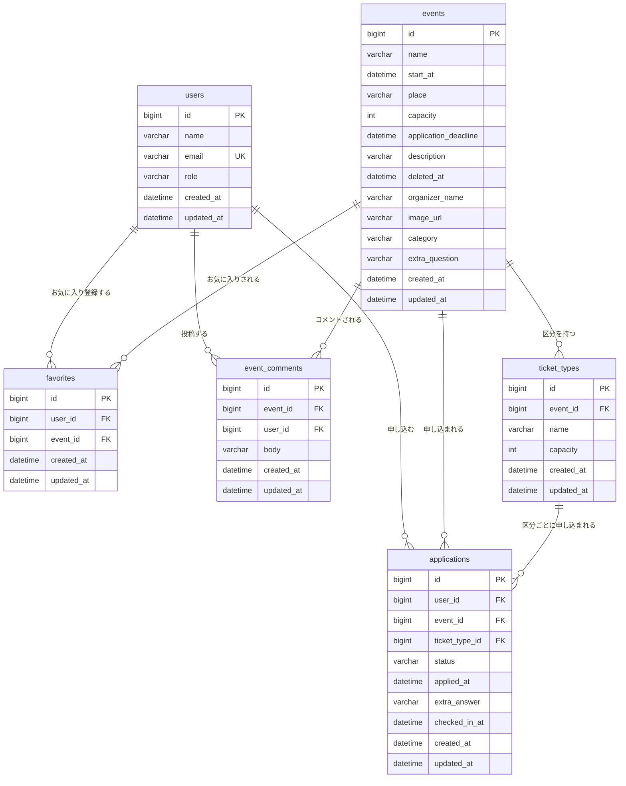

# イベント申込システム DB設計書（アジャイル開発フェーズ版）

v2.0（2026-09-18作成。`テーブル定義書_v1.0.md`（v1.3）をもとに、`要件定義書_v2.0.md`の機能追加10件に対応する列・テーブルを追加した新規ファイル）

要件定義書_v2.0.md §9・API設計書_v2.0.md に対応。DBMSはMySQL（技術仕様書§2準拠）。**v1.0の内容（users/events/applicationsの既存列、インデックス、FK方針、同時実行方針）はそのまま踏襲し、変更・追加分のみ明記する。**

---

## 1. テーブル一覧

| テーブル名 | 概要 | 主キー | 区分 |
|---|---|---|---|
| `users` | 利用者（一般ユーザー・管理者） | `id` | 既存（列追加なし） |
| `events` | イベント（管理者が登録するマスタ） | `id` | 既存＋列追加 |
| `applications` | 申込 | `id` | 既存＋列追加 |
| `favorites` | お気に入り（機能追加） | `id` | **新規** |
| `ticket_types` | 定員区分／チケット種別（機能追加） | `id` | **新規** |
| `event_comments` | イベントコメント（機能追加） | `id` | **新規** |

---

## 2. カラム定義書

### 2.1 `users`（利用者）— 変更なし（v1.0の§2.1を参照）

### 2.2 `events`（イベント）— 列追加

v1.0の列（id/name/start_at/place/capacity/application_deadline/description/deleted_at/created_at/updated_at）はそのまま。以下を追加する。

| カラム名 | 型 | NULL | デフォルト | 制約 | 説明 |
|---|---|---|---|---|---|
| organizer_name | VARCHAR(100) | NULL | - | - | 主催者名（機能追加） |
| image_url | VARCHAR(500) | NULL | - | - | イベント画像のURL（機能追加） |
| category | VARCHAR(50) | NULL | - | - | カテゴリ（機能追加、絞り込みに使用） |
| extra_question | VARCHAR(200) | NULL | - | - | 申込時アンケートの質問文言（機能追加。NULL＝アンケート無し） |

> `capacity`の意味づけを補足：`ticket_types`に区分が1件も無いイベントでは、従来通り`capacity`が定員そのものとして使われる。区分がある場合は`capacity`は「区分の合計定員（参考値、レポート用）」として扱い、実際の申込可否判定は区分ごとの`ticket_types.capacity`で行う（§5・§8参照）。

### 2.3 `applications`（申込）— 列追加

v1.0の列（id/user_id/event_id/status/applied_at/created_at/updated_at）はそのまま。以下を追加する。

| カラム名 | 型 | NULL | デフォルト | 制約 | 説明 |
|---|---|---|---|---|---|
| ticket_type_id | BIGINT | NULL | - | FK → `ticket_types.id` | 申し込んだ区分。対象イベントに区分が無い場合はNULL（機能追加） |
| extra_answer | VARCHAR(500) | NULL | - | - | 申込時アンケートの回答（機能追加。対象イベントに`extra_question`が無い場合はNULL） |
| checked_in_at | DATETIME | NULL | - | - | 当日受付でチェックインされた日時（機能追加。NULL＝未チェックイン） |

### 2.4 `favorites`（お気に入り）【新規】

| カラム名 | 型 | NULL | デフォルト | 制約 | 説明 |
|---|---|---|---|---|---|
| id | BIGINT | NOT NULL | AUTO_INCREMENT | PK | お気に入りID |
| user_id | BIGINT | NOT NULL | - | FK → `users.id` | 登録した利用者 |
| event_id | BIGINT | NOT NULL | - | FK → `events.id` | 対象イベント |
| created_at | DATETIME | NOT NULL | CURRENT_TIMESTAMP | - | 作成日時（監査カラム） |
| updated_at | DATETIME | NOT NULL | CURRENT_TIMESTAMP（更新時に自動更新） | - | 更新日時（監査カラム。実運用では更新は発生しない） |

> `(user_id, event_id)` に **UNIQUE制約あり**（`applications`とは異なり、お気に入りは同じ組み合わせを二重登録する意味が無いため）。

### 2.5 `ticket_types`（定員区分／チケット種別）【新規】

| カラム名 | 型 | NULL | デフォルト | 制約 | 説明 |
|---|---|---|---|---|---|
| id | BIGINT | NOT NULL | AUTO_INCREMENT | PK | 区分ID |
| event_id | BIGINT | NOT NULL | - | FK → `events.id` | 対象イベント |
| name | VARCHAR(50) | NOT NULL | - | - | 区分名（例：「一般枠」「会員枠」） |
| capacity | INT | NOT NULL | - | CHECK (capacity >= 1) | この区分の定員 |
| created_at | DATETIME | NOT NULL | CURRENT_TIMESTAMP | - | 作成日時（監査カラム） |
| updated_at | DATETIME | NOT NULL | CURRENT_TIMESTAMP（更新時に自動更新） | - | 更新日時（監査カラム） |

### 2.6 `event_comments`（イベントコメント）【新規】

| カラム名 | 型 | NULL | デフォルト | 制約 | 説明 |
|---|---|---|---|---|---|
| id | BIGINT | NOT NULL | AUTO_INCREMENT | PK | コメントID |
| event_id | BIGINT | NOT NULL | - | FK → `events.id` | 対象イベント |
| user_id | BIGINT | NOT NULL | - | FK → `users.id` | 投稿者 |
| body | VARCHAR(500) | NOT NULL | - | - | コメント本文 |
| created_at | DATETIME | NOT NULL | CURRENT_TIMESTAMP | - | 作成日時（監査カラム。表示上の投稿日時としても使う） |
| updated_at | DATETIME | NOT NULL | CURRENT_TIMESTAMP（更新時に自動更新） | - | 更新日時（監査カラム。コメントは編集不可のため実運用では更新は発生しない） |

---

## 3. インデックス一覧（v1.0に追加）

v1.0の3件（`idx_events_start_at`／`idx_app_event_status_user`／`idx_app_user_applied`）はそのまま。以下を追加する。

| テーブル | インデックス名 | 対象列 | 用途 |
|---|---|---|---|
| `favorites` | `uk_favorites_user_event` | `user_id, event_id`（UNIQUE） | 重複登録の防止（DB制約）、マイページのお気に入り一覧取得 |
| `ticket_types` | `idx_ticket_types_event` | `event_id` | イベント詳細での区分一覧取得 |
| `applications` | `idx_app_ticket_type_status` | `ticket_type_id, status` | 区分単位の定員超過チェック・受付済数集計（機能追加） |
| `event_comments` | `idx_comments_event_created` | `event_id, created_at` | イベント詳細でのコメント一覧取得（投稿日時順） |

`favorites.user_id`／`ticket_types.event_id`等、FK列単体にはInnoDBの仕様で自動的にインデックスが張られる。

---

## 4. 外部キー・参照整合性（v1.0に追加）

v1.0の2件（`applications.user_id`→RESTRICT／`applications.event_id`→CASCADE）はそのまま。以下を追加する。

| FK | 参照先 | ON DELETE | 理由 |
|---|---|---|---|
| `applications.ticket_type_id` | `ticket_types.id` | RESTRICT | 区分に申込が残っている状態での区分削除は業務ルールで禁止する想定（詳細設計で確定） |
| `favorites.user_id` | `users.id` | RESTRICT | `applications.user_id`と同様 |
| `favorites.event_id` | `events.id` | CASCADE | イベントが削除（ソフトデリート）されても、物理削除された場合に孤立行を残さないための保険 |
| `ticket_types.event_id` | `events.id` | CASCADE | 同上 |
| `event_comments.event_id` | `events.id` | CASCADE | 同上 |
| `event_comments.user_id` | `users.id` | RESTRICT | 利用者を削除する機能は無いため通常は発生しない |

---

## 5. カラムにしない「派生値」一覧（v1.0に追加）

v1.0の4件（`acceptedCount`／`open`／`remaining`／`fillRate`）はそのまま。以下を追加する。

| 値 | 対応API | 計算式 |
|---|---|---|
| `waitlistRank`（キャンセル待ちの順位） | API-04（自分の申込一覧） | 対象申込より`appliedAt`が古い、同一区分（区分が無いイベントは同一イベント）の「キャンセル待ち」件数 + 1 |
| 区分ごとの`acceptedCount`（機能追加） | API-02（詳細）、API-15（区分一覧） | `applications`を`ticket_type_id`かつ`status='受付済'`でCOUNT |
| `events.capacity`（区分ありイベントの場合の意味） | API-01/02/09 | 区分がある場合は`ticket_types.capacity`の合計（アプリ側で区分保存時に同期。§2.2参照） |

---

## 6. 要件定義書・API設計書との整合確認結果（追加分）

| 確認項目 | 結果 |
|---|---|
| `events`／`applications`の追加列 | 要件定義書_v2.0.md §9と一致 |
| `favorites`／`ticket_types`／`event_comments`の新規テーブル | 同上、原則1機能1テーブルの方針と一致 |
| 定員超過チェックの区分単位化（§8変更） | `ticket_types.capacity`と`applications`（`ticket_type_id`,`status`のCOUNT）で判定可能 |
| チェックイン可否チェック（E8） | `applications.status`（受付済のみ可） |
| お気に入りの重複防止（E9） | `favorites`のUNIQUE制約（DB側）＋アプリ側の事前チェックで対応 |
| コメント削除可否チェック（E10） | `event_comments.user_id`と実行者、または`users.role`（管理者） |
| 区分存在チェック（E11） | `ticket_types.id`と`ticket_types.event_id`の組み合わせ |

---

## 7. 設計書間トレーサビリティ（追加分のみ）

### 7.1 画面の入力項目 → DBカラム

| 画面 | 入力項目 | 対応するDBカラム |
|---|---|---|
| イベント登録・編集フォーム（拡張） | 主催者名／画像URL／カテゴリ／アンケート文言／区分（複数） | `events.organizer_name/image_url/category/extra_question`、`ticket_types`（複数行） |
| イベント詳細・申込（拡張） | お気に入りボタン／区分選択／アンケート回答／コメント投稿 | `favorites`、`applications.ticket_type_id/extra_answer`、`event_comments` |
| マイページ（拡張） | お気に入り一覧／順位表示 | `favorites`（一覧）、`waitlistRank`（派生値） |
| 受付画面（新規、SC-06） | チェックイン対象の申込（ボタン） | `applications.id`（更新対象は`checked_in_at`） |

### 7.2 APIのリクエスト/レスポンス → DBカラム

| API | 項目 | 対応するDBカラム |
|---|---|---|
| API-01/02（拡張） | organizerName, imageUrl, category | `events`の同名列（スネークケース⇄キャメルケース） |
| API-02（拡張） | extraQuestion, ticketTypes[] | `events.extra_question`、`ticket_types`（`event_id`で絞り込み） |
| API-03（拡張） | ticketTypeId, extraAnswer（リクエスト） | `applications.ticket_type_id/extra_answer` |
| API-04（拡張） | waitlistRank | （非保存・派生値。§5参照） |
| API-15〜23（新規） | favorites/ticketTypes/attendees/comments一式 | §2.4〜2.6のカラムに直接対応 |

### 7.3 画面・API・ロジックに対応が無いDBカラムの説明（追加分）

| カラム | 分類 | 説明 |
|---|---|---|
| `favorites.id`／`ticket_types.id`／`event_comments.id` | 自動生成（PK） | `AUTO_INCREMENT` |
| `favorites`／`ticket_types`／`event_comments`の`updated_at` | 監査カラム | 技術仕様書§4.3準拠で付与。実運用では更新（UPDATE）が発生しない想定だが、既存3テーブルとの構成統一のため保持する |

---

## 8. 同時実行・排他制御の方針（v1.0から変更なし、対象が増えただけ）

v1.0の方針（ロック無し、Service層1トランザクションでのカウント→INSERT、教材段階の割り切り）をそのまま適用する。区分単位の定員超過チェックも、判定対象が`events`から`ticket_types`に変わるだけで、方針自体に変更はない。

---

## 9. 設計全体の整合性確認（総括）

- **用語の表記揺れ**：無し（既存の「受付済／キャンセル待ち／キャンセル済」の3値、監査カラムの命名規則を踏襲）
- **前工程への反映漏れ**：無し
- **矛盾・抜け**：無し（§6・§7で全項目説明済み）
- **v1.0との関係**：v1.0のテーブル構成・制約は変更せず、列追加・テーブル追加のみで機能拡張を実現できている（既存データへの影響が無い＝マイグレーションは`ALTER TABLE ... ADD COLUMN`と`CREATE TABLE`のみで済む）

以上により、本ファイルを**アジャイル開発フェーズにおけるDB設計書（v1.0からの差分＋統合ビュー）**として確定する。
