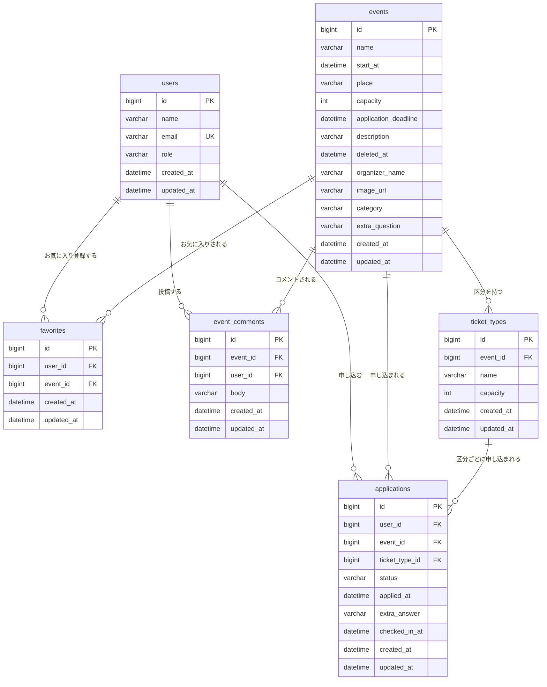

# イベント申込システム DB設計書

v2.0（2026-09-18）

要件定義書_v2.0.md §9（主要データ項目）・API設計書_v2.0.md（リクエスト/レスポンス定義）に対応。DBMSはMySQL（技術仕様書§2準拠）。

---

## 1. テーブル一覧

| テーブル名 | 概要 | 主キー |
|---|---|---|
| `users` | 利用者（一般ユーザー・管理者） | `id` |
| `events` | イベント（管理者が登録するマスタ） | `id` |
| `applications` | 申込（利用者とイベントを結ぶ、申込という行為の実体） | `id` |
| `favorites` | お気に入り（利用者とイベントを結ぶ） | `id` |
| `ticket_types` | 定員区分／チケット種別（イベントに紐づく） | `id` |
| `event_comments` | イベントコメント | `id` |

**関連**：`users`と`events`は`applications`／`favorites`を介して多対多の関係にある。`events`と`ticket_types`は1対多（1イベントが複数の区分を持てる）。`applications`は任意で`ticket_types`を参照する（区分の無いイベントへの申込では`ticket_type_id`はNULL）。

---

## 2. カラム定義書

### 2.1 `users`（利用者）

| カラム名 | 型 | NULL | デフォルト | 制約 | 説明 |
|---|---|---|---|---|---|
| id | BIGINT | NOT NULL | AUTO_INCREMENT | PK | 利用者ID |
| name | VARCHAR(100) | NOT NULL | - | - | 氏名 |
| email | VARCHAR(255) | NOT NULL | - | **UNIQUE** | メールアドレス |
| role | VARCHAR(20) | NOT NULL | - | - | `general`／`admin` |
| created_at | DATETIME | NOT NULL | CURRENT_TIMESTAMP | - | 作成日時（監査カラム） |
| updated_at | DATETIME | NOT NULL | CURRENT_TIMESTAMP（更新時に自動更新） | - | 更新日時（監査カラム） |

### 2.2 `events`（イベント）

| カラム名 | 型 | NULL | デフォルト | 制約 | 説明 |
|---|---|---|---|---|---|
| id | BIGINT | NOT NULL | AUTO_INCREMENT | PK | イベントID |
| name | VARCHAR(100) | NOT NULL | - | - | イベント名 |
| start_at | DATETIME | NOT NULL | - | - | 開催日時 |
| place | VARCHAR(100) | NOT NULL | - | - | 場所 |
| capacity | INT | NOT NULL | - | CHECK (capacity >= 1) | 定員。区分（`ticket_types`）がある場合は区分の定員合計をアプリ側で同期する参考値、区分が無い場合は実際の定員そのもの |
| application_deadline | DATETIME | NOT NULL | - | - | 申込締切日時（`start_at`以前であることはアプリ側で担保、DB制約にはしない） |
| description | VARCHAR(1000) | NULL | - | - | 説明 |
| deleted_at | DATETIME | NULL | - | - | ソフトデリート用。NULL=有効、日時あり=削除済み。物理削除はせず、管理者の「削除済みイベント」画面から復元できる |
| organizer_name | VARCHAR(100) | NULL | - | - | 主催者名 |
| image_url | VARCHAR(500) | NULL | - | - | イベント画像のURL |
| category | VARCHAR(50) | NULL | - | - | カテゴリ（絞り込みに使用） |
| extra_question | VARCHAR(200) | NULL | - | - | 申込時アンケートの質問文言（NULL＝アンケート無し） |
| created_at | DATETIME | NOT NULL | CURRENT_TIMESTAMP | - | 作成日時（監査カラム） |
| updated_at | DATETIME | NOT NULL | CURRENT_TIMESTAMP（更新時に自動更新） | - | 更新日時（監査カラム） |

### 2.3 `applications`（申込）

| カラム名 | 型 | NULL | デフォルト | 制約 | 説明 |
|---|---|---|---|---|---|
| id | BIGINT | NOT NULL | AUTO_INCREMENT | PK | 申込ID |
| user_id | BIGINT | NOT NULL | - | FK → `users.id` | 申込者 |
| event_id | BIGINT | NOT NULL | - | FK → `events.id` | 対象イベント |
| ticket_type_id | BIGINT | NULL | - | FK → `ticket_types.id` | 申し込んだ区分。対象イベントに区分が無い場合はNULL |
| status | VARCHAR(20) | NOT NULL | `'受付済'` | - | `受付済`／`キャンセル待ち`／`キャンセル済` |
| applied_at | DATETIME | NOT NULL | CURRENT_TIMESTAMP | - | 申込日時 |
| extra_answer | VARCHAR(500) | NULL | - | - | 申込時アンケートの回答 |
| checked_in_at | DATETIME | NULL | - | - | 当日受付でチェックインされた日時（NULL＝未チェックイン） |
| created_at | DATETIME | NOT NULL | CURRENT_TIMESTAMP | - | 作成日時（監査カラム） |
| updated_at | DATETIME | NOT NULL | CURRENT_TIMESTAMP（更新時に自動更新） | - | 更新日時（監査カラム） |

> `(user_id, event_id)` に UNIQUE制約は付けない。キャンセル後の再申込を許すため、同じ組み合わせの行が状態違いで複数存在してよい（二重申込チェックは `status='受付済'`または`'キャンセル待ち'`の行の有無だけをアプリ側で見る）。

### 2.4 `favorites`（お気に入り）

| カラム名 | 型 | NULL | デフォルト | 制約 | 説明 |
|---|---|---|---|---|---|
| id | BIGINT | NOT NULL | AUTO_INCREMENT | PK | お気に入りID |
| user_id | BIGINT | NOT NULL | - | FK → `users.id` | 登録した利用者 |
| event_id | BIGINT | NOT NULL | - | FK → `events.id` | 対象イベント |
| created_at | DATETIME | NOT NULL | CURRENT_TIMESTAMP | - | 作成日時（監査カラム） |
| updated_at | DATETIME | NOT NULL | CURRENT_TIMESTAMP（更新時に自動更新） | - | 更新日時（監査カラム。実運用では更新は発生しない） |

> `(user_id, event_id)` に **UNIQUE制約あり**（同じ組み合わせを二重登録する意味が無いため。二重登録の要求は冪等にAPI側で処理する）。

### 2.5 `ticket_types`（定員区分／チケット種別）

| カラム名 | 型 | NULL | デフォルト | 制約 | 説明 |
|---|---|---|---|---|---|
| id | BIGINT | NOT NULL | AUTO_INCREMENT | PK | 区分ID |
| event_id | BIGINT | NOT NULL | - | FK → `events.id` | 対象イベント |
| name | VARCHAR(50) | NOT NULL | - | - | 区分名（例：「一般枠」「会員枠」） |
| capacity | INT | NOT NULL | - | CHECK (capacity >= 1) | この区分の定員 |
| created_at | DATETIME | NOT NULL | CURRENT_TIMESTAMP | - | 作成日時（監査カラム） |
| updated_at | DATETIME | NOT NULL | CURRENT_TIMESTAMP（更新時に自動更新） | - | 更新日時（監査カラム） |

### 2.6 `event_comments`（イベントコメント）

| カラム名 | 型 | NULL | デフォルト | 制約 | 説明 |
|---|---|---|---|---|---|
| id | BIGINT | NOT NULL | AUTO_INCREMENT | PK | コメントID |
| event_id | BIGINT | NOT NULL | - | FK → `events.id` | 対象イベント |
| user_id | BIGINT | NOT NULL | - | FK → `users.id` | 投稿者 |
| body | VARCHAR(500) | NOT NULL | - | - | コメント本文 |
| created_at | DATETIME | NOT NULL | CURRENT_TIMESTAMP | - | 作成日時（監査カラム。投稿日時として表示に使う） |
| updated_at | DATETIME | NOT NULL | CURRENT_TIMESTAMP（更新時に自動更新） | - | 更新日時（監査カラム。コメントは編集不可のため実運用では更新は発生しない） |

---

## 3. インデックス一覧

| テーブル | インデックス名 | 対象列 | 用途 |
|---|---|---|---|
| `events` | `idx_events_start_at` | `start_at` | 一覧の開催日時昇順ソート（API-01） |
| `applications` | `idx_app_event_status_user` | `event_id, status, user_id` | イベント単位の定員超過チェック・充足率集計、二重申込チェック |
| `applications` | `idx_app_user_applied` | `user_id, applied_at` | マイページの自分の申込一覧（申込日時順） |
| `applications` | `idx_app_ticket_type_status` | `ticket_type_id, status` | 区分単位の定員超過チェック・受付済数集計 |
| `favorites` | `uk_favorites_user_event` | `user_id, event_id`（UNIQUE） | 重複登録の防止（DB制約）、マイページのお気に入り一覧取得 |
| `ticket_types` | `idx_ticket_types_event` | `event_id` | イベント詳細・編集フォームでの区分一覧取得 |
| `event_comments` | `idx_comments_event_created` | `event_id, created_at` | イベント詳細でのコメント一覧取得（投稿日時順） |

`user_id`／`event_id`等のFK列単体には、FK制約により自動でインデックスが張られる（InnoDBの仕様）。

---

## 4. 外部キー・参照整合性

| FK | 参照先 | ON DELETE | 理由 |
|---|---|---|---|
| `applications.user_id` | `users.id` | RESTRICT | 利用者を削除する機能は無いため通常は発生しない |
| `applications.event_id` | `events.id` | CASCADE | イベント削除は原則ソフトデリートのため物理削除は基本発生しないが、保険として設定 |
| `applications.ticket_type_id` | `ticket_types.id` | RESTRICT | 区分に申込が残っている状態での区分削除は業務ルールで想定しない |
| `favorites.user_id` | `users.id` | RESTRICT | 同上 |
| `favorites.event_id` | `events.id` | CASCADE | 同上 |
| `ticket_types.event_id` | `events.id` | CASCADE | 同上 |
| `event_comments.event_id` | `events.id` | CASCADE | 同上 |
| `event_comments.user_id` | `users.id` | RESTRICT | 同上 |

---

## 5. カラムにしない「派生値」一覧

API・画面で使うが、DBには保存せずクエリ時に計算する値（二重管理を避けるため）。

| 値 | 対応API | 計算式 |
|---|---|---|
| `acceptedCount`（受付済数） | API-01, 02, 09 | 区分が無いイベント：`applications`を`event_id`かつ`status='受付済'`でCOUNT。区分がある場合：区分ごとに`ticket_type_id`でCOUNT |
| `open`（受付中フラグ） | API-01, 02 | `NOW() <= application_deadline AND NOW() < start_at` |
| `remaining`（残り枠） | API-02 | `capacity - acceptedCount`（区分がある場合は区分ごと） |
| `fillRate`（充足率） | API-09 | `acceptedCount / capacity` |
| `waitlistRank`（キャンセル待ちの順位） | API-04 | 対象申込より`applied_at`が古い、同一イベント（区分がある場合は同一区分）の「キャンセル待ち」件数 + 1 |
| `commentCount`（コメント数） | API-02 | `event_comments`を`event_id`でCOUNT |

`deleted_at`／`organizer_name`／`image_url`／`category`／`extra_question`は上記と異なり派生値ではなく実カラム（§2.2）。一覧・詳細系APIは`deleted_at IS NULL`を、削除済み一覧APIは`deleted_at IS NOT NULL`を条件に加えて絞り込む。

---

## 6. 要件定義書・API設計書との整合確認結果

| 確認項目 | 結果 |
|---|---|
| `users`／`events`／`applications`／`favorites`／`ticket_types`／`event_comments`のカラム構成 | 要件定義書_v2.0.md §9と一致 |
| 各カラムの型・桁数 | API設計書_v2.0.mdのバリデーションと一致 |
| `status`の値 | `受付済`／`キャンセル待ち`／`キャンセル済`の3値で、要件定義書§4・API-03/04と一致 |
| `events.deleted_at`（ソフトデリート） | 要件定義書§7「削除済みイベント」機能と一致 |
| 業務ロジック14件（要件定義書§8） | すべてこのテーブル構成で判定可能（下表） |

| 業務ロジック | 判定に使う列 |
|---|---|
| 定員超過チェック（区分単位／イベント単位） | `ticket_types.capacity`または`events.capacity`と`applications`のCOUNT |
| 申込締切・日付チェック | `events.application_deadline`, `events.start_at` |
| 二重申込チェック | `applications.user_id`, `event_id`, `status` |
| 区分存在・必須チェック | `ticket_types.id`, `event_id` |
| 取消可否チェック | `applications.status`, `events.start_at` |
| キャンセル待ちの繰り上げ・順位計算 | `applications.status`, `applied_at`, `ticket_type_id` |
| イベント削除可否チェック | `applications`（`event_id`,`status='受付済'`のCOUNT） |
| ソフトデリート・復元 | `events.deleted_at` |
| チェックイン可否チェック | `applications.status`, `checked_in_at` |
| お気に入りの重複防止 | `favorites`のUNIQUE制約 |
| コメント削除可否チェック | `event_comments.user_id`, `users.role` |
| 権限チェック | `users.role` |

---

## 7. 設計書間トレーサビリティ確認

### 7.1 画面の入力項目 → DBカラム

| 画面 | 入力項目 | 変換パターン | 対応するDBカラム |
|---|---|---|---|
| SC-01 ログイン | メールアドレス | 入力 → 検索キー | `users.email`（該当ユーザーの検索に使用） |
| SC-02 詳細・申込 | 申込対象イベント・区分（選択） | 選択 → ID型の外部キー | `applications.event_id`, `ticket_type_id` |
| SC-02 詳細 | お気に入りボタン | 選択 → 行の作成・削除 | `favorites` |
| SC-02 詳細 | コメント投稿・削除 | 入力／選択 → 行の作成・削除 | `event_comments` |
| SC-03 マイページ | 取消対象の申込（ボタン） | 選択 → ID型の主キー | `applications.id` |
| SC-04 登録・編集フォーム | イベント名／開催日時／場所／定員／申込締切／説明／主催者名／画像URL／カテゴリ／アンケート文言／区分（複数） | 直接対応 | `events`の同名列、`ticket_types`（複数行） |
| SC-04 管理一覧 | 削除・復元対象イベント（ボタン） | 選択 → ID型の主キー | `events.id`（更新対象は`deleted_at`） |
| SC-06 受付画面 | チェックイン対象の申込（ボタン） | 選択 → ID型の主キー | `applications.id`（更新対象は`checked_in_at`） |

### 7.2 APIのリクエスト/レスポンス → DBカラム

| API | 項目 | 対応するDBカラム | 備考 |
|---|---|---|---|
| API-01/02 | id, name, startAt, place, capacity, applicationDeadline, description, organizerName, imageUrl, category | 各テーブルの同名列 | 直接対応 |
| API-01/02/09 | acceptedCount, open, remaining, fillRate | （非保存・派生値） | §5参照 |
| API-02 | extraQuestion, ticketTypes[], commentCount | `events.extra_question`, `ticket_types`, `event_comments`のCOUNT | |
| API-03 | eventId, ticketTypeId, extraAnswer（リクエスト） | `applications.event_id/ticket_type_id/extra_answer` | 直接対応 |
| API-03/04/05 | id, status, appliedAt | `applications.id/status/applied_at` | 直接対応 |
| API-03レスポンス | userId | `applications.user_id` | リクエストボディには含まれない。`X-User-Id`ヘッダからServiceが設定 |
| API-04 | eventName, startAt, waitlistRank | `events.name/start_at`（JOIN）、非保存・派生値 | |
| API-09 csv | 申込者名 | `users.name`（JOIN） | |
| API-06/07 | name〜category、ticketTypes[] | `events`の同名列、`ticket_types` | |
| API-10 | userId, name, role | `users.id/name/role` | 直接対応 |
| API-13/14（削除済み一覧・復元） | id, name, startAt, place, capacity, deletedAt | `events`の同名列 | `deleted_at`で絞り込み・更新 |
| API-15〜17（お気に入り） | eventId, favoritedAt | `favorites`の同名列 | |
| API-18/19（受付） | applicationId, userName, ticketTypeName, checkedInAt | `applications`／`ticket_types`／`users`のJOIN | |
| API-20〜22（コメント） | id, userName, body, createdAt | `event_comments`／`users`のJOIN | |

### 7.3 業務ロジックの状態値 → DBカラム

| ロジック／状態値 | 対応するDBカラム |
|---|---|
| 申込ステータス | `applications.status` |
| 受付中／受付終了 | （非保存・派生）`events.application_deadline`, `events.start_at`と現在時刻の比較 |
| 定員超過チェック | `ticket_types.capacity`または`events.capacity` ／ `applications`のCOUNT |
| キャンセル待ちの順位 | `applications.status`, `applied_at`, `ticket_type_id` |
| 取消可否チェック | `applications.status`, `events.start_at` |
| イベント削除可否チェック | `applications`のCOUNT（`event_id`,`status='受付済'`） |
| チェックイン可否チェック | `applications.status` |
| コメント削除可否チェック | `event_comments.user_id`, `users.role` |
| 権限チェック | `users.role` |
| 充足率・人気度（独自機能） | （非保存・派生）`applications`のCOUNT ÷ `events.capacity` |

### 7.4 画面・API・ロジックに対応が無いDBカラムの説明

| カラム | 分類 | 説明 |
|---|---|---|
| 各テーブルの`id` | 自動生成（PK） | `AUTO_INCREMENT`。画面・APIからは指定しない |
| 各テーブルの`created_at`／`updated_at` | 監査カラム | DBが自動設定（`DEFAULT`／`ON UPDATE`）。`favorites`／`event_comments`の`updated_at`は実運用では更新が発生しないが、構成統一のため保持 |
| `applications.applied_at`／`checked_in_at` | システム設定 | サーバーが処理時刻を設定。画面からの入力値ではない |
| `applications.user_id`／`event_comments.user_id`／`favorites.user_id` | 認証情報由来 | 画面入力・APIリクエストボディには存在しない（7.2参照） |
| `users.name`, `users.email` | 初期データ／会員登録経由 | 初期データ投入、または会員登録API経由でのみ設定される |

---

## 8. 同時実行・排他制御の方針

「定員超過チェック」は、複数人がほぼ同時に最後の1枠を奪い合う**競合状態（race condition）**が理論上発生しうる処理である。区分単位の判定に変わっても同じ性質を持つ。

- **方針**：定員ぎりぎりでの同時申込の競合制御は考慮しない（テスト段階の割り切り）。悲観ロック・楽観ロックのいずれも採用しない。
- **理由**：教材作成のためのテスト段階であり、同時アクセスが実質発生しない前提（1人での動作確認が中心）のため。
- **最低限の実装方針**：ロックは行わないが、「受付済数のカウント → INSERT」はService層で1つの`@Transactional`にまとめ、処理の途中失敗時に中途半端な状態が残らないようにする。
- 参考（本番相当にする場合）：`events`または`ticket_types`行を`SELECT ... FOR UPDATE`する悲観ロック方式が向く。同時アクセス頻度が低い前提なら、`version`カラムを追加する楽観ロックでも良い。

---

## 9. 設計全体の整合性確認（総括）

要件定義書・画面遷移図・API設計書・テーブル定義書のすべてを通して確認した結果：

- **用語の表記揺れ**：無し
- **矛盾・抜け**：無し（§6・§7がすべて説明できた）
- **既存データへの影響**：`events`／`applications`への列追加と、`favorites`／`ticket_types`／`event_comments`の新規作成のみで実現でき、既存データの変換・移行は不要

以上により、本ファイルを**DB設計書（テーブル定義書＋ER図の統合）**として確定する。
