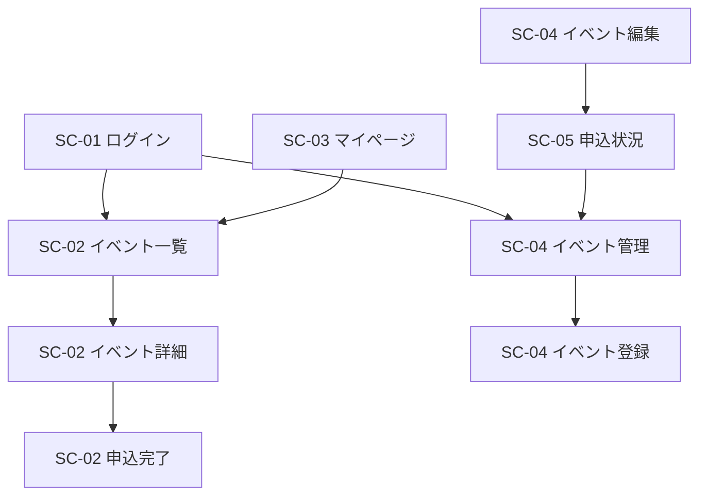

# イベント申込システム 画面遷移図・画面一覧

フェーズA-2 成果物 ／ v1.1（Excelの図形を手描きで再作成したものに合わせて更新）

要件定義書 §7（機能一覧）・API設計書に対応。技術仕様書 §3（画面設計）・§3.2'（SPA要件）準拠。

---

## 1. 画面一覧

| 画面ID | 画面名 | ルートパス | コンポーネント | 権限 | 主な機能 |
|---|---|---|---|---|---|
| SC-01 | ログイン | `/login` | `LoginComponent` | 未ログイン | 機能1 |
| SC-02 | イベント一覧 | `/events` | `EventListComponent` | 一般 | 機能2 |
| SC-02 | イベント詳細・申込 | `/events/:id` | `EventDetailComponent` | 一般 | 機能3,4 |
| SC-02 | 申込完了 | `/events/:id/done` | `ApplyDoneComponent` | 一般 | 申込結果表示 |
| SC-03 | マイページ | `/my/applications` | `MyApplicationsComponent` | 一般 | 機能5,6 |
| SC-04 | イベント管理 | `/admin/events` | `AdminEventListComponent` | 管理者 | 機能9 |
| SC-04 | イベント登録・編集 | `/admin/events/new` `/admin/events/:id/edit` | `AdminEventFormComponent` | 管理者 | 機能7,8 |
| SC-05 | 申込状況・実績 | `/admin/reports` | `AdminReportComponent` | 管理者 | 機能10／受付済申込数・充足率の表示・申込数順の並び替え（一部＝チーム独自機能） |

> 必須5画面の型（技術仕様書§3.1）との対応：SC-01＝ログイン型／SC-02（一覧・詳細・申込・完了）＝一覧・登録型／SC-03＝自分のデータ確認・取消型／SC-04（管理・フォーム）＝マスタ管理型／SC-05＝実績・出力型。
>
> ヘッダーナビ（イベント一覧／マイページ／ログアウト 等）は画面ではなく全画面共通のレイアウト部品。

---

## 2. 画面遷移図

Excelシートの図形（手描き）をそのまま反映したものです。旧バージョンの画像挿入は図形に置き換わったため、画像ファイルの参照は廃止しました。

> ⚠️ **現状の図はシンプル化されています**。§3・§4で確定している仕様（ヘッダーナビの双方向遷移、ログアウト、フォームの保存/キャンセルでの戻り、削除・取消・CSV出力の自己完結、エラー時は遷移しない 等）の多くは、まだ図形として描かれていません。また `イベント編集 → 申込状況` の矢印は、`イベント編集 → イベント管理`（保存後に一覧へ戻る）の意図的な接続先変更でなければ、接続し間違いの可能性があります。仕様どおりに図を仕上げたい場合は教えてください。

---

## 3. 画面遷移一覧（確定仕様・要件定義書/API設計書ベース）

上記の図に描かれているかどうかに関わらず、**設計として確定している**遷移一覧です。

| 遷移元 | トリガー | 遷移先 | 種別 | 備考 |
|---|---|---|---|---|
| ログイン | 「一般としてログイン」 | イベント一覧 | 通常 | ログイン後リダイレクト（`/events`） |
| ログイン | 「管理者としてログイン」 | イベント管理 | 通常 | ログイン後リダイレクト（`/admin/events`） |
| イベント一覧 | ヘッダー「マイページ」 | マイページ | ナビ | 共通ヘッダー（一般） |
| マイページ | ヘッダー「イベント一覧」 | イベント一覧 | ナビ | 共通ヘッダー（一般） |
| イベント一覧 | イベント行を選択 | イベント詳細・申込 | 通常 | |
| イベント詳細・申込 | 「一覧に戻る」 | イベント一覧 | 戻る | |
| イベント詳細・申込 | 「申し込む」（成功） | 申込完了 | 通常 | 定員・締切・二重申込チェックOK時 |
| イベント詳細・申込 | 「申し込む」（失敗） | （遷移なし） | エラー | E1〜E3：同一画面でメッセージ表示 |
| 申込完了 | 「イベント一覧へ」 | イベント一覧 | 通常 | |
| マイページ | 「取消」（成功） | マイページ | 自己 | ステータス→キャンセル済、同一画面で反映 |
| マイページ | 「取消」（失敗） | （遷移なし） | エラー | E4：同一画面でメッセージ表示 |
| イベント管理 | ヘッダー「申込状況・実績」 | 申込状況・実績 | ナビ | 共通ヘッダー（管理者） |
| 申込状況・実績 | ヘッダー「イベント管理」 | イベント管理 | ナビ | 共通ヘッダー（管理者） |
| イベント管理 | 「新規登録」 | イベント登録・編集 | 通常 | |
| イベント管理 | 「編集」 | イベント登録・編集 | 通常 | 対象の現在値を API-02 で取得して表示 |
| イベント登録・編集 | 「保存」／「キャンセル」 | イベント管理 | 戻る | 保存成功時は一覧へ戻る |
| イベント管理 | 「削除」→確認ダイアログ→OK（成功） | イベント管理 | 自己 | 一覧から消える、同一画面 |
| イベント管理 | 「削除」（失敗） | （遷移なし） | エラー | E5：受付済申込あり→メッセージ表示 |
| 申込状況・実績 | 「CSV出力」 | 申込状況・実績 | 自己 | ファイルダウンロード、遷移なし |
| 一般の全画面 | ヘッダー「ログアウト」 | ログイン | ログアウト | 保持中の userId を破棄 |
| 管理者の全画面 | ヘッダー「ログアウト」 | ログイン | ログアウト | 保持中の userId を破棄 |
| 管理者以外 | `/admin/*` にアクセス | イベント一覧 または ログイン | ガード | `adminGuard`（E6の画面側挙動） |
| 全画面 | 未定義URLにアクセス | 404（NotFound） | 例外 | 任意（入れる場合のみ） |

---

## 4. 補足メモ

- **ログイン後リダイレクト**：一般→`/events`、管理者→`/admin/events`。未ログインで保護URLにアクセス→`/login`。
- **共通ヘッダーナビ**（ルーティングされる画面ではなく共通レイアウト部品）：
  - 一般＝［イベント一覧／マイページ／ログアウト］
  - 管理者＝［イベント管理／申込状況・実績／ログアウト］
- **異常系**（要件定義書 §6 E1〜E7）は画面遷移せず、実行元の画面でエラーメッセージを表示する。
- **ルートガード**：全保護ルートに `authGuard`、`/admin/**` に `adminGuard`。未定義パス `**` → 404（任意）。
- **SPA要件**（技術仕様書§3.2'）：SC-01〜05 は1つのAngularプロジェクト内の別コンポーネント。遷移はすべて Angular Router（`routerLink`／`Router.navigate()`）でクライアントサイド遷移。`<a href>` によるサーバー遷移・ページ全体の再読み込みは不可。
