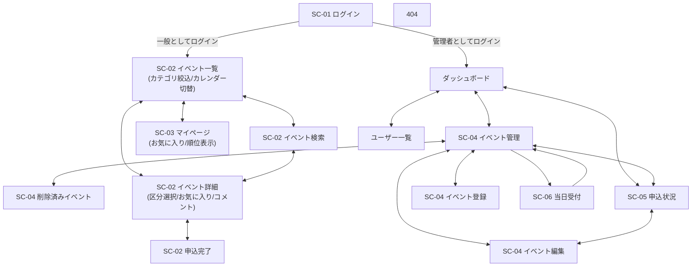

# イベント申込システム 画面遷移図・画面一覧

v2.0（2026-09-18）

要件定義書_v2.0.md §7（機能一覧）・API設計書_v2.0.mdに対応。技術仕様書 §3（画面設計）・§3.2'（SPA要件）準拠。

---

## 1. 画面一覧

| 画面ID | 画面名 | ルートパス | コンポーネント | 権限 | 主な機能 |
|---|---|---|---|---|---|
| SC-01 | ログイン | `/login` | `Login` | 未ログイン | 機能1・2 |
| SC-02 | イベント一覧 | `/events` | `EventList` | 一般 | 機能4・5・6（カテゴリ絞り込み・カレンダー表示） |
| SC-02 | イベント検索 | `/events/search` | `EventSearch` | 一般 | 機能5（キーワード・開催日範囲・カテゴリ） |
| SC-02 | イベント詳細・申込 | `/events/:id` | `EventDetail` | 一般 | 機能7・8・17・18（区分選択・アンケート・お気に入り・コメント） |
| SC-02 | 申込完了 | `/events/:id/done` | `ApplyDone` | 一般 | 申込結果表示 |
| SC-03 | マイページ | `/my/applications` | `MyApplications` | 一般 | 機能9・10・17（申込一覧・順位表示・お気に入りタブ） |
| SC-04 | イベント管理 | `/admin/events` | `AdminEventList` | 管理者 | 機能13 |
| SC-04 | イベント登録・編集 | `/admin/events/new` `/admin/events/:id/edit` | `AdminEventForm` | 管理者 | 機能11・12（主催者・画像・カテゴリ・アンケート・区分の設定） |
| SC-04 | 削除済みイベント | `/admin/events/deleted` | `AdminDeletedEvents` | 管理者 | 機能14 |
| SC-05 | 申込状況・実績 | `/admin/reports` | `AdminReport` | 管理者 | 機能15／受付済申込数・充足率の表示・申込数順の並び替え（チーム独自機能） |
| SC-06 | 当日受付 | `/admin/events/:id/checkin` | `AdminCheckin` | 管理者 | 機能19（申込者一覧の表示・チェックイン） |
| - | ダッシュボード | `/admin/dashboard` | `AdminDashboard` | 管理者 | 機能16（管理者ログイン直後の遷移先） |
| - | ユーザー一覧 | `/admin/users` | `AdminUserList` | 管理者 | 機能3（マスタ確認用） |
| - | 404（未定義URL） | `**`（ワイルドカード） | `NotFound` | 全 | - |

> 必須5画面の型（技術仕様書§3.1）との対応：SC-01＝ログイン型／SC-02（一覧・検索・詳細・申込・完了）＝一覧・登録型／SC-03＝自分のデータ確認・取消型／SC-04（管理一覧・フォーム・削除済み）＝マスタ管理型／SC-05＝実績・出力型。SC-06・ダッシュボード・ユーザー一覧・404は技術仕様書§3.4「任意拡張画面」に該当する。
>
> ヘッダーナビ（イベント一覧／マイページ／ログアウト 等）は画面ではなく全画面共通のレイアウト部品。

---

## 2. 画面遷移図

> ログインから一般用（イベント一覧）・管理者用（ダッシュボード）の各画面群へ分岐し、それ以降は共通ヘッダーナビ・親子画面間はすべて双方向遷移となる。404は未定義URLからのみ到達し、「イベント一覧に戻る」で復帰する（図では省略）。

---

## 3. 画面遷移一覧（確定仕様）

| 遷移元 | トリガー | 遷移先 | 種別 | 備考 |
|---|---|---|---|---|
| ログイン | 「一般としてログイン」 | イベント一覧 | 通常 | ログイン後リダイレクト（`/events`） |
| ログイン | 「管理者としてログイン」 | ダッシュボード | 通常 | ログイン後リダイレクト（`/admin/dashboard`） |
| ログイン | 新規会員登録 | イベント一覧 | 通常 | 登録直後、一般ユーザーとしてログイン扱い |
| イベント一覧 | ヘッダー「マイページ」 | マイページ | ナビ | 共通ヘッダー（一般） |
| イベント一覧 | 「検索」 | イベント検索 | 通常 | |
| イベント一覧／検索 | カテゴリ絞り込み・カレンダー表示切替 | 自己 | 自己 | 遷移せず、同一画面内で表示切替 |
| イベント一覧／検索 | イベント行を選択 | イベント詳細・申込 | 通常 | |
| イベント詳細・申込 | 「一覧に戻る」／「検索に戻る」 | イベント一覧／検索 | 戻る | どちらから来たかで戻り先が変わる |
| イベント詳細・申込 | 「お気に入り」ボタン | 自己 | 自己 | API呼び出しのみ、遷移なし |
| イベント詳細・申込 | コメント投稿・削除 | 自己 | 自己 | API呼び出しのみ、遷移なし |
| イベント詳細・申込 | 「申し込む」（成功） | 申込完了 | 通常 | 定員・締切・二重申込・区分チェックOK時 |
| イベント詳細・申込 | 「申し込む」（失敗） | （遷移なし） | エラー | E1〜E3, E11, E12：同一画面でメッセージ表示 |
| 申込完了 | 「イベント一覧へ」 | イベント一覧 | 通常 | |
| マイページ | ヘッダー「イベント一覧」 | イベント一覧 | ナビ | 共通ヘッダー（一般） |
| マイページ | 「お気に入り」タブ切替 | 自己 | 自己 | 同一画面内でのタブ切り替え |
| マイページ | 「キャンセル」（成功） | 自己 | 自己 | ステータス→キャンセル済、同一画面で反映 |
| マイページ | 「キャンセル」（失敗） | （遷移なし） | エラー | E4：同一画面でメッセージ表示 |
| ダッシュボード | ヘッダー各項目 | イベント管理／申込状況／ユーザー一覧 | ナビ | 共通ヘッダー（管理者） |
| イベント管理 | 「新規登録」 | イベント登録・編集 | 通常 | |
| イベント管理 | 「編集」 | イベント登録・編集 | 通常 | 対象の現在値をAPI-02で取得して表示（区分含む） |
| イベント管理 | 「削除済みイベント」 | 削除済みイベント | 通常 | |
| イベント管理 | 「受付」 | 当日受付（SC-06） | 通常 | 対象イベントの申込者一覧を表示 |
| 削除済みイベント | 「復元」（成功） | 自己 | 自己 | 一覧から消え、通常の一覧に再表示される |
| 当日受付 | 「チェックイン」 | 自己 | 自己 | 対象行の状態のみ更新 |
| 当日受付 | 「イベント管理に戻る」 | イベント管理 | 戻る | |
| イベント登録・編集 | 「保存」／「キャンセル」 | イベント管理 | 戻る | 保存成功時は一覧へ戻る |
| イベント管理 | 「削除」→確認ダイアログ→OK（成功） | 自己 | 自己 | 一覧から消える、同一画面 |
| イベント管理 | 「削除」（失敗） | （遷移なし） | エラー | E5：受付済申込あり→メッセージ表示 |
| 申込状況・実績 | 「CSV出力」 | 自己 | 自己 | ファイルダウンロード、遷移なし |
| 一般の全画面 | ヘッダー「ログアウト」 | ログイン | ログアウト | 保持中の userId を破棄 |
| 管理者の全画面 | ヘッダー「ログアウト」 | ログイン | ログアウト | 保持中の userId を破棄 |
| 管理者以外 | `/admin/*` にアクセス | イベント一覧 | ガード | `adminGuard` |
| 未ログイン | 保護URLにアクセス | ログイン | ガード | `authGuard` |
| 全画面 | 未定義URLにアクセス | 404 | 例外 | ガード無し（未ログインでも表示） |
| 404 | 「イベント一覧に戻る」 | イベント一覧 | 通常 | 未ログインなら`authGuard`によりログインへ |

---

## 4. 補足メモ

- **ログイン後リダイレクト**：一般→`/events`、管理者→`/admin/dashboard`。未ログインで保護URLにアクセス→`/login`。
- **共通ヘッダーナビ**（ルーティングされる画面ではなく共通レイアウト部品）：
  - 一般＝［イベント一覧／マイページ／ログアウト］
  - 管理者＝［ダッシュボード／イベント管理／申込状況・実績／ユーザー一覧／ログアウト］
- **区分（チケット種別）が無いイベントの申込画面**：区分選択欄自体を表示しない（区分があるイベントのみ選択欄が現れる）。
- **お気に入り・コメントの権限**：一般ユーザー・管理者の両方が使える。コメントの削除は投稿者本人または管理者のみ。
- **異常系**（要件定義書§6 E1〜E12）は画面遷移せず、実行元の画面でエラーメッセージを表示する。
- **ルートガード**：全保護ルートに `authGuard`、`/admin/**` に `adminGuard`。未定義パス `**` → 404（ガード無し）。
- **SPA要件**（技術仕様書§3.2'）：全画面が1つのAngularプロジェクト内の別コンポーネントとして実装され、遷移はすべて Angular Router（`routerLink`／`Router.navigate()`）でクライアントサイド遷移。`<a href>` によるサーバー遷移・ページ全体の再読み込みは発生させない。

---

## 5. 画面別入力・表示項目定義

各画面が実際にどの項目を入力・表示するかを定義する。ラベル文言・入力形式は実装時の初期案であり、細部の文言は実装時に調整してよい。

### 5.1 SC-01 ログイン

**ログインフォーム**

| 項目名 | ラベル | 入力形式 | 必須/任意 | バリデーション | 初期値 |
|---|---|---|---|---|---|
| email | メールアドレス | テキスト（email） | 必須 | メール形式 | 空欄 |

ボタン：「ログイン」。エラー時：フォーム下に「メールアドレスの形式が正しくありません」（400）または「該当するユーザーが見つかりません」（401）を表示。

**会員登録フォーム**（ログイン画面内の切替リンクから表示）

| 項目名 | ラベル | 入力形式 | 必須/任意 | バリデーション | 初期値 |
|---|---|---|---|---|---|
| name | 氏名 | テキスト | 必須 | 1〜100文字 | 空欄 |
| email | メールアドレス | テキスト（email） | 必須 | メール形式、255文字以内、未登録であること | 空欄 |

ボタン：「登録」。エラー時：各項目直下に「氏名を入力してください」「メールアドレスの形式が正しくありません」「このメールアドレスは既に登録されています」等を表示。

### 5.2 SC-02 イベント一覧／検索

**イベント一覧（表示）**：1件ごとにイベント名／開催日時／場所／カテゴリ／残り枠（`remaining`/`capacity`）／受付中・受付終了バッジ／お気に入りボタン（トグル、登録済みは塗りつぶし表示）を表示するカード（または行）。

**表示切替**：「一覧表示」「カレンダー表示」の切替ボタン（同一画面内でのタブ切替。カレンダー表示では開催日にイベント名を配置）。

**イベント検索フォーム**

| 項目名 | ラベル | 入力形式 | 必須/任意 | 備考 |
|---|---|---|---|---|
| keyword | キーワード | テキスト | 任意 | イベント名の部分一致 |
| dateFrom | 開催日（から） | 日付ピッカー | 任意 | |
| dateTo | 開催日（まで） | 日付ピッカー | 任意 | dateFrom以降であること |
| category | カテゴリ | プルダウン | 任意 | 登録済みイベントのカテゴリ値から選択肢を生成 |

ボタン：「検索」。結果は一覧と同じカード表示。

### 5.3 SC-02 イベント詳細・申込

**表示項目**：イベント名／開催日時／場所／主催者名／画像／カテゴリ／説明／定員・残り枠／申込締切／お気に入りボタン。

**申込フォーム**

| 項目名 | ラベル | 入力形式 | 必須/任意 | 表示条件 | バリデーション |
|---|---|---|---|---|---|
| ticketTypeId | 参加区分 | プルダウン | イベントに区分がある場合は必須 | 区分があるイベントのみ表示 | 未選択のまま送信不可（E12） |
| extraAnswer | アンケート回答 | テキストエリア | 任意 | `extraQuestion`が設定されているイベントのみ表示 | 500文字以内 |

ボタン：「申し込む」。エラー時（同一画面にメッセージ表示）：定員超過はエラーにせずキャンセル待ちで登録、締切超過（E2）／二重申込（E3）／区分未選択（E12）／区分不正（E11）はそれぞれの文言を表示。

**コメント欄**

| 項目名 | ラベル | 入力形式 | 必須/任意 | バリデーション |
|---|---|---|---|---|
| body | コメント | テキストエリア | 必須 | 1〜500文字 |

ボタン：「投稿」。各コメントに投稿者名・投稿日時・本文を表示し、本人または管理者のみ「削除」ボタンを表示（E10）。

### 5.4 SC-02 申込完了

表示項目：申込ステータス（「受付済」または「キャンセル待ち」、キャンセル待ちの場合は順位も表示）。ボタン：「イベント一覧へ」。

### 5.5 SC-03 マイページ

タブ切替：「申込一覧」／「お気に入り」（同一画面内のタブ）。

**申込一覧タブ（表示）**：イベント名／開催日時／区分名（あれば）／ステータス／キャンセル待ち順位（該当時のみ）。行ごとに「キャンセル」ボタン（「受付済」「キャンセル待ち」かつ開催前のみ活性、それ以外は非表示）。

**お気に入りタブ（表示）**：イベント名／開催日時。行ごとに「お気に入り解除」ボタン。

### 5.6 SC-04 イベント管理

**イベント一覧（表示）**：イベント名／開催日時／定員／受付済数／状態（受付中・受付終了）。行ごとに「編集」「削除」ボタン。画面上部に「新規登録」ボタンと「削除済みイベント」リンク。

**イベント登録・編集フォーム**

| 項目名 | ラベル | 入力形式 | 必須/任意 | バリデーション |
|---|---|---|---|---|
| name | イベント名 | テキスト | 必須 | 100文字以内 |
| startAt | 開催日時 | 日時ピッカー | 必須 | - |
| place | 場所 | テキスト | 必須 | 100文字以内 |
| capacity | 定員 | 数値 | 必須 | 1以上。区分を1件以上入力した場合は自動計算され入力不可になる |
| applicationDeadline | 申込締切 | 日時ピッカー | 必須 | `startAt`以前 |
| description | 説明 | テキストエリア | 任意 | 1000文字以内 |
| organizerName | 主催者名 | テキスト | 任意 | 100文字以内 |
| imageUrl | 画像URL | テキスト | 任意 | 500文字以内 |
| category | カテゴリ | テキスト | 任意 | 50文字以内 |
| extraQuestion | アンケート文言 | テキスト | 任意 | 200文字以内 |
| ticketTypes | 参加区分（複数） | 区分名＋定員の行を「区分を追加」ボタンで増減 | 任意 | 区分名50文字以内・定員1以上。1件も無ければ区分無しのイベントとして扱う |

ボタン：「保存」「キャンセル」。エラー時：各項目直下にメッセージを表示。

**削除済みイベント（表示）**：イベント名／削除日時。行ごとに「復元」ボタン。

### 5.7 SC-05 申込状況・実績

表示項目：イベント名／開催日時／定員／受付済数／充足率。並び替え（開催日時順・受付済数順）のプルダウン。画面上部に「CSV出力」ボタン（クリックでファイルダウンロード、遷移なし。詳細仕様は要件定義書_v2.0.md §12・API設計書_v2.0.md API-09参照）。

### 5.8 SC-06 当日受付

表示項目：申込者氏名／区分名／ステータス／チェックイン状況。行ごとに「チェックイン」ボタン（ステータスが「受付済」の行のみ活性、E8）。

### 5.9 ダッシュボード・ユーザー一覧・404

- **ダッシュボード**：総イベント数／総ユーザー数／総受付済申込数の3つの数値表示のみ（入力項目無し）。
- **ユーザー一覧**：氏名／メールアドレス／ロールの一覧表示のみ（入力項目無し）。
- **404**：「ページが見つかりません」等のメッセージと「イベント一覧に戻る」リンクのみ。
