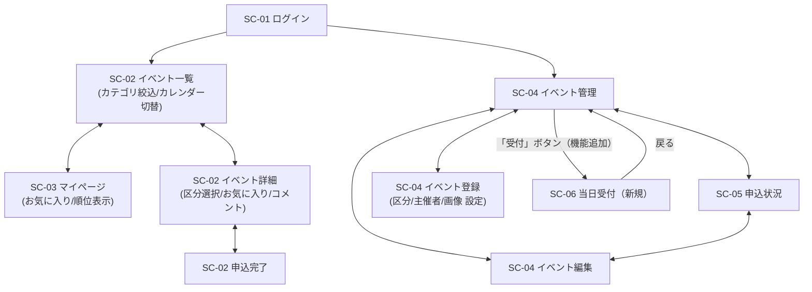

# イベント申込システム 画面遷移図・画面一覧（アジャイル開発フェーズ版）

v2.0（2026-09-18作成。`画面遷移図_v1.0.md`（v1.1）をもとに、`要件定義書_v2.0.md`の機能追加10件を反映した新規ファイル）

要件定義書_v2.0.md §7・API設計書_v2.0.mdに対応。技術仕様書 §3（画面設計）・§3.2'（SPA要件）準拠。**v1.0の画面構成（SC-01〜05）は変更せず、既存画面への機能追加と、新規画面（SC-06）のみを追記する。**

---

## 1. 画面一覧（v1.0に追加・変更のみ）

v1.0のSC-01〜05（ログイン／イベント一覧・詳細・完了／マイページ／イベント管理・登録編集／申込状況・実績）は画面ID・ルートパス・コンポーネントとも変更なし。**機能が追加される画面**と、**新規に増える画面**のみ記す。

### 機能が追加される既存画面

| 画面ID | 画面名 | 追加される機能 |
|---|---|---|
| SC-02 | イベント一覧 | カテゴリ絞り込み（検索画面の拡張）、カレンダー表示への切り替え |
| SC-02 | イベント詳細・申込 | 主催者名・画像・カテゴリの表示、区分（チケット種別）の選択、申込時アンケート回答欄、お気に入りボタン、コメント欄（投稿・削除・一覧） |
| SC-03 | マイページ | お気に入り一覧（タブ切り替え）、キャンセル待ちの順位表示 |
| SC-04 | イベント登録・編集 | 主催者名・画像URL・カテゴリ・アンケート文言・区分（複数、追加/削除可能）の入力欄 |

### 新規画面

| 画面ID | 画面名 | ルートパス | コンポーネント | 権限 | 主な機能 |
|---|---|---|---|---|---|
| SC-06 | 当日受付 | `/admin/events/:id/checkin` | `AdminCheckinComponent` | 管理者 | 機能19（申込者一覧の表示・チェックイン） |

> SC-06は技術仕様書§3.4「任意拡張画面」の扱い。既存のSC-01〜05必須5画面の型には影響しない。

---

## 2. 画面遷移図（v1.0に追加分を反映）

> ログインから一般用・管理者用の各画面群へ分岐する構造はv1.0のまま。SC-06はイベント管理一覧から新たに分岐する管理者専用画面。

---

## 3. 画面遷移一覧（v1.0に追加分のみ記載）

v1.0の遷移（ログイン後リダイレクト、一覧⇄詳細、マイページの取消、イベント管理のCRUD、CSV出力、ログアウト、ガード、404）はすべてそのまま成立する。以下を追加する。

| 遷移元 | トリガー | 遷移先 | 種別 | 備考 |
|---|---|---|---|---|
| イベント一覧 | 「カレンダー表示」切り替え | イベント一覧（自己） | 自己 | 同一画面内でのビュー切り替え、画面遷移は発生しない |
| イベント一覧／検索 | カテゴリを選択 | イベント一覧（自己） | 自己 | フロント側の絞り込み（既存の検索機能の拡張） |
| イベント詳細 | 「お気に入り」ボタン | イベント詳細（自己） | 自己 | API-15/16を呼び出しボタンの状態のみ切り替え、遷移なし |
| イベント詳細 | コメント投稿・削除 | イベント詳細（自己） | 自己 | API-20/21/22、遷移なし |
| イベント詳細 | 「申し込む」（区分ありイベント） | 申込完了 | 通常 | 区分未選択の場合はボタン非活性（E11のクライアント側先回り） |
| マイページ | 「お気に入り」タブ切り替え | マイページ（自己） | 自己 | 同一画面内でのタブ切り替え |
| イベント管理 | 「受付」ボタン（機能追加） | 当日受付（SC-06） | 通常 | 対象イベントの申込者一覧を表示 |
| 当日受付 | 「チェックイン」ボタン | 当日受付（自己） | 自己 | 同一画面で該当行の状態のみ更新 |
| 当日受付 | 「イベント管理に戻る」 | イベント管理 | 戻る | |

---

## 4. 補足メモ（v1.0に追加）

- **区分（チケット種別）が無いイベントの申込画面**：v1.0までと全く同じ見た目・挙動（区分選択欄自体を表示しない）。区分がある場合のみ選択欄が現れる。
- **お気に入り・コメントの権限**：一般ユーザー・管理者の両方が使える（要件定義書§7 機能15・20は「全」ロール対象）。ただしコメントの削除は投稿者本人または管理者のみ（E10）。
- **SC-06の権限ガード**：他のSC-04系画面と同様、`authGuard`＋`adminGuard`を適用する。
- **既存のSPA要件（技術仕様書§3.2'）**：SC-06もAngular Routerによるクライアントサイド遷移で実装し、`<a href>`によるフルリロード遷移は行わない（v1.0の方針を継続）。
