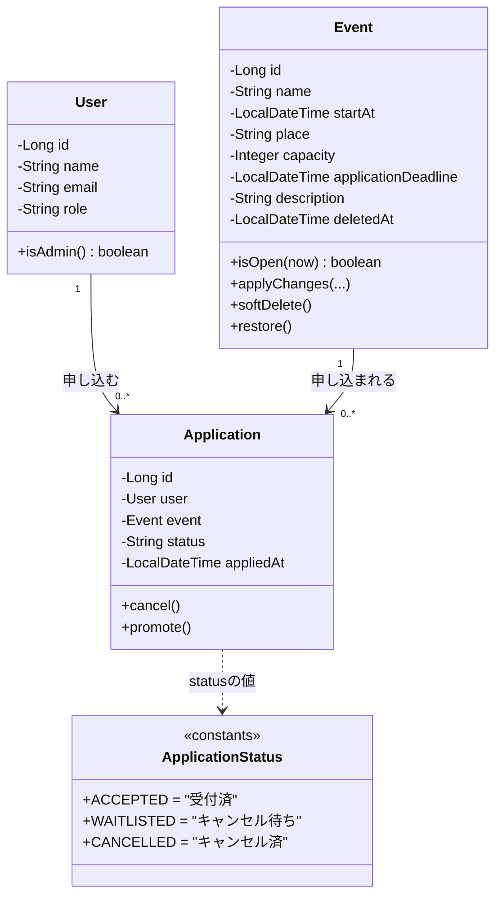
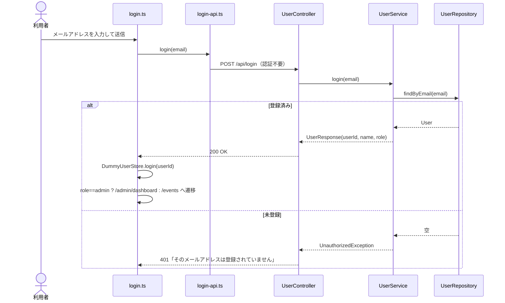
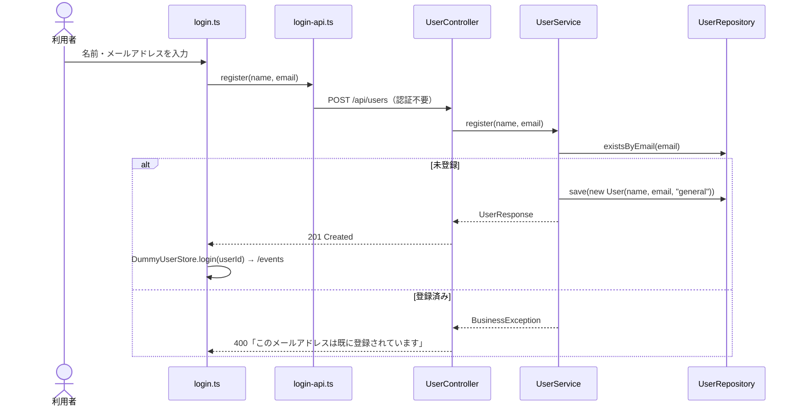
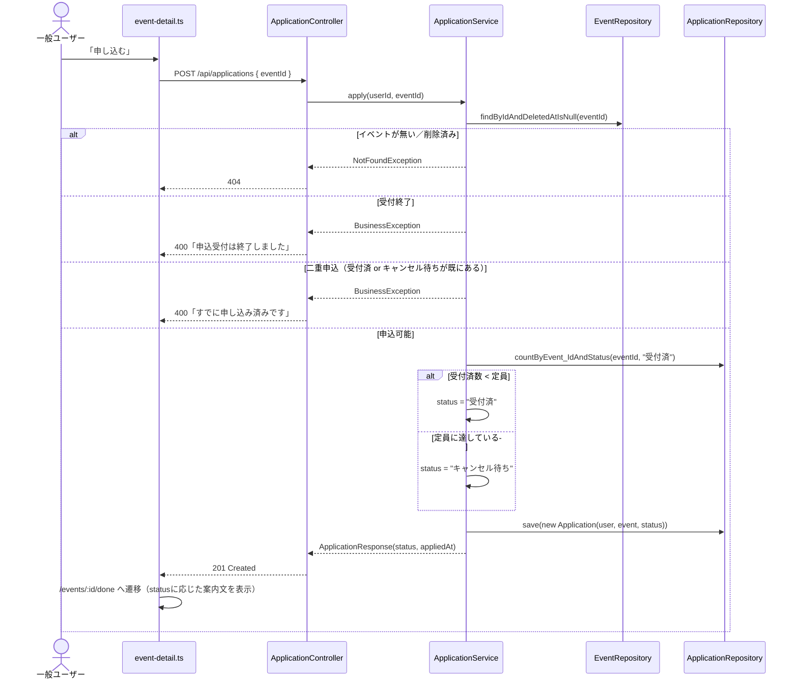
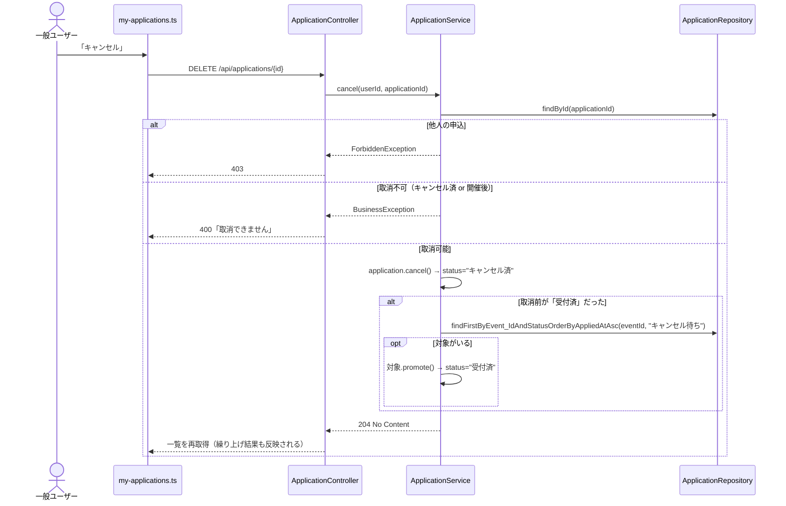
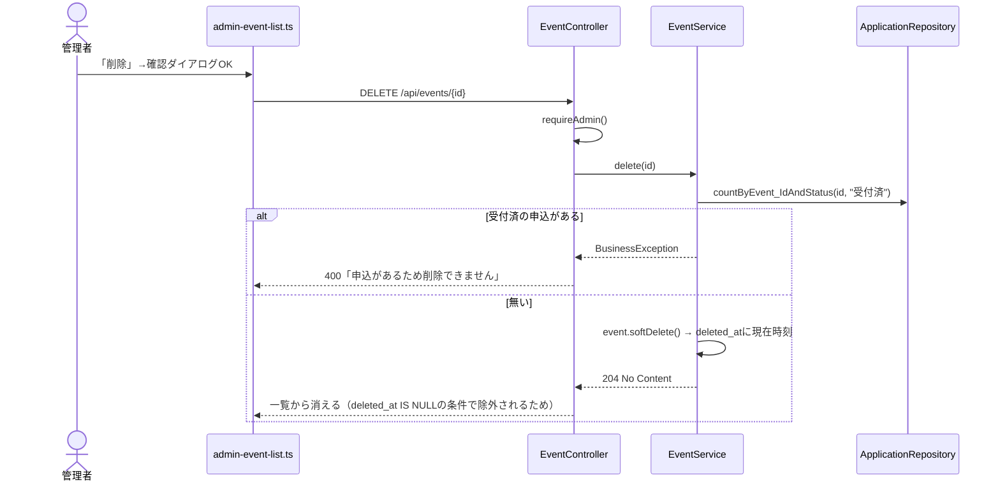
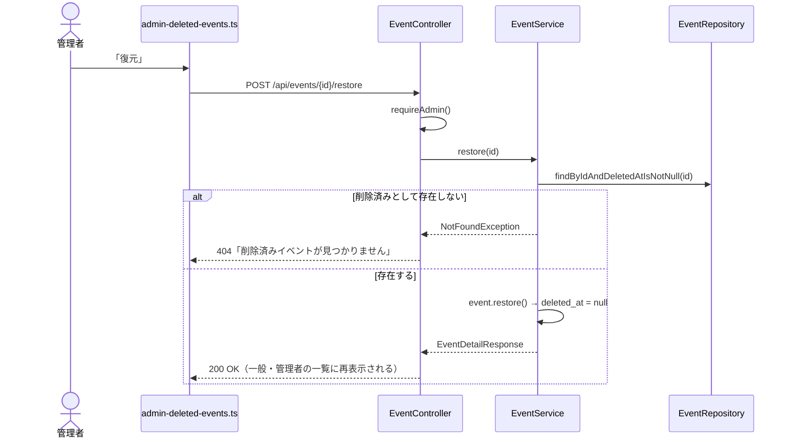
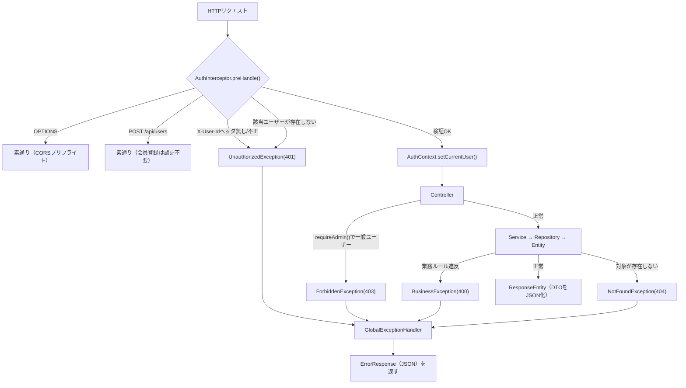
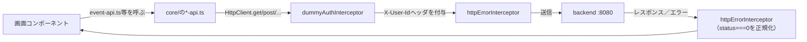

# イベント申込システム 詳細設計書

フェーズA-4 追補 成果物 ／ v1.0（2026-09-18作成）

要件定義書_v1.0.md（v1.7）・API設計書_v1.1.md（v1.6）・テーブル定義書_v1.0.md（v1.3）・画面遷移図_v1.0.md（基本設計＝「何を作るか」）を前提に、**「どう実装しているか」**を実装単位（クラス・メソッド・処理順序）まで落とし込んだもの。`docs/コードベース解説.md`（ファイル単位の索引）・`docs/アーキテクチャ構成図.html`（1リクエストの流れの図解）と合わせて読むと理解しやすい。

---

## 1. 本書の位置づけ

| 既存の設計書 | 扱う粒度 |
|---|---|
| 要件定義書 | 何を実現するか（機能・業務ルール・利用者像） |
| 画面遷移図 | 画面と画面の間をどう移動するか |
| API設計書 | 画面とサーバーの間で、何を・どんな形でやり取りするか |
| テーブル定義書 | データをどう保存するか |
| **本書（詳細設計書）** | **API1本の内部で、どのクラスがどの順番で何を行うか** |

対象読者は「実装済みのコードを読み解きたい人」「同じ設計方針で新しい機能を追加したい人」。

---

## 2. システム構成（復習）

```
【ブラウザ】→ frontend（Angular, :4200）→ ―API境界― → backend（Spring Boot, :8080）→ MySQL（eventapp）
```

backendは **Controller → Service → Repository → Entity** の4層構造（`docs/コードベース解説.md` §2.1）。frontendは **画面コンポーネント → core/のAPI窓口 → インターセプター** の3層構造（同 §2.2）。詳しい図は `docs/アーキテクチャ構成図.html` を参照。

---

## 3. バックエンド詳細設計

### 3.1 パッケージ構成とクラス一覧

```
com.example.eventapp
├─ entity/       Event, Application, ApplicationStatus, User
├─ repository/   EventRepository, ApplicationRepository, UserRepository
├─ service/      EventService, ApplicationService, UserService, ReportService, PingService
├─ dto/          *Request / *Response（APIごとの入出力の形。§3.6参照）
├─ controller/   EventController, ApplicationController, UserController, ReportController, PingController
└─ common/       AuthInterceptor, AuthContext, CurrentUser, WebConfig
   ├─ exception/   UnauthorizedException, ForbiddenException, NotFoundException,
   │               BusinessException, ErrorResponse, GlobalExceptionHandler
   └─ validation/  ValidEventDates, EventDatesValidator
```

### 3.2 クラス図（Entity関連）



### 3.3 主要処理のシーケンス図

#### 3.3.1 ログイン（メールアドレス方式、機能追加）



#### 3.3.2 会員登録（機能追加、常に一般ユーザー）



#### 3.3.3 イベント申込（キャンセル待ちの分岐、機能追加）



#### 3.3.4 申込キャンセル（自動繰り上げ、機能追加）



#### 3.3.5 イベント削除（ソフトデリート、機能追加）



#### 3.3.6 削除済みイベントの復元（機能追加）



### 3.4 認証・共通処理のフロー

すべての `/api/**` リクエストは、Controllerに届く前に必ず `AuthInterceptor`（`HandlerInterceptor`、`WebConfig`で登録）を通る。



`WebConfig`での適用範囲：`addPathPatterns("/api/**")`・`excludePathPatterns("/api/login", "/api/ping")`。`POST /api/users`だけは`AuthInterceptor`内でメソッド単位に個別許可している（`GET /api/users`は管理者専用のままにするため、パス単位の除外ではなくメソッド単位にしている）。

CORSは`WebConfig#addCorsMappings`で`http://localhost:4200`のみ許可。

### 3.5 バリデーション設計

| 対象DTO | 制約 | 実現方法 |
|---|---|---|
| `EventUpsertRequest` | name必須・100文字以内／startAt必須・未来日時／place必須・100文字以内／capacity必須・1以上／applicationDeadline必須／description1000文字以内 | Bean Validation（`@NotBlank`/`@NotNull`/`@Size`/`@Min`/`@Future`） |
| `EventUpsertRequest`（クラスレベル） | 申込締切は開催日時**以前** | 独自アノテーション`@ValidEventDates` → `EventDatesValidator`が`applicationDeadline.isAfter(startAt)`を判定し、違反時は`applicationDeadline`フィールドにエラーを紐付ける |
| `LoginRequest` | email必須・メール形式 | `@NotBlank`/`@Email` |
| `UserRegisterRequest` | name必須・100文字以内／email必須・メール形式・255文字以内 | 同上 |

**適用タイミングの使い分け**（D-7）：`EventController`の登録・編集は「`requireAdmin()`（権限チェック）→ `validate(request)`（手動でのValidator実行）」の順。`@Valid`をそのまま使うと権限チェックより先にバリデーションが走ってしまう（一般ユーザーの入力エラーで403ではなく400が先に出てしまう）ため、あえて`@Valid`を使わず手動実行している。一方`UserController`のlogin/registerは認証不要のAPIのため`@Valid`をそのまま使用。

### 3.6 例外設計

| 例外クラス | HTTPステータス | 発生元の例 |
|---|---|---|
| `UnauthorizedException` | 401 | `AuthInterceptor`（ヘッダ無し・不正なuserId・登録されていないメールアドレス） |
| `ForbiddenException` | 403 | 各Controllerの`requireAdmin()`、他人の申込へのアクセス |
| `NotFoundException` | 404 | 存在しないイベント／申込／削除済みでない復元対象 |
| `BusinessException` | 400 | 定員・締切・二重申込・取消可否・削除可否・メール重複などの業務ルール違反 |
| `MethodArgumentNotValidException`（`@Valid`由来） | 400 | login/registerの入力エラー |
| `ConstraintViolationException`（手動Validator由来） | 400 | イベント登録・編集の入力エラー（D-7の順序のため） |
| `HttpMessageNotReadableException` | 400 | 不正なJSON・型不一致 |
| `MethodArgumentTypeMismatchException` | 400 | パスパラメータが数値でない等 |

すべて`GlobalExceptionHandler`（`@RestControllerAdvice`）が捕捉し、`ErrorResponse`（`timestamp`/`status`/`error`/`message`[`/errors`]）に統一して返す（API設計書§0）。

---

## 4. フロントエンド詳細設計

### 4.1 ディレクトリ構成

```
src/app/
├─ core/          API窓口・認証・ガード・インターセプター（画面をまたいで共通）
├─ login/         SC-01
├─ events/        event-list, event-search, event-detail, apply-done（SC-02系）
├─ my-applications/  SC-03
├─ admin/         admin-dashboard, admin-event-list, admin-deleted-events,
│                 admin-event-form, admin-report, admin-user-list（SC-04・SC-05系）
├─ app.ts/html/css  共通ナビ＋router-outlet
├─ app.routes.ts  URL対応表
└─ app.config.ts  HttpClient・Routerのプロバイダー登録
```

### 4.2 ルーティング・ガード設計

`app.routes.ts`はURLを配列の順番で評価し、静的なパス（`events/search`・`admin/events/deleted`等）を`:id`のような可変パスより前に置く必要がある（先に一致した方が使われるため）。

| ガード | 適用範囲 | 判定内容 | 不許可時の遷移先 |
|---|---|---|---|
| `authGuard` | 全保護ルート | `DummyUserStore.currentUserId() !== null` | `/login` |
| `adminGuard` | `/admin/**` | `currentUserId() === '2'`（管理者の固定ID） | `/events` |

`adminGuard`は`authGuard`の後段として適用するため、実行時点で未ログインではないことが前提（`app.routes.ts`で`canActivate: [authGuard, adminGuard]`の順に指定）。

### 4.3 状態管理

- `DummyUserStore`：ログイン中のuserIdを`signal`で保持。`login()`/`logout()`で更新し、`localStorage`にも保存（リロードしてもログイン状態を維持）。`localStorage`が使えない環境（プライベートブラウジング等）でも動作は継続する設計（try/catchで握りつぶす）。
- 各画面コンポーネント：一覧・詳細等のデータは`signal`で保持し、テンプレート側は`@if`/`@for`でその`signal`を参照する（Angularの最新の書き方。RxJSの`Observable`をテンプレートに直接バインドする方式ではなく、`.subscribe()`内で`signal.set()`する方式に統一）。

### 4.4 HTTP通信層

`app.config.ts`で以下の順にインターセプターを登録（`withInterceptors([dummyAuthInterceptor, httpErrorInterceptor])`）。



`dummyAuthInterceptor`は未ログイン（`userId === null`）の場合はヘッダを付けずに素通りさせる（保護ルートには`authGuard`があるため通常は発生しないが、直接API疎通確認をする場合等のためにbackend側の401判定に委ねる設計）。`httpErrorInterceptor`は「バックエンドに繋がらない」（`status === 0`）場合のみ、`err.error.message`を分かりやすい固定文言に正規化する。それ以外（400/401/403/404）は`ErrorResponse.message`をそのまま各画面が使う。

---

## 5. Repositoryメソッド一覧（クエリ内容）

Spring Data JPAはメソッド名を解析して自動でSQLを生成するため（`docs/コードベース解説.md`参照）、メソッド名そのものが仕様になっている。

| Repository | メソッド | 用途 |
|---|---|---|
| `EventRepository` | `findAllByDeletedAtIsNullOrderByStartAtAsc()` | 一覧取得（API-01、削除済み除外） |
| | `findAllByDeletedAtIsNotNullOrderByStartAtAsc()` | 削除済み一覧（API-13） |
| | `findByIdAndDeletedAtIsNull(id)` | 詳細・更新・申込時の存在確認（削除済みは404扱い） |
| | `findByIdAndDeletedAtIsNotNull(id)` | 復元時の存在確認（削除済みのものだけ対象） |
| `ApplicationRepository` | `countByEvent_IdAndStatus(eventId, status)` | 定員チェック・受付済数の集計 |
| | `existsByUser_IdAndEvent_IdAndStatusIn(userId, eventId, statuses)` | 二重申込チェック |
| | `findFirstByEvent_IdAndStatusOrderByAppliedAtAsc(eventId, status)` | キャンセル待ちの繰り上げ対象（最古の1件） |
| | `findByUser_IdOrderByAppliedAtDesc(userId)` | マイページの自分の申込一覧 |
| | `findAllByOrderByEvent_StartAtAsc()` | 申込実績CSVの明細順 |
| `UserRepository` | `existsByEmail(email)` | 会員登録の重複チェック |
| | `findByEmail(email)` | ログイン時のユーザー特定 |
| | `findAllByOrderByIdAsc()` | ユーザー一覧（機能追加） |

---

## 6. 設計書間トレーサビリティ

| 本書の章 | 対応する既存設計書 |
|---|---|
| 3.3.1〜3.3.2（ログイン・会員登録） | API設計書 API-10・API-11／要件定義書 機能1・1' |
| 3.3.3〜3.3.4（申込・キャンセル） | API設計書 API-03・API-05／要件定義書 §8 業務ルール |
| 3.3.5〜3.3.6（削除・復元） | API設計書 API-08・API-13・API-14／要件定義書 機能9・9' |
| 3.4（認証・例外） | API設計書 §0 共通事項 |
| 3.6（例外設計） | API設計書 各APIの「エラー」表 |
| 4.2（ルーティング・ガード） | 画面遷移図 §4 補足メモ／要件定義書 E-6・E-7 |
| 5（Repositoryメソッド） | テーブル定義書 §3 インデックス一覧 |

すべての項目が既存の基本設計（要件定義書・画面遷移図・API設計書・テーブル定義書）のいずれかに紐づいており、本書独自の新しい仕様は含まない（＝実装の詳細を後から書き起こしたものであり、設計変更ではない）。
