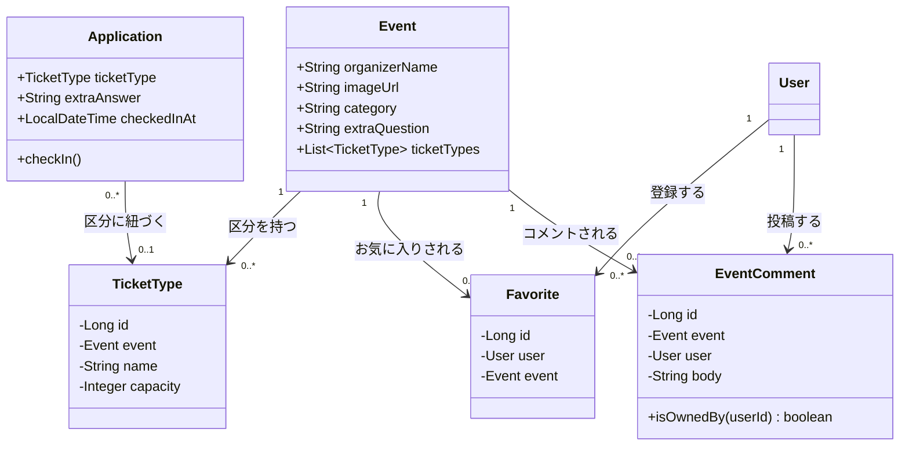
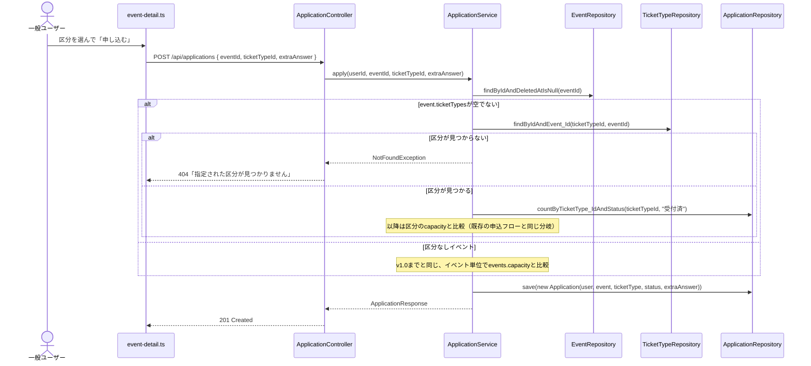
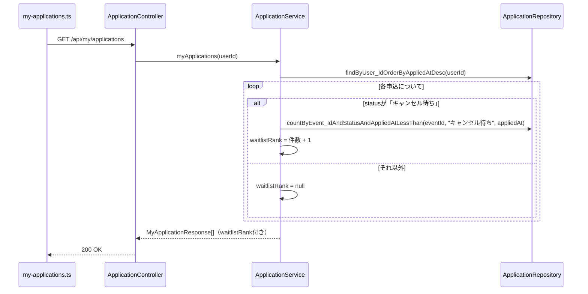
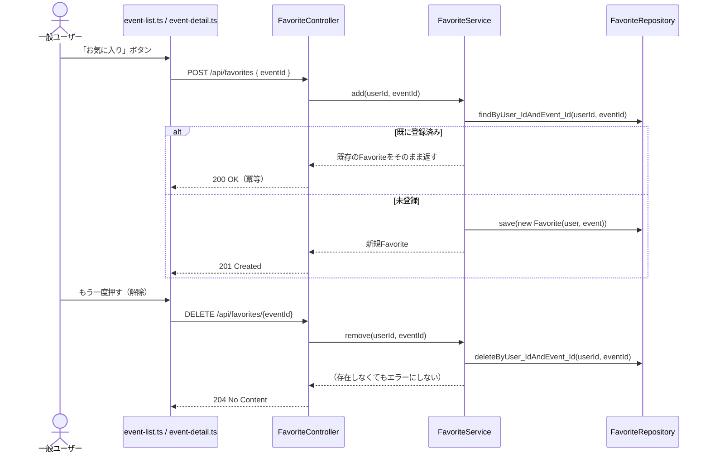
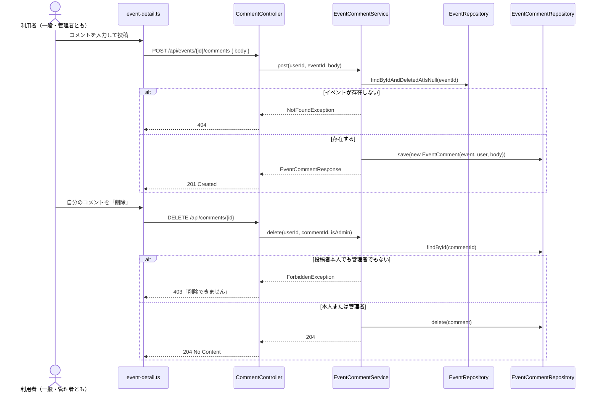
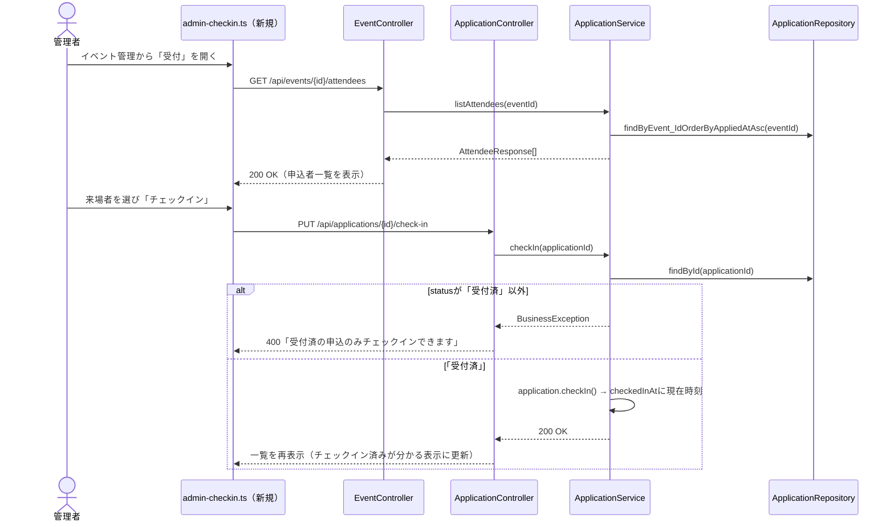

# イベント申込システム 詳細設計書（アジャイル開発フェーズ版）

v2.0（2026-09-18作成。`詳細設計書_v1.0.md`をもとに、`要件定義書_v2.0.md`・`API設計書_v2.0.md`・`テーブル定義書_v2.0.md`・`画面遷移図_v2.0.md`の機能追加10件に対応するクラス構成・処理フローを追加した新規ファイル）

**v1.0で説明した層構造（Controller→Service→Repository→Entity）・認証共通フロー・例外設計の基本方針は変更しない。**本書は追加分のクラスと、新しい処理の流れ（シーケンス図）のみを記す。

---

## 1. パッケージ構成の追加分

```
com.example.eventapp
├─ entity/
│  ├─ Favorite（新規）
│  ├─ TicketType（新規）
│  └─ EventComment（新規）
├─ repository/
│  ├─ FavoriteRepository（新規）
│  ├─ TicketTypeRepository（新規）
│  └─ EventCommentRepository（新規）
├─ service/
│  ├─ FavoriteService（新規）
│  └─ EventCommentService（新規）
│  （EventService・ApplicationServiceは既存クラスを拡張。§3参照）
├─ dto/
│  ├─ TicketTypeResponse／TicketTypeRequest（新規）
│  ├─ FavoriteResponse（新規）
│  ├─ AttendeeResponse（新規）
│  └─ EventCommentResponse／EventCommentCreateRequest（新規）
└─ controller/
   ├─ FavoriteController（新規、API-15〜17）
   └─ CommentController（新規、API-20〜22）
   （EventController・ApplicationControllerは既存クラスにメソッド追加。API-18・19はApplicationControllerに追加）
```

---

## 2. クラス図（追加分）



---

## 3. 既存クラスへの変更点

| クラス | 変更内容 |
|---|---|
| `Event` | フィールド追加（§2）。`applyChanges()`にも新フィールドを反映。`ticketTypes`は`@OneToMany`で保持（保存時に全置換） |
| `Application` | フィールド追加（§2）。`checkIn()`メソッド新設（`checkedInAt = LocalDateTime.now()`を設定するだけの単純なメソッド、`softDelete()`と同じ設計方針） |
| `EventRepository` | `findAllByCategory...`等は不要（カテゴリ絞り込みはフロント側で行うため、既存の全件取得メソッドをそのまま使う） |
| `ApplicationRepository` | `countByTicketType_IdAndStatus(ticketTypeId, status)`、`countByEvent_IdAndStatusAndAppliedAtLessThan(...)`（順位計算用）を追加 |
| `EventService` | `create()`/`update()`で`ticketTypes`をあわせて保存する処理を追加。`toDetail()`に`ticketTypes`・`commentCount`を含める |
| `ApplicationService` | `apply()`の定員判定を区分単位に対応。`toMyApplicationResponse()`に`waitlistRank`計算を追加。`listAttendees()`・`checkIn()`メソッドを追加 |

---

## 4. 主要処理のシーケンス図（追加分）

### 4.1 イベント申込（区分ありイベント、機能追加）



### 4.2 キャンセル待ちの順位表示（マイページ、機能追加）



### 4.3 お気に入り登録・解除（機能追加、冪等）



### 4.4 コメント投稿・削除（機能追加）



### 4.5 当日受付（チェックイン、機能追加）



---

## 5. バリデーション設計（追加分）

| 対象DTO | 制約 |
|---|---|
| `EventUpsertRequest`（拡張） | `organizerName`0〜100文字／`imageUrl`0〜500文字／`category`0〜50文字／`extraQuestion`0〜200文字／`ticketTypes`各要素の`name`必須・1〜50文字、`capacity`必須・1以上 |
| `ApplicationCreateRequest`（拡張） | `extraAnswer`0〜500文字。`ticketTypeId`は必須チェックをBean Validationではなく**Service層で条件付き判定**する（イベントによって必須可否が変わるため、静的なアノテーションでは表現できない） |
| `EventCommentCreateRequest`（新規） | `body`必須・1〜500文字 |

---

## 6. 例外設計（追加分）

新しい例外クラスは追加しない。既存4種類（`UnauthorizedException`/`ForbiddenException`/`NotFoundException`/`BusinessException`）の範囲で対応できる。

| 異常系 | 使う例外 | HTTPステータス |
|---|---|---|
| E8 チェックイン不可（受付済以外） | `BusinessException` | 400 |
| E9 お気に入り重複 | （例外を投げない。冪等に成功として処理） | 200／201／204 |
| E10 コメント削除の権限なし | `ForbiddenException` | 403 |
| E11 区分が見つからない | `NotFoundException` | 404 |

---

## 7. Repositoryメソッド一覧（追加分）

| Repository | メソッド | 用途 |
|---|---|---|
| `FavoriteRepository` | `findByUser_IdAndEvent_Id(userId, eventId)` | お気に入りの重複確認・冪等処理 |
| | `deleteByUser_IdAndEvent_Id(userId, eventId)` | お気に入り解除 |
| | `findByUser_IdOrderByCreatedAtDesc(userId)` | マイページのお気に入り一覧 |
| `TicketTypeRepository` | `findByEvent_Id(eventId)` | イベント詳細・編集フォームの区分一覧 |
| | `findByIdAndEvent_Id(id, eventId)` | 申込時の区分存在チェック（E11） |
| `EventCommentRepository` | `findByEvent_IdOrderByCreatedAtAsc(eventId)` | イベント詳細のコメント一覧 |
| `ApplicationRepository`（追加） | `countByTicketType_IdAndStatus(ticketTypeId, status)` | 区分単位の定員超過チェック |
| | `countByEvent_IdAndStatusAndAppliedAtLessThan(eventId, status, appliedAt)` | キャンセル待ちの順位計算 |
| | `findByEvent_IdOrderByAppliedAtAsc(eventId)` | 受付画面の申込者一覧 |

---

## 8. 設計書間トレーサビリティ（追加分）

| 本書の章 | 対応する設計書 |
|---|---|
| 4.1（区分ありの申込） | 要件定義書_v2.0.md 機能18／API設計書_v2.0.md API-03拡張 |
| 4.2（順位表示） | 要件定義書_v2.0.md 機能16／API設計書_v2.0.md API-04拡張 |
| 4.3（お気に入り） | 要件定義書_v2.0.md 機能15／API設計書_v2.0.md API-15〜17 |
| 4.4（コメント） | 要件定義書_v2.0.md 機能20／API設計書_v2.0.md API-20〜22 |
| 4.5（チェックイン） | 要件定義書_v2.0.md 機能19／API設計書_v2.0.md API-18〜19／画面遷移図_v2.0.md SC-06 |
