# イベント申込システム 詳細設計書

v2.0（2026-09-18）

要件定義書_v2.0.md・API設計書_v2.0.md・テーブル定義書_v2.0.md・画面遷移図_v2.0.md（基本設計＝「何を作るか」）を前提に、**「どう実装しているか」**を実装単位（クラス・メソッド・処理順序）まで落とし込んだもの。`docs/コードベース解説.md`（ファイル単位の索引）と合わせて読むと理解しやすい。

---

## 1. 本書の位置づけ

| 既存の設計書 | 扱う粒度 |
|---|---|
| 要件定義書 | 何を実現するか（機能・業務ルール・利用者像） |
| 画面遷移図 | 画面と画面の間をどう移動するか |
| API設計書 | 画面とサーバーの間で、何を・どんな形でやり取りするか |
| テーブル定義書 | データをどう保存するか |
| **本書（詳細設計書）** | **API1本の内部で、どのクラスがどの順番で何を行うか** |

---

## 2. システム構成

```
【ブラウザ】→ frontend（Angular, :4200）→ ―API境界― → backend（Spring Boot, :8080）→ MySQL（eventapp）
```

backendは **Controller → Service → Repository → Entity** の4層構造。frontendは **画面コンポーネント → core/のAPI窓口 → インターセプター** の3層構造。

---

## 3. バックエンド詳細設計

### 3.1 パッケージ構成とクラス一覧

```
com.example.eventapp
├─ entity/       Event, Application, ApplicationStatus, User, Favorite, TicketType, EventComment
├─ repository/   EventRepository, ApplicationRepository, UserRepository,
│                FavoriteRepository, TicketTypeRepository, EventCommentRepository
├─ service/      EventService, ApplicationService, UserService, ReportService, PingService,
│                FavoriteService, EventCommentService
├─ dto/          APIごとの入出力の形（§3.5参照）
├─ controller/   EventController, ApplicationController, UserController, ReportController, PingController,
│                FavoriteController, CommentController
└─ common/
   ├─ AuthInterceptor, AuthContext, CurrentUser, WebConfig
   ├─ exception/   UnauthorizedException, ForbiddenException, NotFoundException, BusinessException, ErrorResponse, GlobalExceptionHandler
   └─ validation/  ValidEventDates, EventDatesValidator
```

### 3.2 クラス図（Entity関連）

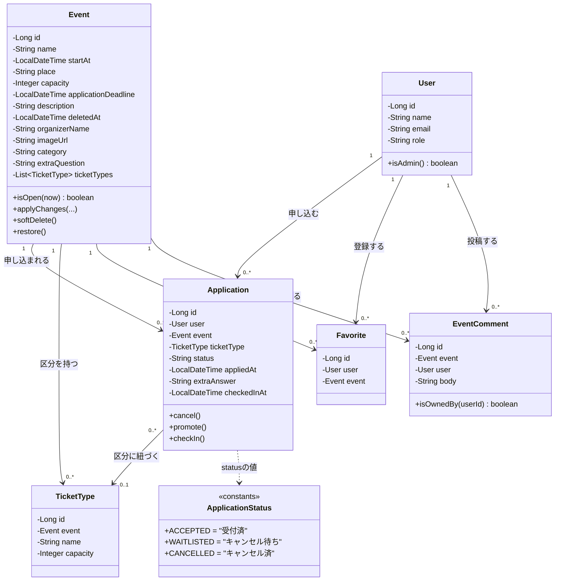

### 3.3 主要処理のシーケンス図

#### 3.3.1 ログイン（メールアドレス方式）

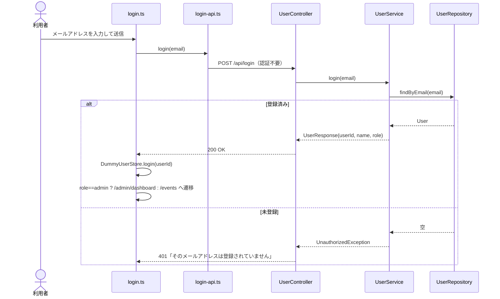

#### 3.3.2 会員登録

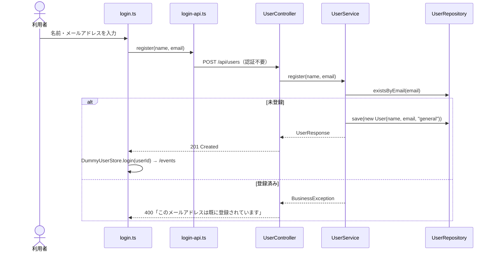

#### 3.3.3 イベント申込（区分・アンケート・キャンセル待ちの分岐）

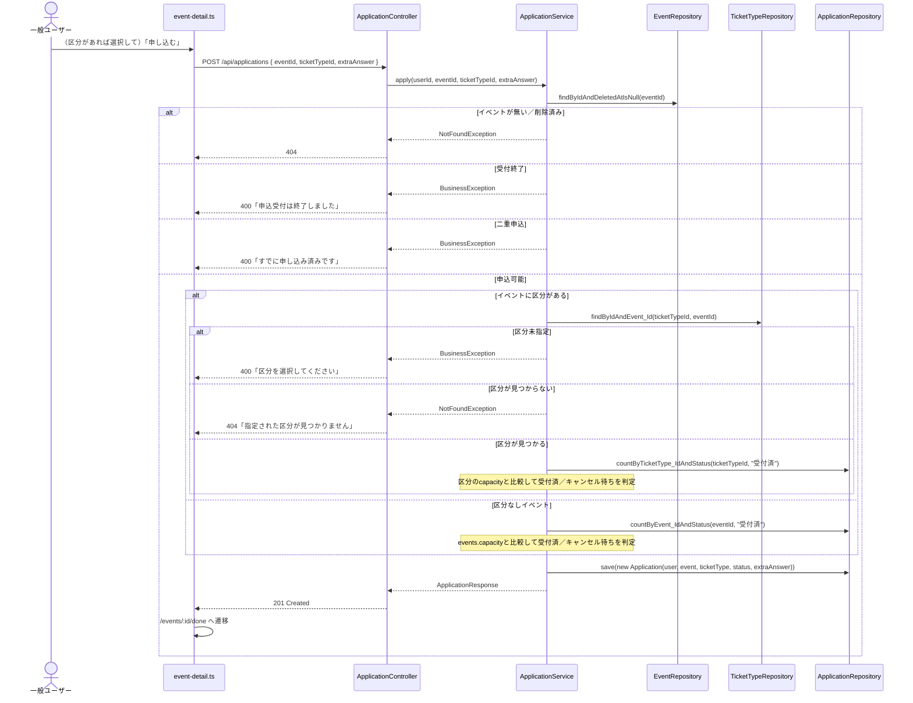

#### 3.3.4 申込キャンセル（自動繰り上げ）

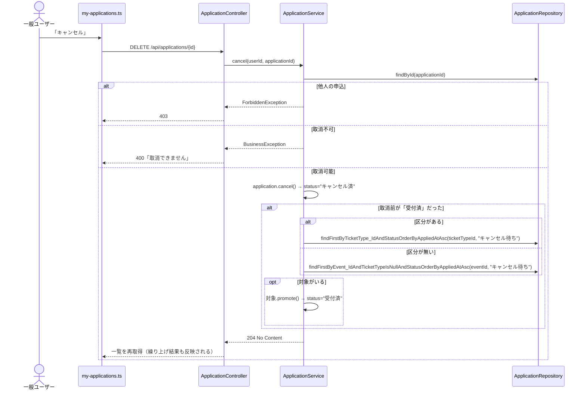

#### 3.3.5 マイページのキャンセル待ち順位表示

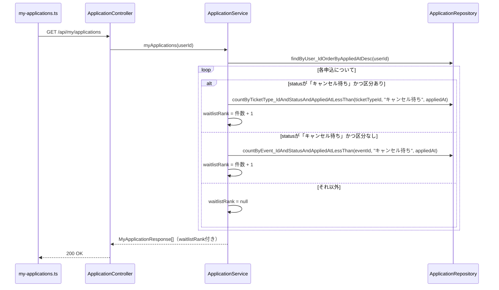

#### 3.3.6 イベント削除（ソフトデリート）・復元

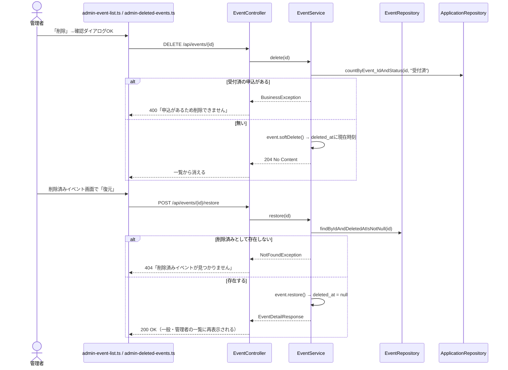

#### 3.3.7 お気に入り登録・解除（冪等）

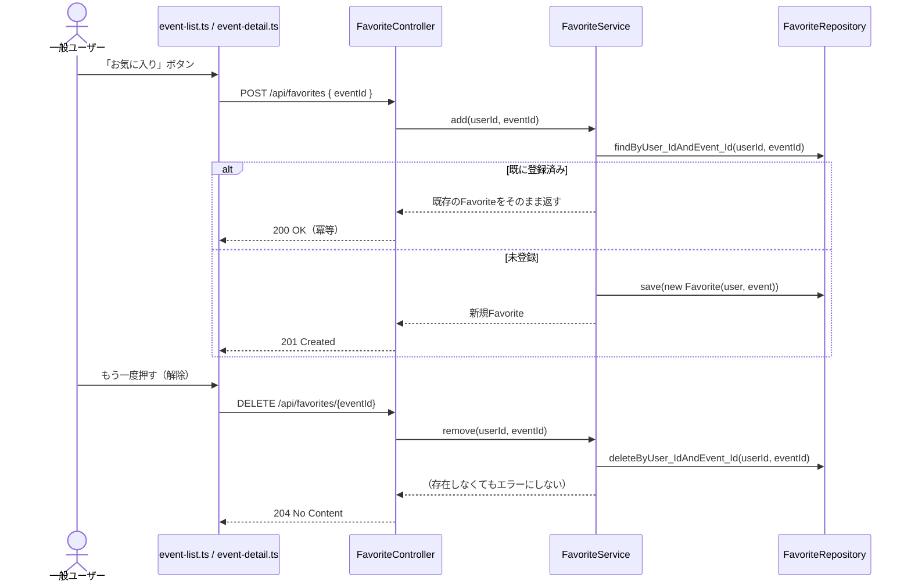

#### 3.3.8 コメント投稿・削除

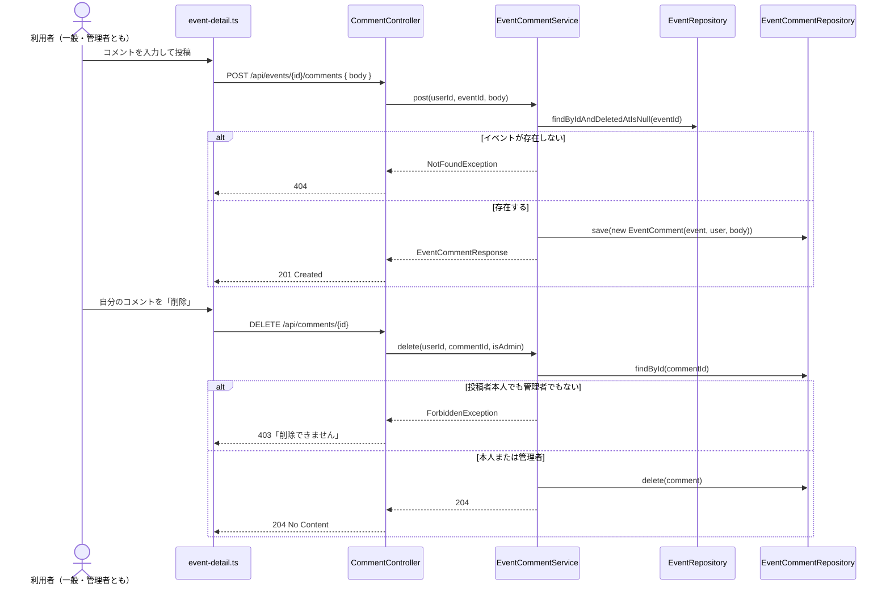

#### 3.3.9 当日受付（チェックイン）

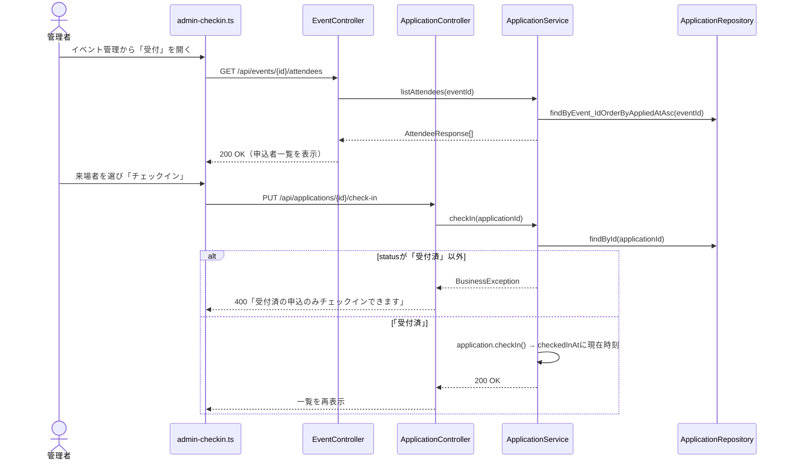

#### 3.3.10 イベント登録・編集（区分の全置換）

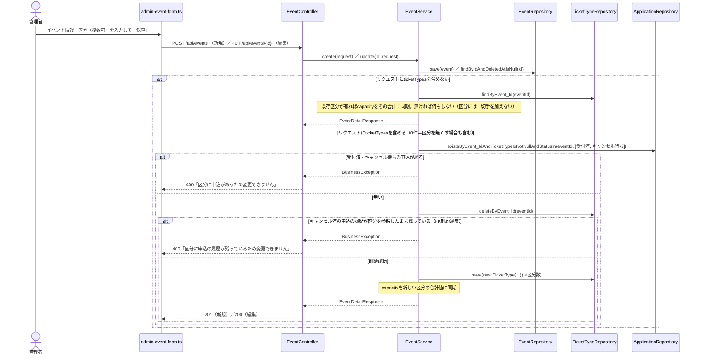

対応：機能11・12／API-06・07／業務ロジック：区分変更時の申込チェック（要件定義書_v2.0.md §8）

### 3.4 認証・共通処理のフロー

すべての `/api/**` リクエストは、Controllerに届く前に必ず `AuthInterceptor`（`HandlerInterceptor`、`WebConfig`で登録）を通る。

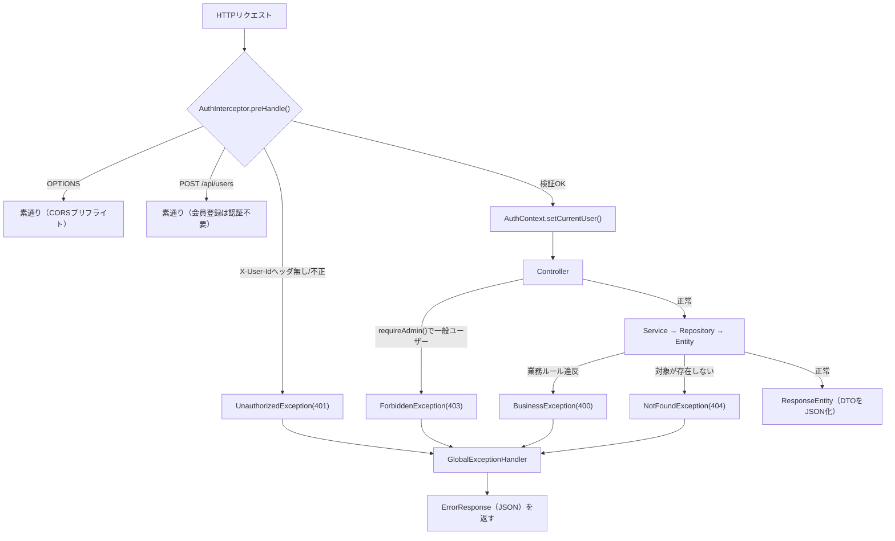

`WebConfig`での適用範囲：`addPathPatterns("/api/**")`・`excludePathPatterns("/api/login", "/api/ping")`。`POST /api/users`だけは`AuthInterceptor`内でメソッド単位に個別許可している。CORSは`WebConfig#addCorsMappings`で`http://localhost:4200`のみ許可。

### 3.5 バリデーション設計

| 対象DTO | 制約 |
|---|---|
| `EventUpsertRequest` | name必須・100文字以内／startAt必須・未来日時／place必須・100文字以内／capacity必須・1以上／applicationDeadline必須／description1000文字以内／organizerName・imageUrl・category・extraQuestionは任意（各文字数上限あり）／ticketTypesの各要素はname必須1〜50文字・capacity必須1以上 |
| `EventUpsertRequest`（クラスレベル） | 申込締切は開催日時**以前**。独自アノテーション`@ValidEventDates` → `EventDatesValidator`が判定し、違反時は`applicationDeadline`フィールドにエラーを紐付ける |
| `LoginRequest` | email必須・メール形式 |
| `UserRegisterRequest` | name必須・100文字以内／email必須・メール形式・255文字以内 |
| `ApplicationCreateRequest` | extraAnswer 0〜500文字。`ticketTypeId`の必須可否はイベントによって変わるため、Bean Validationではなく**Service層で条件付き判定**する |
| `EventCommentCreateRequest` | body必須・1〜500文字 |

**適用タイミングの使い分け**：`EventController`の登録・編集は「`requireAdmin()`（権限チェック）→ `validate(request)`（手動でのValidator実行）」の順。`@Valid`をそのまま使うと権限チェックより先にバリデーションが走ってしまう（一般ユーザーの入力エラーで403ではなく400が先に出てしまう）ため、あえて`@Valid`を使わず手動実行している。login/register/コメント投稿は認証不要または権限分岐が無いAPIのため`@Valid`をそのまま使用。

### 3.6 例外設計

| 例外クラス | HTTPステータス | 発生元の例 |
|---|---|---|
| `UnauthorizedException` | 401 | `AuthInterceptor`（ヘッダ無し・不正なuserId・登録されていないメールアドレス） |
| `ForbiddenException` | 403 | 各Controllerの`requireAdmin()`、他人の申込へのアクセス、コメント削除の権限なし |
| `NotFoundException` | 404 | 存在しないイベント／申込／区分／コメント／削除済みでない復元対象 |
| `BusinessException` | 400 | 定員・締切・二重申込・取消可否・削除可否・メール重複・区分未指定・区分変更不可・チェックイン不可などの業務ルール違反 |
| `MethodArgumentNotValidException`（`@Valid`由来） | 400 | login/register/コメント投稿の入力エラー |
| `ConstraintViolationException`（手動Validator由来） | 400 | イベント登録・編集の入力エラー |
| `HttpMessageNotReadableException` | 400 | 不正なJSON・型不一致 |
| `MethodArgumentTypeMismatchException` | 400 | パスパラメータが数値でない等 |

新しい例外クラスは追加せず、既存8種類の範囲で全業務エラーに対応する（お気に入りの重複・解除は冪等処理のため例外を投げない）。すべて`GlobalExceptionHandler`（`@RestControllerAdvice`）が捕捉し、`ErrorResponse`に統一して返す。

---

## 4. フロントエンド詳細設計

### 4.1 ディレクトリ構成

```
src/app/
├─ core/          API窓口・認証・ガード・インターセプター
├─ login/         SC-01
├─ events/        event-list, event-search, event-detail, apply-done（SC-02系）
├─ my-applications/  SC-03
├─ admin/         admin-dashboard, admin-event-list, admin-deleted-events,
│                 admin-event-form, admin-report, admin-user-list, admin-checkin（SC-04〜06系）
├─ not-found/     404画面
├─ app.ts/html/css  共通ナビ＋router-outlet
├─ app.routes.ts  URL対応表（ワイルドカードルートは必ず配列の最後）
└─ app.config.ts  HttpClient・Routerのプロバイダー登録
```

### 4.2 ルーティング・ガード設計

| ガード | 適用範囲 | 判定内容 | 不許可時の遷移先 |
|---|---|---|---|
| `authGuard` | 全保護ルート | `DummyUserStore.currentUserId() !== null` | `/login` |
| `adminGuard` | `/admin/**` | `currentUserId() === '2'`（管理者の固定ID） | `/events` |

`adminGuard`は`authGuard`の後段として適用する（`canActivate: [authGuard, adminGuard]`の順）。ワイルドカードルート（`**`→`NotFound`）にはガードを適用しない（未ログインでも404自体は表示できる）。

### 4.3 状態管理

- `DummyUserStore`：ログイン中のuserIdを`signal`で保持し`localStorage`にも保存。
- 各画面コンポーネント：一覧・詳細等のデータは`signal`で保持し、テンプレート側は`@if`/`@for`でその`signal`を参照する。

### 4.4 HTTP通信層

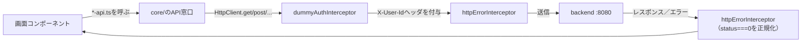

`dummyAuthInterceptor`は未ログイン時はヘッダを付けずに素通りさせる。`httpErrorInterceptor`は「バックエンドに繋がらない」（`status === 0`）場合のみ、固定文言に正規化する。それ以外はバックエンドの`ErrorResponse.message`をそのまま各画面が使う。

---

## 5. Repositoryメソッド一覧（クエリ内容）

| Repository | メソッド | 用途 |
|---|---|---|
| `EventRepository` | `findAllByDeletedAtIsNullOrderByStartAtAsc()` | 一覧取得（削除済み除外） |
| | `findAllByDeletedAtIsNotNullOrderByStartAtAsc()` | 削除済み一覧 |
| | `findByIdAndDeletedAtIsNull(id)` | 詳細・更新・申込時の存在確認 |
| | `findByIdAndDeletedAtIsNotNull(id)` | 復元時の存在確認 |
| `ApplicationRepository` | `countByEvent_IdAndStatus(eventId, status)` | イベント単位の定員チェック・受付済数集計 |
| | `countByTicketType_IdAndStatus(ticketTypeId, status)` | 区分単位の定員チェック |
| | `existsByUser_IdAndEvent_IdAndStatusIn(userId, eventId, statuses)` | 二重申込チェック |
| | `findFirstByEvent_IdAndTicketTypeIsNullAndStatusOrderByAppliedAtAsc(eventId, status)` | キャンセル待ちの繰り上げ対象（区分の無いイベント） |
| | `findFirstByTicketType_IdAndStatusOrderByAppliedAtAsc(ticketTypeId, status)` | キャンセル待ちの繰り上げ対象（区分単位） |
| | `countByEvent_IdAndStatusAndAppliedAtLessThan(eventId, status, appliedAt)` | キャンセル待ちの順位計算（区分の無いイベント） |
| | `countByTicketType_IdAndStatusAndAppliedAtLessThan(ticketTypeId, status, appliedAt)` | キャンセル待ちの順位計算（区分単位） |
| | `findByUser_IdOrderByAppliedAtDesc(userId)` | マイページの自分の申込一覧 |
| | `findByEvent_IdOrderByAppliedAtAsc(eventId)` | 受付画面の申込者一覧 |
| | `findAllByOrderByEvent_StartAtAsc()` | 申込実績CSVの明細順 |
| `UserRepository` | `existsByEmail(email)` | 会員登録の重複チェック |
| | `findByEmail(email)` | ログイン時のユーザー特定 |
| | `findAllByOrderByIdAsc()` | ユーザー一覧 |
| `FavoriteRepository` | `findByUser_IdAndEvent_Id(userId, eventId)` | お気に入りの重複確認・冪等処理 |
| | `deleteByUser_IdAndEvent_Id(userId, eventId)` | お気に入り解除 |
| | `findByUser_IdOrderByCreatedAtDesc(userId)` | マイページのお気に入り一覧 |
| `TicketTypeRepository` | `findByEvent_Id(eventId)` | イベント詳細・編集フォームの区分一覧 |
| | `findByIdAndEvent_Id(id, eventId)` | 申込時の区分存在チェック |
| `EventCommentRepository` | `findByEvent_IdOrderByCreatedAtAscIdAsc(eventId)` | イベント詳細のコメント一覧（created_atが同一秒の場合に備えidを第2キーにする） |

---

## 6. 設計書間トレーサビリティ

| 本書の章 | 対応する既存設計書 |
|---|---|
| 3.3.1〜3.3.2（ログイン・会員登録） | API設計書 API-10・11／要件定義書 機能1・2 |
| 3.3.3〜3.3.5（申込・キャンセル・順位） | API設計書 API-03・04・05／要件定義書 §8 業務ルール |
| 3.3.6（削除・復元） | API設計書 API-08・13・14／要件定義書 機能13・14 |
| 3.3.7（お気に入り） | API設計書 API-15〜17／要件定義書 機能17 |
| 3.3.8（コメント） | API設計書 API-20〜22／要件定義書 機能18 |
| 3.3.9（チェックイン） | API設計書 API-18・19／要件定義書 機能19／画面遷移図 SC-06 |
| 3.3.10（イベント登録・編集） | API設計書 API-06・07／要件定義書 機能11・12・§8 区分変更時の申込チェック |
| 3.4（認証・例外） | API設計書 §0 共通事項 |
| 4.2（ルーティング・ガード） | 画面遷移図 §4 補足メモ |
| 5（Repositoryメソッド） | テーブル定義書 §3 インデックス一覧 |
